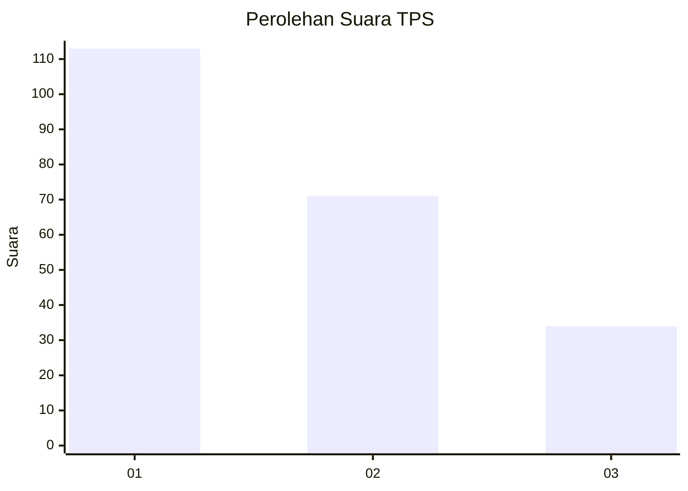
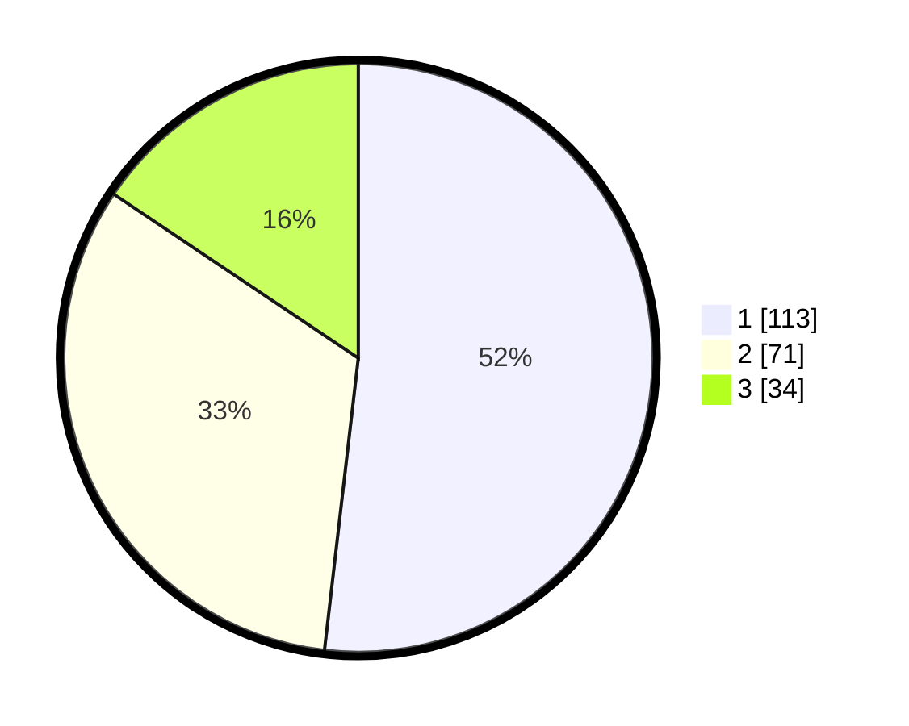

# Hasil

## Grafik

## Tabel

| No. | Nama Paslon    | Suara | Suara (raw) | Persentase |
|:--- |:-------------- | -----:| -----------:| ----------:|
| 1   | ANIES MUHAIMIN | 113   | [113][p-1]  | 51,83      |
| 2   | PRABOWO GIBRAN | 71    | [71][p-2]   | 32,57      |
| 3   | GANJAR MAHFUD  | 34    | [34][p-3]   | 15,60      |

[p-1]: https://github.com/gigit-pemilu/pemilu-2024/blob/main/pilpres/hitung-suara/sub/36-banten/sub/04-serang/sub/05-kramatwatu/sub/2001-kramatwatu/sub/002-tps/sub/paslon-1.txt
[p-2]: https://github.com/gigit-pemilu/pemilu-2024/blob/main/pilpres/hitung-suara/sub/36-banten/sub/04-serang/sub/05-kramatwatu/sub/2001-kramatwatu/sub/002-tps/sub/paslon-2.txt
[p-3]: https://github.com/gigit-pemilu/pemilu-2024/blob/main/pilpres/hitung-suara/sub/36-banten/sub/04-serang/sub/05-kramatwatu/sub/2001-kramatwatu/sub/002-tps/sub/paslon-3.txt

## Foto C Plano

https://sirekap-obj-formc.kpu.go.id/1f6e/pemilu/ppwp/36/04/05/20/01/3604052001002-20240225-133554--298a25df-d793-464c-a397-5626fe28304f.jpg

https://sirekap-obj-formc.kpu.go.id/1f6e/pemilu/ppwp/36/04/05/20/01/3604052001002-20240225-134608--46224388-051b-4b6e-90ff-4133c49cd2a7.jpg

https://sirekap-obj-formc.kpu.go.id/1f6e/pemilu/ppwp/36/04/05/20/01/3604052001002-20240225-134635--7b5f0adf-f00f-4be9-9746-c5d72f914071.jpg

## Metadata

| Key        | Value               |
| ---------- | ------------------- |
| Time Stamp | 2024-02-25 14:00:00 |

## DATA PEMILIH TETAP

Jumlah pemilih dalam DPT: **267**.
 * L: **136**.
 * P: **131**.

## DATA PENGGUNA HAK PILIH

Jumlah pengguna hak pilih dalam DPT: **128**.
 * L: **124**.
 * P: **94**.

Jumlah pengguna hak pilih dalam DPTb: **555**.
 * L: **0**.
 * P: **555**.

Jumlah pengguna hak pilih dalam DPK: **664**.
 * L: **55**.
 * P: **565**.

Jumlah pengguna hak pilih: **222**.
 * L: **127**.
 * P: **55**.

## JUMLAH SUARA SAH DAN TIDAK SAH

JUMLAH SELURUH SUARA SAH: **218**.

JUMLAH SUARA TIDAK SAH: **4**.

JUMLAH SELURUH SUARA SAH DAN SUARA TIDAK SAH: **222**.

