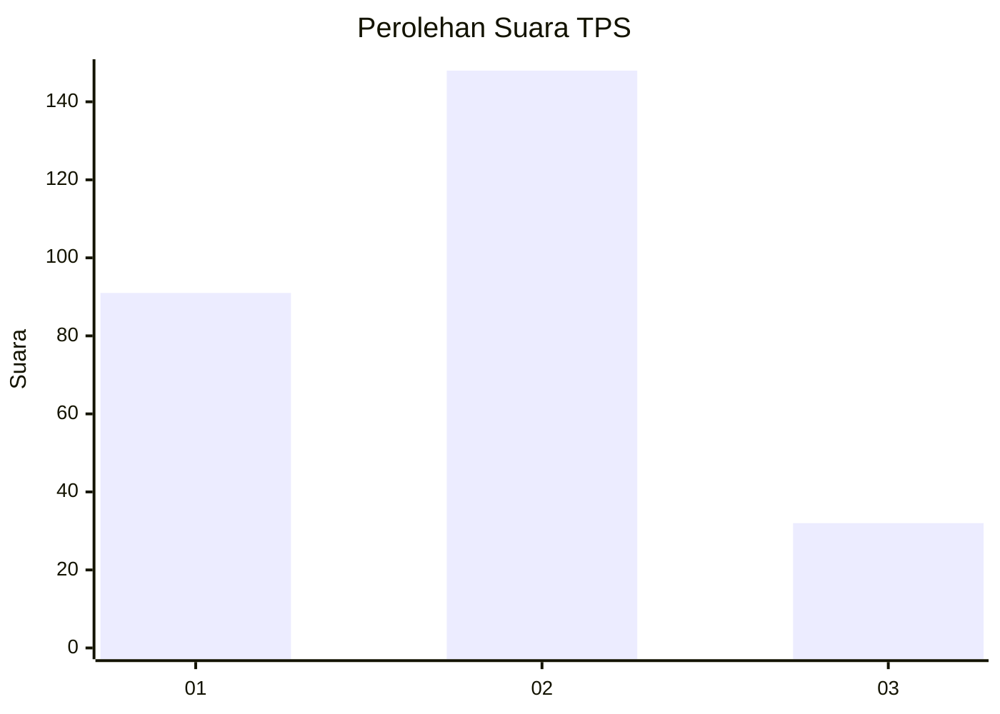
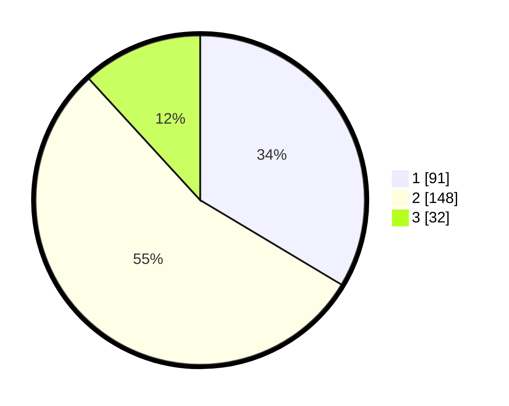

# Hasil

## Grafik

## Tabel

| No. | Nama Paslon    | Suara | Suara (raw) | Persentase |
|:--- |:-------------- | -----:| -----------:| ----------:|
| 1   | ANIES MUHAIMIN | 91    | [91][p-1]   | 33,58      |
| 2   | PRABOWO GIBRAN | 148   | [148][p-2]  | 54,61      |
| 3   | GANJAR MAHFUD  | 32    | [32][p-3]   | 11,81      |

[p-1]: https://github.com/gigit-pemilu/pemilu-2024/blob/main/pilpres/hitung-suara/sub/36-banten/sub/04-serang/sub/05-kramatwatu/sub/2002-margasana/sub/001-tps/sub/paslon-1.txt
[p-2]: https://github.com/gigit-pemilu/pemilu-2024/blob/main/pilpres/hitung-suara/sub/36-banten/sub/04-serang/sub/05-kramatwatu/sub/2002-margasana/sub/001-tps/sub/paslon-2.txt
[p-3]: https://github.com/gigit-pemilu/pemilu-2024/blob/main/pilpres/hitung-suara/sub/36-banten/sub/04-serang/sub/05-kramatwatu/sub/2002-margasana/sub/001-tps/sub/paslon-3.txt

## Foto C Plano

https://sirekap-obj-formc.kpu.go.id/e60a/pemilu/ppwp/36/04/05/20/02/3604052002001-20240221-091834--486d962f-4001-4798-876b-25514e70bbb5.jpg

https://sirekap-obj-formc.kpu.go.id/e60a/pemilu/ppwp/36/04/05/20/02/3604052002001-20240221-091930--18f4de74-2761-4423-a70c-0c079b257b9d.jpg

https://sirekap-obj-formc.kpu.go.id/e60a/pemilu/ppwp/36/04/05/20/02/3604052002001-20240221-092038--4799f081-aaae-4995-875d-a898fea00be2.jpg

## Metadata

| Key        | Value               |
| ---------- | ------------------- |
| Time Stamp | 2024-02-24 22:31:28 |

