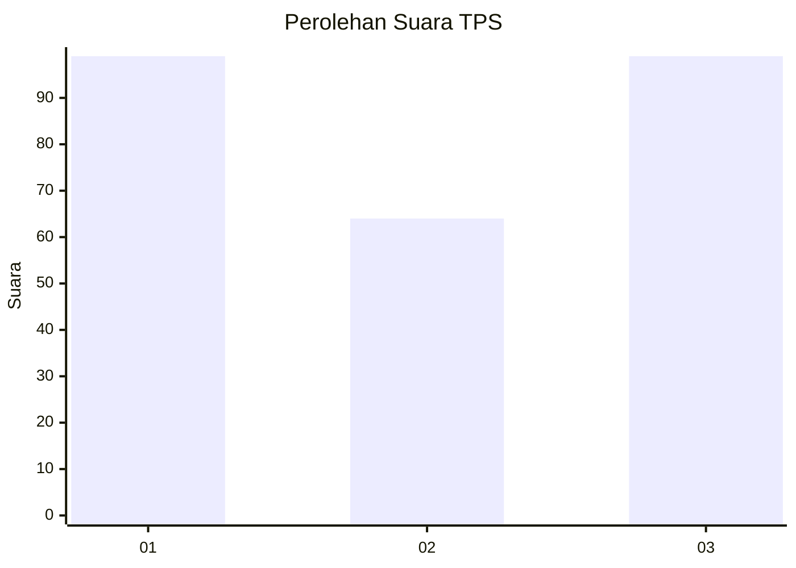
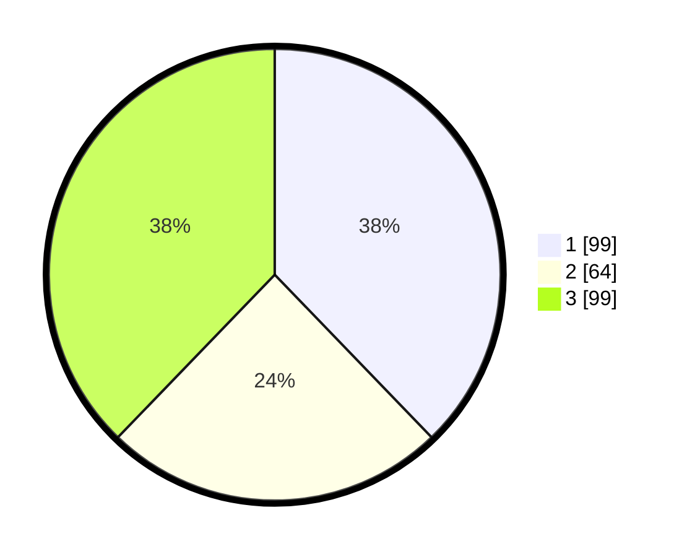

# Hasil

## Grafik

## Tabel

| No. | Nama Paslon    | Suara | Suara (raw) | Persentase |
|:--- |:-------------- | -----:| -----------:| ----------:|
| 1   | ANIES MUHAIMIN | 99    | [99][p-1]   | 37,79      |
| 2   | PRABOWO GIBRAN | 64    | [64][p-2]   | 24,43      |
| 3   | GANJAR MAHFUD  | 99    | [99][p-3]   | 37,79      |

[p-1]: https://github.com/gigit-pemilu/pemilu-2024/blob/main/pilpres/hitung-suara/sub/36-banten/sub/04-serang/sub/05-kramatwatu/sub/2002-margasana/sub/002-tps/sub/paslon-1.txt
[p-2]: https://github.com/gigit-pemilu/pemilu-2024/blob/main/pilpres/hitung-suara/sub/36-banten/sub/04-serang/sub/05-kramatwatu/sub/2002-margasana/sub/002-tps/sub/paslon-2.txt
[p-3]: https://github.com/gigit-pemilu/pemilu-2024/blob/main/pilpres/hitung-suara/sub/36-banten/sub/04-serang/sub/05-kramatwatu/sub/2002-margasana/sub/002-tps/sub/paslon-3.txt

## Foto C Plano

https://sirekap-obj-formc.kpu.go.id/90c0/pemilu/ppwp/36/04/05/20/02/3604052002002-20240221-102800--b7a20416-5ca8-44ed-bf0f-467f7685f0fb.jpg

https://sirekap-obj-formc.kpu.go.id/90c0/pemilu/ppwp/36/04/05/20/02/3604052002002-20240221-102907--d769412f-bf5e-4f5c-b132-aa00bc361668.jpg

https://sirekap-obj-formc.kpu.go.id/90c0/pemilu/ppwp/36/04/05/20/02/3604052002002-20240221-103019--be05c134-f8aa-4b19-b24a-18519f1460d6.jpg

## Metadata

| Key        | Value               |
| ---------- | ------------------- |
| Time Stamp | 2024-02-22 13:00:00 |

