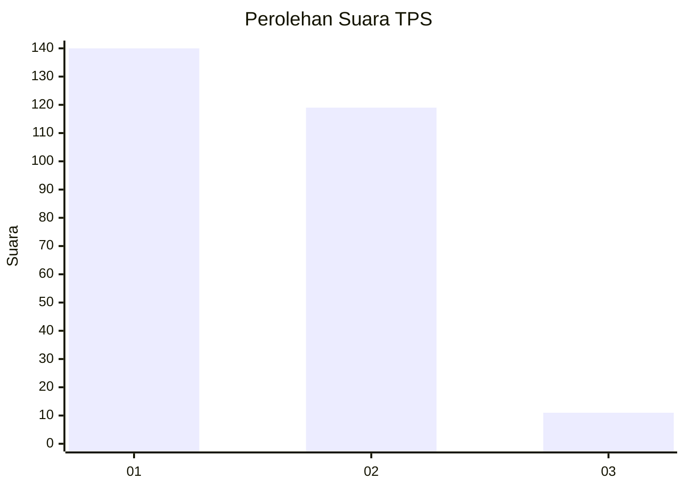
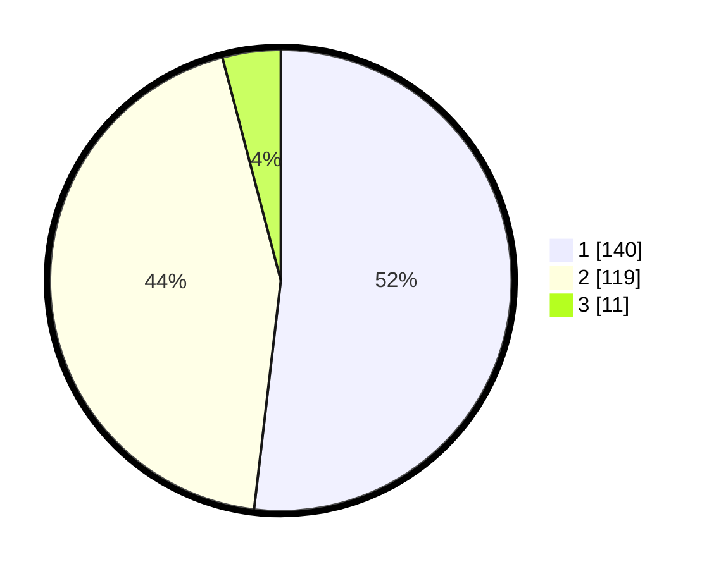

# Hasil

## Grafik

## Tabel

| No. | Nama Paslon    | Suara | Suara (raw) | Persentase |
|:--- |:-------------- | -----:| -----------:| ----------:|
| 1   | ANIES MUHAIMIN | 140   | [140][p-1]  | 51,85      |
| 2   | PRABOWO GIBRAN | 119   | [119][p-2]  | 44,07      |
| 3   | GANJAR MAHFUD  | 11    | [11][p-3]   | 4,07       |

[p-1]: https://github.com/gigit-pemilu/pemilu-2024-36-banten/blob/main/pilpres/hitung-suara/sub/36-banten/sub/04-serang/sub/05-kramatwatu/sub/2004-toyomerto/sub/001-tps/sub/paslon-1.txt
[p-2]: https://github.com/gigit-pemilu/pemilu-2024-36-banten/blob/main/pilpres/hitung-suara/sub/36-banten/sub/04-serang/sub/05-kramatwatu/sub/2004-toyomerto/sub/001-tps/sub/paslon-2.txt
[p-3]: https://github.com/gigit-pemilu/pemilu-2024-36-banten/blob/main/pilpres/hitung-suara/sub/36-banten/sub/04-serang/sub/05-kramatwatu/sub/2004-toyomerto/sub/001-tps/sub/paslon-3.txt

## Foto C Plano

https://sirekap-obj-formc.kpu.go.id/2ad9/pemilu/ppwp/36/04/05/20/04/3604052004001-20240220-174809--3bc5bf70-953f-44da-b3d1-82ac309ead4b.jpg

https://sirekap-obj-formc.kpu.go.id/2ad9/pemilu/ppwp/36/04/05/20/04/3604052004001-20240220-174919--2289ab8d-49cd-4e53-b23d-d31620fa91bd.jpg

https://sirekap-obj-formc.kpu.go.id/2ad9/pemilu/ppwp/36/04/05/20/04/3604052004001-20240220-174954--ac084f8d-fe5d-4f09-bf1e-e37e57a7d33f.jpg

## Metadata

| Key        | Value               |
| ---------- | ------------------- |
| Time Stamp | 2024-02-24 22:31:28 |

