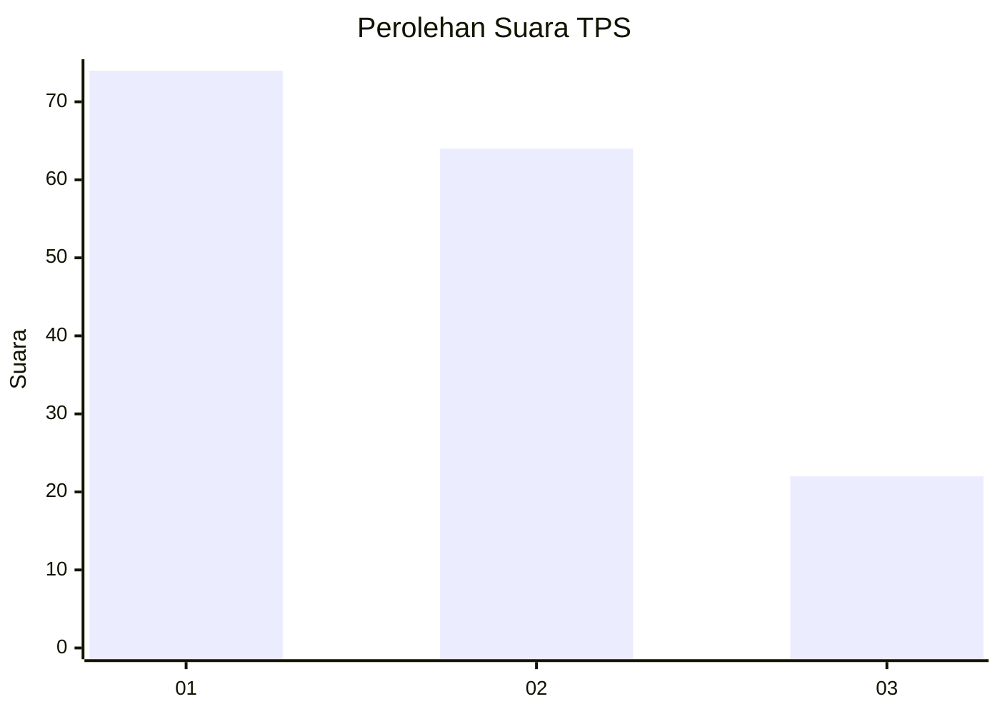
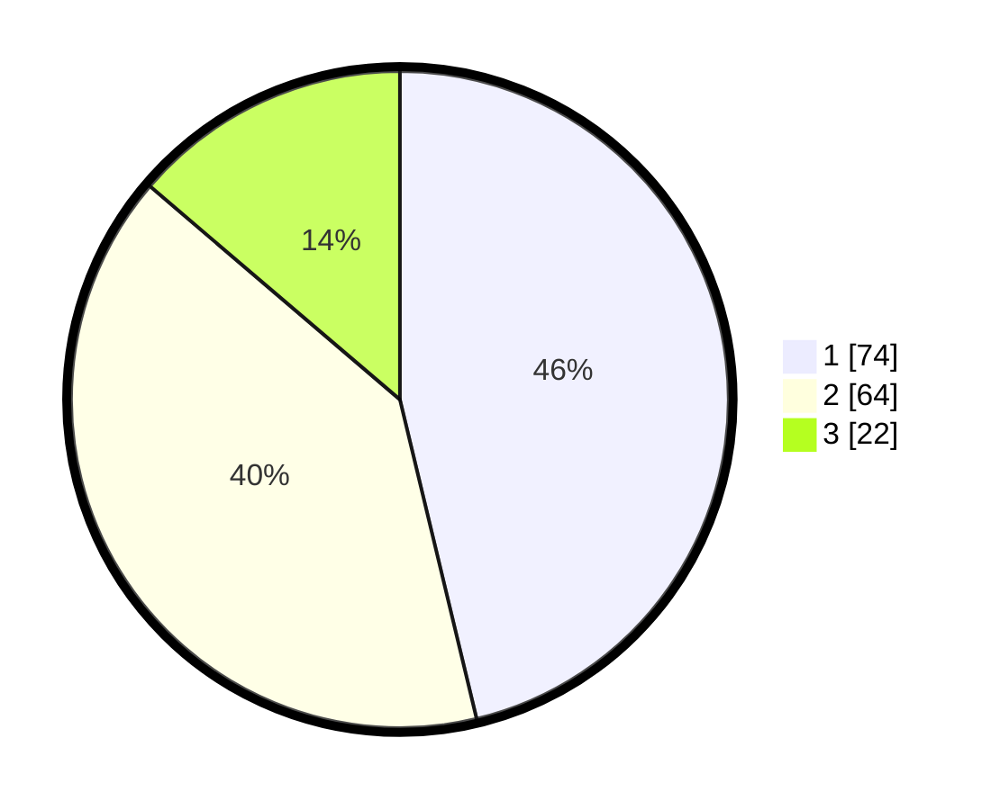

# Hasil

## Grafik

## Tabel

| No. | Nama Paslon    | Suara | Suara (raw) | Persentase |
|:--- |:-------------- | -----:| -----------:| ----------:|
| 1   | ANIES MUHAIMIN | 74    | [74][p-1]   | 46,25      |
| 2   | PRABOWO GIBRAN | 64    | [64][p-2]   | 40,00      |
| 3   | GANJAR MAHFUD  | 22    | [22][p-3]   | 13,75      |

[p-1]: https://github.com/gigit-pemilu/pemilu-2024/blob/main/pilpres/hitung-suara/sub/36-banten/sub/04-serang/sub/05-kramatwatu/sub/2005-harjatani/sub/028-tps/sub/paslon-1.txt
[p-2]: https://github.com/gigit-pemilu/pemilu-2024/blob/main/pilpres/hitung-suara/sub/36-banten/sub/04-serang/sub/05-kramatwatu/sub/2005-harjatani/sub/028-tps/sub/paslon-2.txt
[p-3]: https://github.com/gigit-pemilu/pemilu-2024/blob/main/pilpres/hitung-suara/sub/36-banten/sub/04-serang/sub/05-kramatwatu/sub/2005-harjatani/sub/028-tps/sub/paslon-3.txt

## Foto C Plano

https://sirekap-obj-formc.kpu.go.id/9b4b/pemilu/ppwp/36/04/05/20/05/3604052005028-20240224-122543--d7365df4-1e3a-491c-a233-5910de512a27.jpg

https://sirekap-obj-formc.kpu.go.id/9b4b/pemilu/ppwp/36/04/05/20/05/3604052005028-20240224-122900--299cecd4-7983-4298-8506-7bb4b05a6acd.jpg

https://sirekap-obj-formc.kpu.go.id/9b4b/pemilu/ppwp/36/04/05/20/05/3604052005028-20240224-123011--3647fd83-7a09-4092-aaf0-00a2590f9a83.jpg

## Metadata

| Key        | Value               |
| ---------- | ------------------- |
| Time Stamp | 2024-02-24 22:31:28 |

## DATA PEMILIH TETAP

Jumlah pemilih dalam DPT: **444**.
 * L: **30**.
 * P: **4**.

## DATA PENGGUNA HAK PILIH

Jumlah pengguna hak pilih dalam DPT: **40**.
 * L: **71**.
 * P: **441**.

Jumlah pengguna hak pilih dalam DPTb: **440**.
 * L: **4**.
 * P: **444**.

Jumlah pengguna hak pilih dalam DPK: **444**.
 * L: **1**.
 * P: **444**.

Jumlah pengguna hak pilih: **441**.
 * L: **74**.
 * P: **444**.

## JUMLAH SUARA SAH DAN TIDAK SAH

JUMLAH SELURUH SUARA SAH: **160**.

JUMLAH SUARA TIDAK SAH: **0**.

JUMLAH SELURUH SUARA SAH DAN SUARA TIDAK SAH: **160**.

