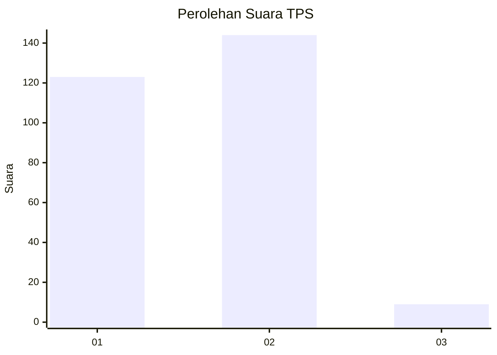
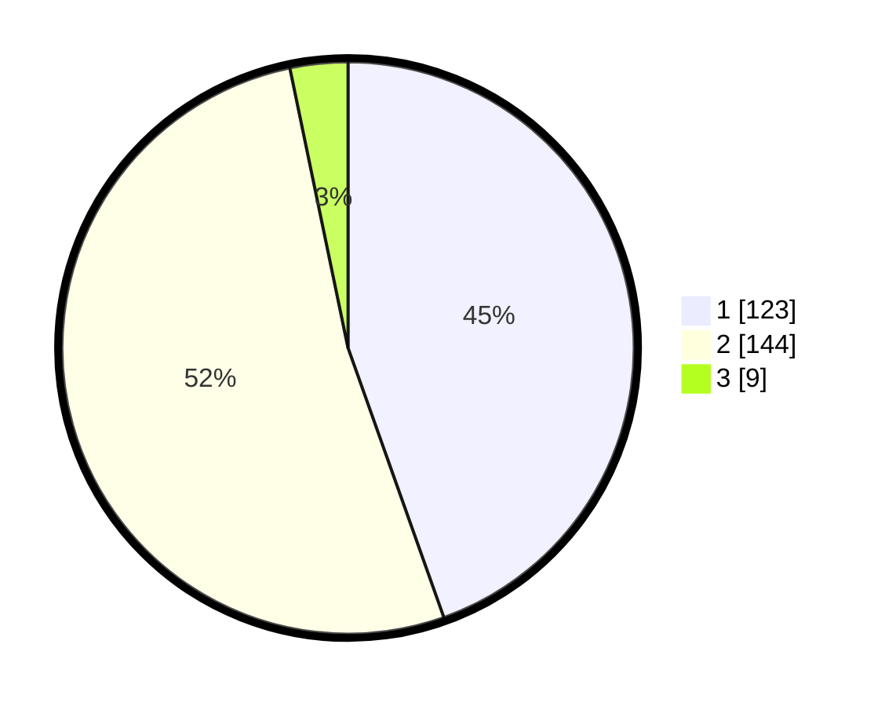

# Hasil

## Grafik

## Tabel

| No. | Nama Paslon    | Suara | Suara (raw) | Persentase |
|:--- |:-------------- | -----:| -----------:| ----------:|
| 1   | ANIES MUHAIMIN | 123   | [123][p-1]  | 44,57      |
| 2   | PRABOWO GIBRAN | 144   | [144][p-2]  | 52,17      |
| 3   | GANJAR MAHFUD  | 9     | [9][p-3]    | 3,26       |

[p-1]: https://github.com/gigit-pemilu/pemilu-2024-36-banten/blob/main/pilpres/hitung-suara/sub/36-banten/sub/04-serang/sub/05-kramatwatu/sub/2008-tonjong/sub/006-tps/sub/paslon-1.txt
[p-2]: https://github.com/gigit-pemilu/pemilu-2024-36-banten/blob/main/pilpres/hitung-suara/sub/36-banten/sub/04-serang/sub/05-kramatwatu/sub/2008-tonjong/sub/006-tps/sub/paslon-2.txt
[p-3]: https://github.com/gigit-pemilu/pemilu-2024-36-banten/blob/main/pilpres/hitung-suara/sub/36-banten/sub/04-serang/sub/05-kramatwatu/sub/2008-tonjong/sub/006-tps/sub/paslon-3.txt

## Foto C Plano

https://sirekap-obj-formc.kpu.go.id/ffa4/pemilu/ppwp/36/04/05/20/08/3604052008006-20240223-214003--4ae00ce0-ad3b-4eaa-b2b8-8db3dea95eb0.jpg

https://sirekap-obj-formc.kpu.go.id/ffa4/pemilu/ppwp/36/04/05/20/08/3604052008006-20240223-214136--70caa96c-247d-4162-9685-5c4c18360770.jpg

https://sirekap-obj-formc.kpu.go.id/ffa4/pemilu/ppwp/36/04/05/20/08/3604052008006-20240223-234201--4cc28b51-e0e3-42df-8ba4-19b158fdc05b.jpg

## Metadata

| Key        | Value               |
| ---------- | ------------------- |
| Time Stamp | 2024-02-24 22:31:28 |

## DATA PEMILIH TETAP

Jumlah pemilih dalam DPT: **298**.
 * L: **155**.
 * P: **643**.

## DATA PENGGUNA HAK PILIH

Jumlah pengguna hak pilih dalam DPT: **278**.
 * L: **249**.
 * P: **324**.

Jumlah pengguna hak pilih dalam DPTb: **803**.
 * L: **584**.
 * P: **588**.

Jumlah pengguna hak pilih dalam DPK: **7**.
 * L: **6**.
 * P: **56**.

Jumlah pengguna hak pilih: **283**.
 * L: **649**.
 * P: **490**.

## JUMLAH SUARA SAH DAN TIDAK SAH

JUMLAH SELURUH SUARA SAH: **276**.

JUMLAH SUARA TIDAK SAH: **13**.

JUMLAH SELURUH SUARA SAH DAN SUARA TIDAK SAH: **289**.

