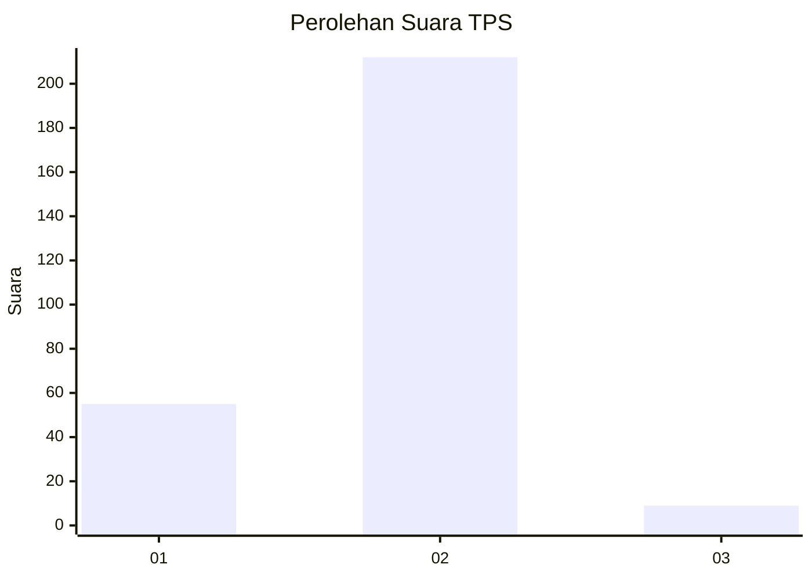
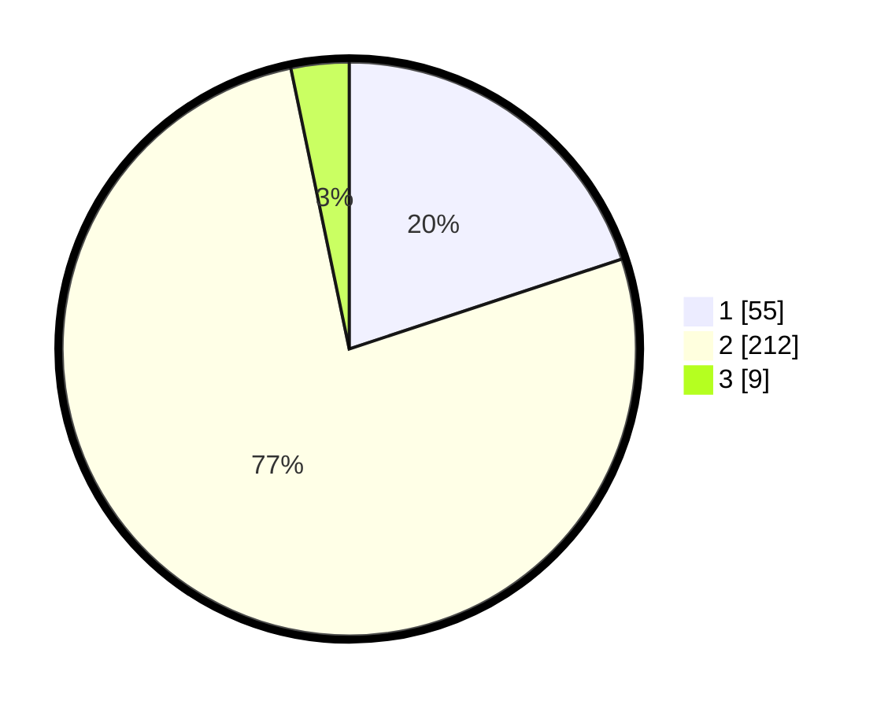

# Hasil

## Grafik

## Tabel

| No. | Nama Paslon    | Suara | Suara (raw) | Persentase |
|:--- |:-------------- | -----:| -----------:| ----------:|
| 1   | ANIES MUHAIMIN | 55    | [55][p-1]   | 19,93      |
| 2   | PRABOWO GIBRAN | 212   | [212][p-2]  | 76,81      |
| 3   | GANJAR MAHFUD  | 9     | [9][p-3]    | 3,26       |

[p-1]: https://github.com/gigit-pemilu/pemilu-2024/blob/main/pilpres/hitung-suara/sub/36-banten/sub/04-serang/sub/05-kramatwatu/sub/2009-pamengkang/sub/001-tps/sub/paslon-1.txt
[p-2]: https://github.com/gigit-pemilu/pemilu-2024/blob/main/pilpres/hitung-suara/sub/36-banten/sub/04-serang/sub/05-kramatwatu/sub/2009-pamengkang/sub/001-tps/sub/paslon-2.txt
[p-3]: https://github.com/gigit-pemilu/pemilu-2024/blob/main/pilpres/hitung-suara/sub/36-banten/sub/04-serang/sub/05-kramatwatu/sub/2009-pamengkang/sub/001-tps/sub/paslon-3.txt

## Foto C Plano

https://sirekap-obj-formc.kpu.go.id/39d5/pemilu/ppwp/36/04/05/20/09/3604052009001-20240226-092735--4df43de6-0a8f-44e6-ae35-55e785d91f4a.jpg

https://sirekap-obj-formc.kpu.go.id/39d5/pemilu/ppwp/36/04/05/20/09/3604052009001-20240215-004639--5eb2a7df-1ae1-4b07-b474-73ab08f0b5cb.jpg

https://sirekap-obj-formc.kpu.go.id/39d5/pemilu/ppwp/36/04/05/20/09/3604052009001-20240215-004424--d104de76-aea4-45d7-975d-ac9429de06d0.jpg

## Metadata

| Key        | Value               |
| ---------- | ------------------- |
| Time Stamp | 2024-02-26 10:00:00 |

