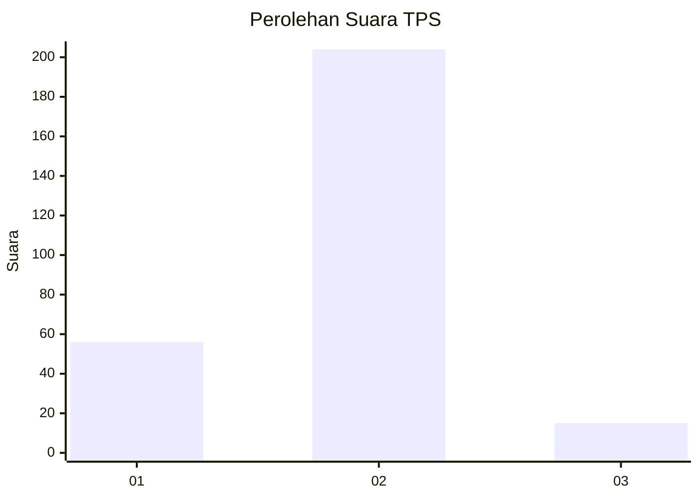

# Hasil

## Grafik

## Tabel

| No. | Nama Paslon    | Suara | Suara (raw) | Persentase |
|:--- |:-------------- | -----:| -----------:| ----------:|
| 1   | ANIES MUHAIMIN | 56    | [56][p-1]   | 20,36      |
| 2   | PRABOWO GIBRAN | 204   | [204][p-2]  | 74,18      |
| 3   | GANJAR MAHFUD  | 15    | [15][p-3]   | 5,45       |

[p-1]: https://github.com/gigit-pemilu/pemilu-2024/blob/main/pilpres/hitung-suara/sub/36-banten/sub/04-serang/sub/05-kramatwatu/sub/2010-pegadingan/sub/013-tps/sub/paslon-1.txt
[p-2]: https://github.com/gigit-pemilu/pemilu-2024/blob/main/pilpres/hitung-suara/sub/36-banten/sub/04-serang/sub/05-kramatwatu/sub/2010-pegadingan/sub/013-tps/sub/paslon-2.txt
[p-3]: https://github.com/gigit-pemilu/pemilu-2024/blob/main/pilpres/hitung-suara/sub/36-banten/sub/04-serang/sub/05-kramatwatu/sub/2010-pegadingan/sub/013-tps/sub/paslon-3.txt

## Foto C Plano

https://sirekap-obj-formc.kpu.go.id/e489/pemilu/ppwp/36/04/05/20/10/3604052010013-20240223-205521--d5b8c214-0f7a-4f5b-91f8-fd1dbc427376.jpg

https://sirekap-obj-formc.kpu.go.id/e489/pemilu/ppwp/36/04/05/20/10/3604052010013-20240223-205347--df63ef46-680e-4fea-b769-9201dc2dab1d.jpg

https://sirekap-obj-formc.kpu.go.id/e489/pemilu/ppwp/36/04/05/20/10/3604052010013-20240223-205432--6dc70f31-7034-4e6a-b212-90b51fdae398.jpg

## Metadata

| Key        | Value               |
| ---------- | ------------------- |
| Time Stamp | 2024-02-24 22:31:28 |

## DATA PEMILIH TETAP

Jumlah pemilih dalam DPT: **557**.
 * L: **557**.
 * P: **557**.

## DATA PENGGUNA HAK PILIH

Jumlah pengguna hak pilih dalam DPT: **485**.
 * L: **930**.
 * P: **444**.

Jumlah pengguna hak pilih dalam DPTb: **776**.
 * L: **551**.
 * P: **554**.

Jumlah pengguna hak pilih dalam DPK: **604**.
 * L: **554**.
 * P: **554**.

Jumlah pengguna hak pilih: **70**.
 * L: **0**.
 * P: **5**.

## JUMLAH SUARA SAH DAN TIDAK SAH

JUMLAH SELURUH SUARA SAH: **175**.

JUMLAH SUARA TIDAK SAH: **12**.

JUMLAH SELURUH SUARA SAH DAN SUARA TIDAK SAH: **187**.

