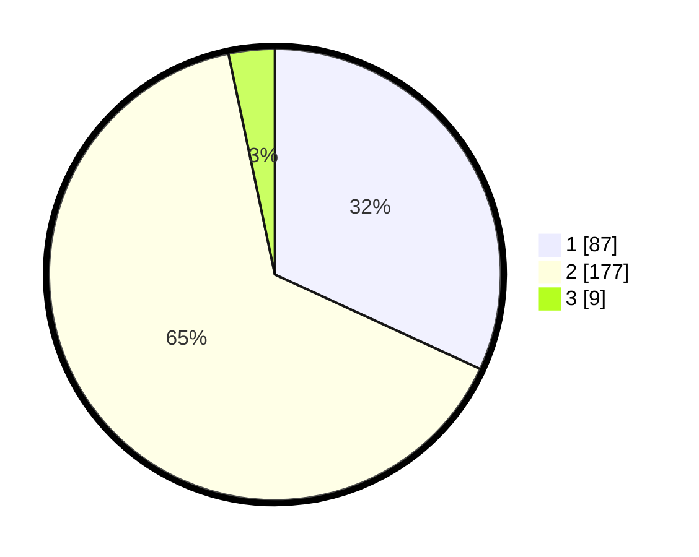

# Hasil

## Grafik

## Tabel

| No. | Nama Paslon    | Suara | Suara (raw) | Persentase |
|:--- |:-------------- | -----:| -----------:| ----------:|
| 1   | ANIES MUHAIMIN | 87    | [87][p-1]   | 31,87      |
| 2   | PRABOWO GIBRAN | 177   | [177][p-2]  | 64,84      |
| 3   | GANJAR MAHFUD  | 9     | [9][p-3]    | 3,30       |

[p-1]: https://github.com/gigit-pemilu/pemilu-2024-36-banten/blob/main/pilpres/hitung-suara/sub/36-banten/sub/04-serang/sub/05-kramatwatu/sub/2011-lebakwana/sub/019-tps/sub/paslon-1.txt
[p-2]: https://github.com/gigit-pemilu/pemilu-2024-36-banten/blob/main/pilpres/hitung-suara/sub/36-banten/sub/04-serang/sub/05-kramatwatu/sub/2011-lebakwana/sub/019-tps/sub/paslon-2.txt
[p-3]: https://github.com/gigit-pemilu/pemilu-2024-36-banten/blob/main/pilpres/hitung-suara/sub/36-banten/sub/04-serang/sub/05-kramatwatu/sub/2011-lebakwana/sub/019-tps/sub/paslon-3.txt

## Foto C Plano

https://sirekap-obj-formc.kpu.go.id/6287/pemilu/ppwp/36/04/05/20/11/3604052011019-20240223-234638--72f0fa69-3f10-4a0a-a4ac-5de84a333dd4.jpg

https://sirekap-obj-formc.kpu.go.id/6287/pemilu/ppwp/36/04/05/20/11/3604052011019-20240223-223939--5fb2bc8b-f0a8-4634-b3cd-6137bacddc59.jpg

https://sirekap-obj-formc.kpu.go.id/6287/pemilu/ppwp/36/04/05/20/11/3604052011019-20240223-224404--c5764537-dbe2-4e8d-82e5-a3cd2ec0a0df.jpg

## Metadata

| Key        | Value               |
| ---------- | ------------------- |
| Time Stamp | 2024-02-24 22:31:28 |

## DATA PEMILIH TETAP

Jumlah pemilih dalam DPT: **0**.
 * L: **0**.
 * P: **0**.

## DATA PENGGUNA HAK PILIH

Jumlah pengguna hak pilih dalam DPT: **291**.
 * L: **151**.
 * P: **141**.

Jumlah pengguna hak pilih dalam DPTb: **231**.
 * L: **111**.
 * P: **120**.

Jumlah pengguna hak pilih dalam DPK: **2**.
 * L: **1**.
 * P: **1**.

Jumlah pengguna hak pilih: **234**.
 * L: **113**.
 * P: **121**.

## JUMLAH SUARA SAH DAN TIDAK SAH

JUMLAH SELURUH SUARA SAH: **322**.

JUMLAH SUARA TIDAK SAH: **475**.

JUMLAH SELURUH SUARA SAH DAN SUARA TIDAK SAH: **200**.

