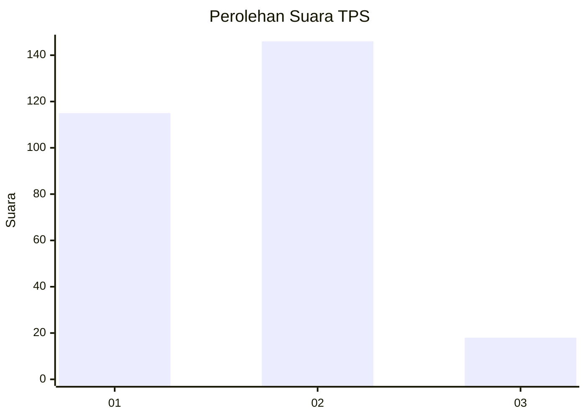

# Hasil

## Grafik

## Tabel

| No. | Nama Paslon    | Suara | Suara (raw) | Persentase |
|:--- |:-------------- | -----:| -----------:| ----------:|
| 1   | ANIES MUHAIMIN | 115   | [115][p-1]  | 41,22      |
| 2   | PRABOWO GIBRAN | 146   | [146][p-2]  | 52,33      |
| 3   | GANJAR MAHFUD  | 18    | [18][p-3]   | 6,45       |

[p-1]: https://github.com/gigit-pemilu/pemilu-2024-36-banten/blob/main/pilpres/hitung-suara/sub/36-banten/sub/04-serang/sub/05-kramatwatu/sub/2013-pelamunan/sub/001-tps/sub/paslon-1.txt
[p-2]: https://github.com/gigit-pemilu/pemilu-2024-36-banten/blob/main/pilpres/hitung-suara/sub/36-banten/sub/04-serang/sub/05-kramatwatu/sub/2013-pelamunan/sub/001-tps/sub/paslon-2.txt
[p-3]: https://github.com/gigit-pemilu/pemilu-2024-36-banten/blob/main/pilpres/hitung-suara/sub/36-banten/sub/04-serang/sub/05-kramatwatu/sub/2013-pelamunan/sub/001-tps/sub/paslon-3.txt

## Foto C Plano

https://sirekap-obj-formc.kpu.go.id/d79b/pemilu/ppwp/36/04/05/20/13/3604052013001-20240222-093328--35fbd918-93b6-4da8-a66d-9bb75db069e8.jpg

https://sirekap-obj-formc.kpu.go.id/d79b/pemilu/ppwp/36/04/05/20/13/3604052013001-20240222-092954--f4294c35-2589-4dbb-933d-479819a4e951.jpg

https://sirekap-obj-formc.kpu.go.id/d79b/pemilu/ppwp/36/04/05/20/13/3604052013001-20240222-093047--66ae5d0a-cdae-494e-87d3-278511682dca.jpg

## Metadata

| Key        | Value               |
| ---------- | ------------------- |
| Time Stamp | 2024-02-24 22:31:28 |

