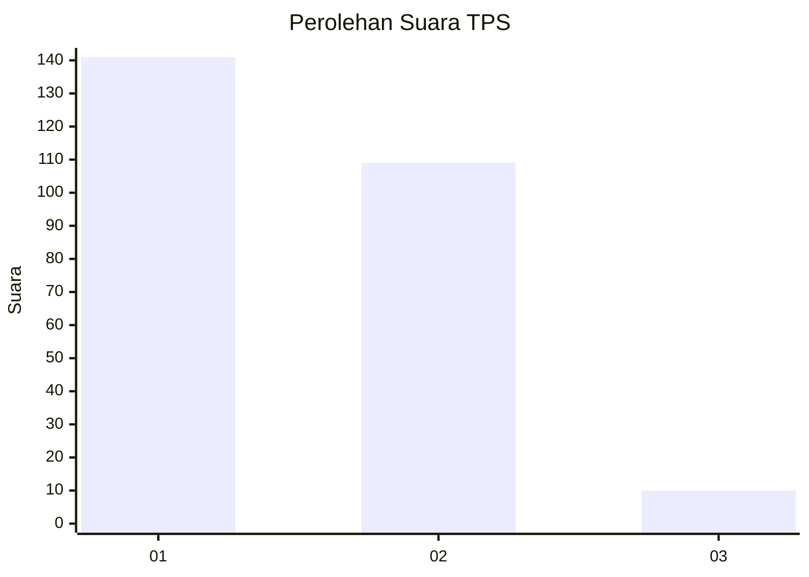
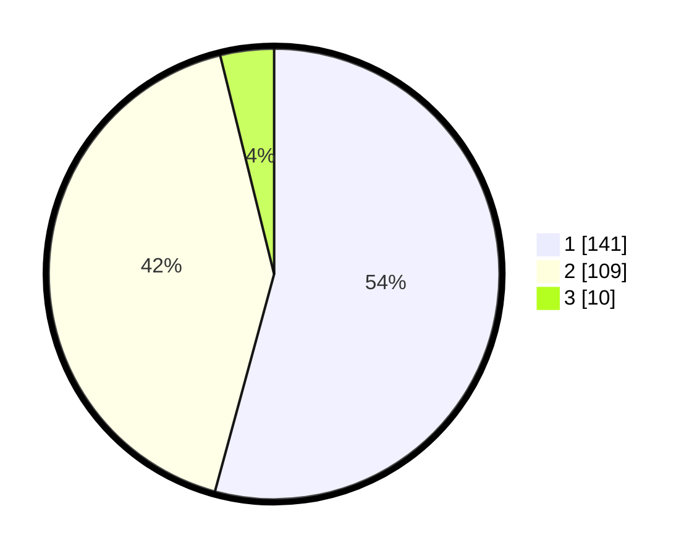

# Hasil

## Grafik

## Tabel

| No. | Nama Paslon    | Suara | Suara (raw) | Persentase |
|:--- |:-------------- | -----:| -----------:| ----------:|
| 1   | ANIES MUHAIMIN | 141   | [141][p-1]  | 54,23      |
| 2   | PRABOWO GIBRAN | 109   | [109][p-2]  | 41,92      |
| 3   | GANJAR MAHFUD  | 10    | [10][p-3]   | 3,85       |

[p-1]: https://github.com/gigit-pemilu/pemilu-2024-36-banten/blob/main/pilpres/hitung-suara/sub/36-banten/sub/04-serang/sub/06-waringinkurung/sub/2001-waringinkurung/sub/030-tps/sub/paslon-1.txt
[p-2]: https://github.com/gigit-pemilu/pemilu-2024-36-banten/blob/main/pilpres/hitung-suara/sub/36-banten/sub/04-serang/sub/06-waringinkurung/sub/2001-waringinkurung/sub/030-tps/sub/paslon-2.txt
[p-3]: https://github.com/gigit-pemilu/pemilu-2024-36-banten/blob/main/pilpres/hitung-suara/sub/36-banten/sub/04-serang/sub/06-waringinkurung/sub/2001-waringinkurung/sub/030-tps/sub/paslon-3.txt

## Foto C Plano

https://sirekap-obj-formc.kpu.go.id/6e1e/pemilu/ppwp/36/04/06/20/01/3604062001030-20240214-215003--7a932885-a919-402d-ba58-62acb1f2a99d.jpg

https://sirekap-obj-formc.kpu.go.id/6e1e/pemilu/ppwp/36/04/06/20/01/3604062001030-20240214-231125--cb15f9e7-fd63-4bc1-8b3e-d24507bedbf7.jpg

https://sirekap-obj-formc.kpu.go.id/6e1e/pemilu/ppwp/36/04/06/20/01/3604062001030-20240214-215135--3feb63ce-d084-440b-b264-e3080a9d2386.jpg

## Metadata

| Key        | Value               |
| ---------- | ------------------- |
| Time Stamp | 2024-02-16 10:00:28 |

