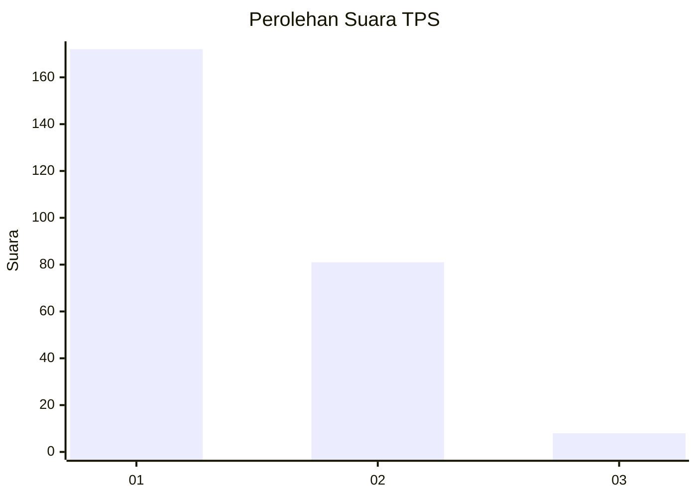
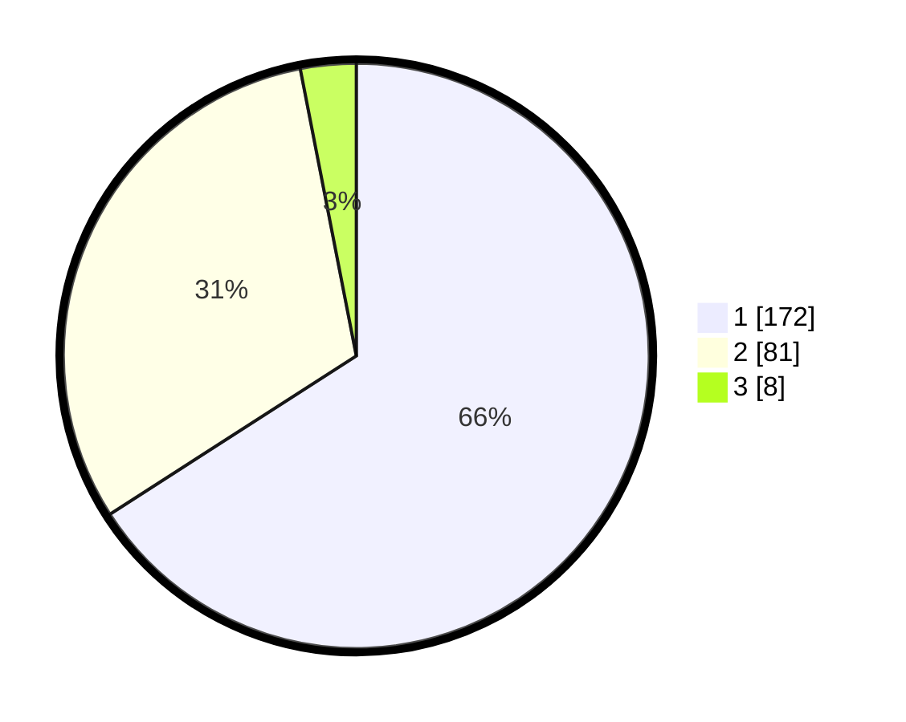

# Hasil

## Grafik

## Tabel

| No. | Nama Paslon    | Suara | Suara (raw) | Persentase |
|:--- |:-------------- | -----:| -----------:| ----------:|
| 1   | ANIES MUHAIMIN | 172   | [172][p-1]  | 65,90      |
| 2   | PRABOWO GIBRAN | 81    | [81][p-2]   | 31,03      |
| 3   | GANJAR MAHFUD  | 8     | [8][p-3]    | 3,07       |

[p-1]: https://github.com/gigit-pemilu/pemilu-2024-36-banten/blob/main/pilpres/hitung-suara/sub/36-banten/sub/04-serang/sub/07-bojonegara/sub/2007-margagiri/sub/007-tps/sub/paslon-1.txt
[p-2]: https://github.com/gigit-pemilu/pemilu-2024-36-banten/blob/main/pilpres/hitung-suara/sub/36-banten/sub/04-serang/sub/07-bojonegara/sub/2007-margagiri/sub/007-tps/sub/paslon-2.txt
[p-3]: https://github.com/gigit-pemilu/pemilu-2024-36-banten/blob/main/pilpres/hitung-suara/sub/36-banten/sub/04-serang/sub/07-bojonegara/sub/2007-margagiri/sub/007-tps/sub/paslon-3.txt

## Foto C Plano

https://sirekap-obj-formc.kpu.go.id/758b/pemilu/ppwp/36/04/07/20/07/3604072007007-20240214-213639--35c0c0be-a983-4307-8edf-90ff9827d1b2.jpg

https://sirekap-obj-formc.kpu.go.id/758b/pemilu/ppwp/36/04/07/20/07/3604072007007-20240214-191333--3aabf32a-407c-4a49-a01a-ba6526c57b2a.jpg

https://sirekap-obj-formc.kpu.go.id/758b/pemilu/ppwp/36/04/07/20/07/3604072007007-20240214-191414--aa7f36ce-9a6e-4d4b-9971-466acdc5b791.jpg

## Metadata

| Key        | Value               |
| ---------- | ------------------- |
| Time Stamp | 2024-02-15 07:00:44 |

