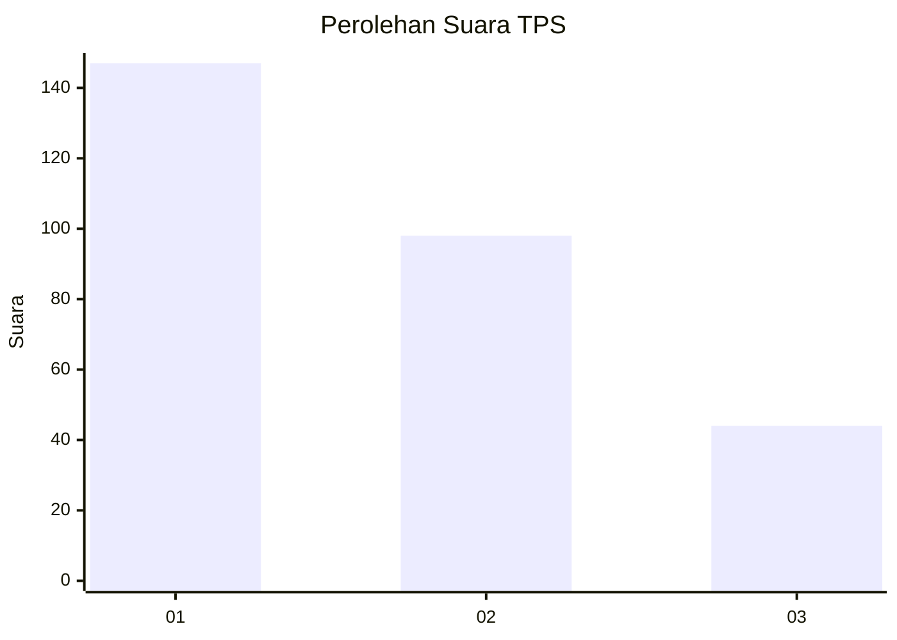
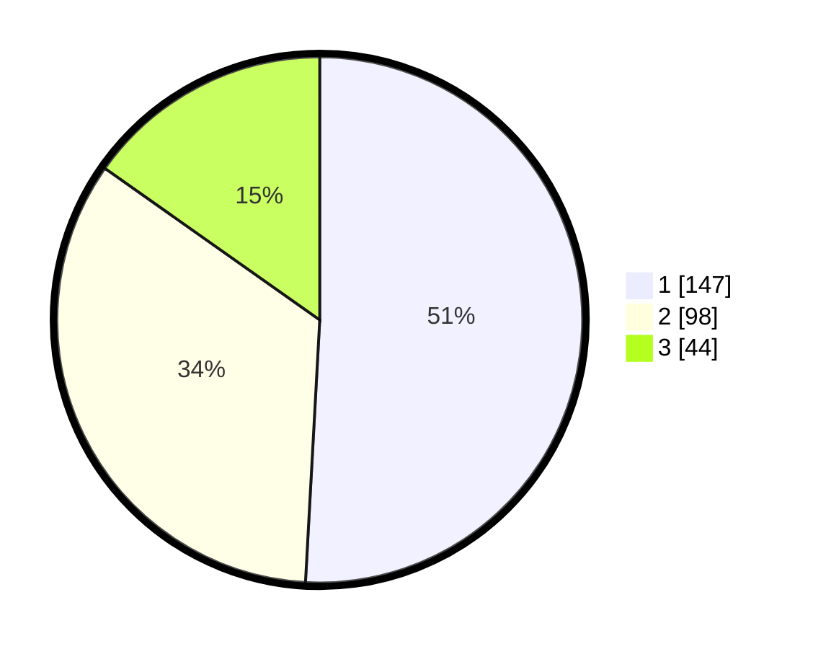

# Hasil

## Grafik

## Tabel

| No. | Nama Paslon    | Suara | Suara (raw) | Persentase |
|:--- |:-------------- | -----:| -----------:| ----------:|
| 1   | ANIES MUHAIMIN | 147   | [147][p-1]  | 50,87      |
| 2   | PRABOWO GIBRAN | 98    | [98][p-2]   | 33,91      |
| 3   | GANJAR MAHFUD  | 44    | [44][p-3]   | 15,22      |

[p-1]: https://github.com/gigit-pemilu/pemilu-2024-36-banten/blob/main/pilpres/hitung-suara/sub/36-banten/sub/04-serang/sub/07-bojonegara/sub/2007-margagiri/sub/011-tps/sub/paslon-1.txt
[p-2]: https://github.com/gigit-pemilu/pemilu-2024-36-banten/blob/main/pilpres/hitung-suara/sub/36-banten/sub/04-serang/sub/07-bojonegara/sub/2007-margagiri/sub/011-tps/sub/paslon-2.txt
[p-3]: https://github.com/gigit-pemilu/pemilu-2024-36-banten/blob/main/pilpres/hitung-suara/sub/36-banten/sub/04-serang/sub/07-bojonegara/sub/2007-margagiri/sub/011-tps/sub/paslon-3.txt

## Foto C Plano

https://sirekap-obj-formc.kpu.go.id/557d/pemilu/ppwp/36/04/07/20/07/3604072007011-20240224-131442--30c697fa-ef44-443b-87b9-6a586890c1f7.jpg

https://sirekap-obj-formc.kpu.go.id/557d/pemilu/ppwp/36/04/07/20/07/3604072007011-20240224-122512--5c280e28-0610-4dd2-92c8-7a652ef2d5ef.jpg

https://sirekap-obj-formc.kpu.go.id/557d/pemilu/ppwp/36/04/07/20/07/3604072007011-20240224-122753--c7374578-90e9-439f-a343-d952a9797b29.jpg

## Metadata

| Key        | Value               |
| ---------- | ------------------- |
| Time Stamp | 2024-02-24 22:31:28 |

