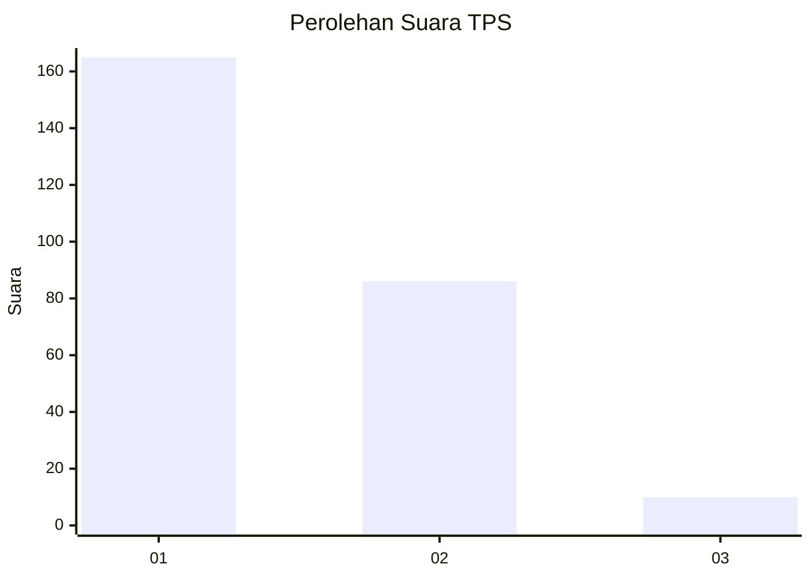
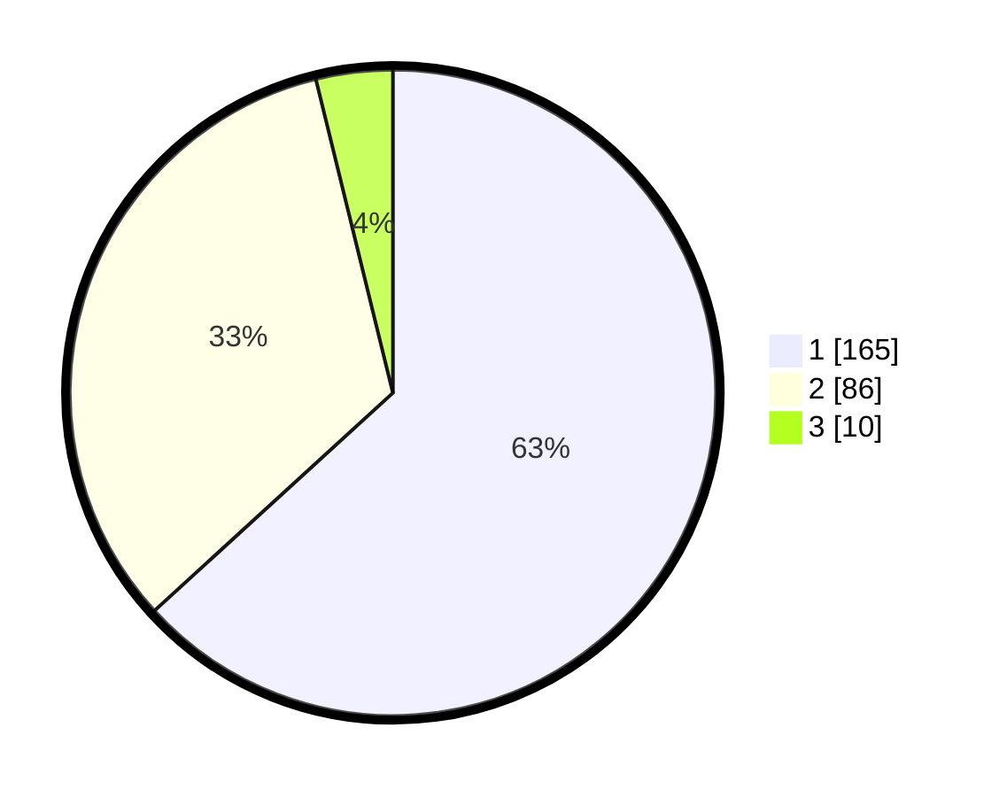

# Hasil

## Grafik

## Tabel

| No. | Nama Paslon    | Suara | Suara (raw) | Persentase |
|:--- |:-------------- | -----:| -----------:| ----------:|
| 1   | ANIES MUHAIMIN | 165   | [165][p-1]  | 63,22      |
| 2   | PRABOWO GIBRAN | 86    | [86][p-2]   | 32,95      |
| 3   | GANJAR MAHFUD  | 10    | [10][p-3]   | 3,83       |

[p-1]: https://github.com/gigit-pemilu/pemilu-2024/blob/main/pilpres/hitung-suara/sub/36-banten/sub/04-serang/sub/07-bojonegara/sub/2007-margagiri/sub/012-tps/sub/paslon-1.txt
[p-2]: https://github.com/gigit-pemilu/pemilu-2024/blob/main/pilpres/hitung-suara/sub/36-banten/sub/04-serang/sub/07-bojonegara/sub/2007-margagiri/sub/012-tps/sub/paslon-2.txt
[p-3]: https://github.com/gigit-pemilu/pemilu-2024/blob/main/pilpres/hitung-suara/sub/36-banten/sub/04-serang/sub/07-bojonegara/sub/2007-margagiri/sub/012-tps/sub/paslon-3.txt

## Foto C Plano

https://sirekap-obj-formc.kpu.go.id/9bfd/pemilu/ppwp/36/04/07/20/07/3604072007012-20240215-150848--a2b2012b-c599-472f-8de2-a6b5f87a4da0.jpg

https://sirekap-obj-formc.kpu.go.id/9bfd/pemilu/ppwp/36/04/07/20/07/3604072007012-20240215-052100--f1b8f582-f208-46c7-b1a2-73f793f528f6.jpg

https://sirekap-obj-formc.kpu.go.id/9bfd/pemilu/ppwp/36/04/07/20/07/3604072007012-20240215-052846--afab44b7-dc44-42d8-90e3-f0ed0ff2dfd9.jpg

## Metadata

| Key        | Value               |
| ---------- | ------------------- |
| Time Stamp | 2024-02-17 08:00:02 |

