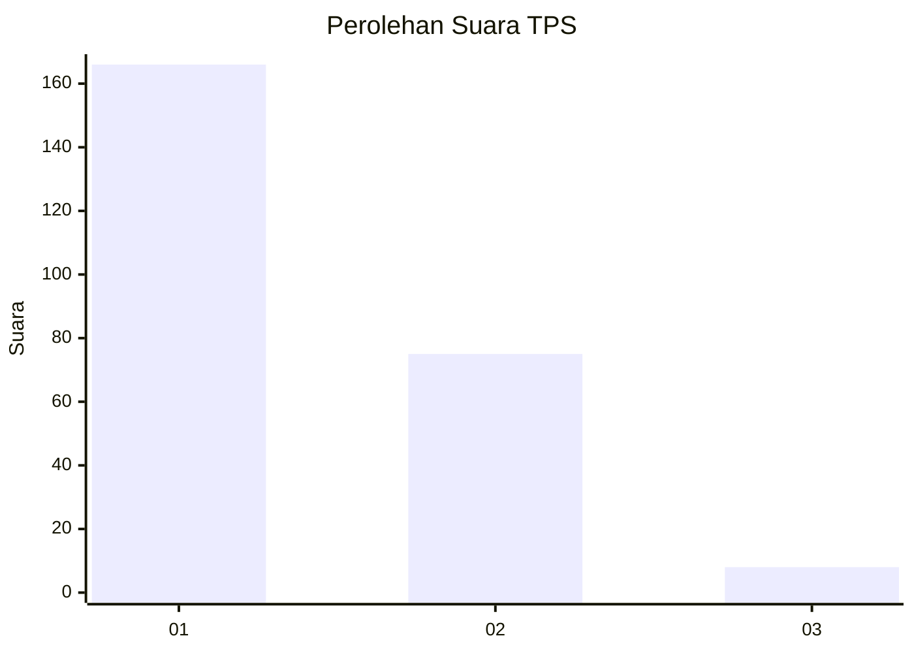
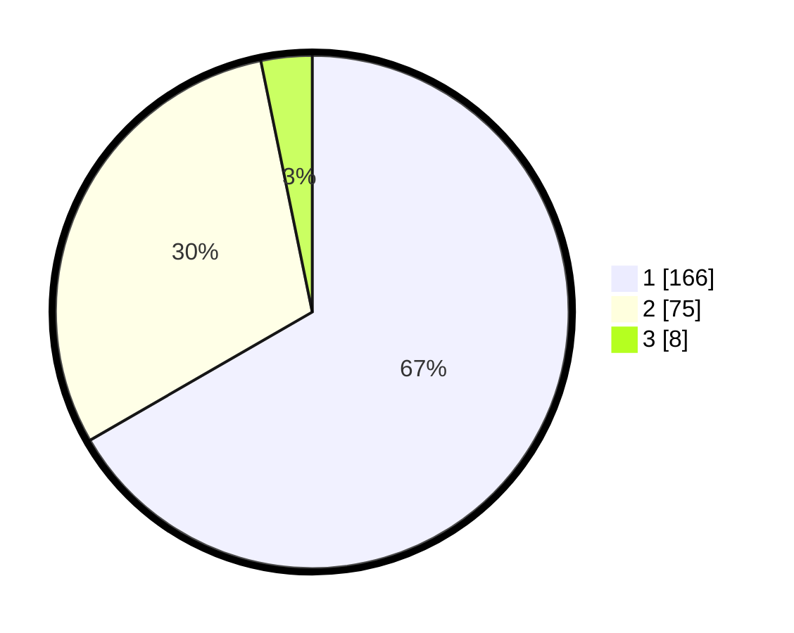

# Hasil

## Grafik

## Tabel

| No. | Nama Paslon    | Suara | Suara (raw) | Persentase |
|:--- |:-------------- | -----:| -----------:| ----------:|
| 1   | ANIES MUHAIMIN | 166   | [166][p-1]  | 66,67      |
| 2   | PRABOWO GIBRAN | 75    | [75][p-2]   | 30,12      |
| 3   | GANJAR MAHFUD  | 8     | [8][p-3]    | 3,21       |

[p-1]: https://github.com/gigit-pemilu/pemilu-2024/blob/main/pilpres/hitung-suara/sub/36-banten/sub/04-serang/sub/07-bojonegara/sub/2008-ukirsari/sub/001-tps/sub/paslon-1.txt
[p-2]: https://github.com/gigit-pemilu/pemilu-2024/blob/main/pilpres/hitung-suara/sub/36-banten/sub/04-serang/sub/07-bojonegara/sub/2008-ukirsari/sub/001-tps/sub/paslon-2.txt
[p-3]: https://github.com/gigit-pemilu/pemilu-2024/blob/main/pilpres/hitung-suara/sub/36-banten/sub/04-serang/sub/07-bojonegara/sub/2008-ukirsari/sub/001-tps/sub/paslon-3.txt

## Foto C Plano

https://sirekap-obj-formc.kpu.go.id/b804/pemilu/ppwp/36/04/07/20/08/3604072008001-20240215-090402--0e28f769-4b01-4158-bfb8-9d14f1ac0e31.jpg

https://sirekap-obj-formc.kpu.go.id/b804/pemilu/ppwp/36/04/07/20/08/3604072008001-20240215-073748--9f140329-a79e-437b-83bb-752a6b07b5b7.jpg

https://sirekap-obj-formc.kpu.go.id/b804/pemilu/ppwp/36/04/07/20/08/3604072008001-20240215-090859--7f74daea-228d-499a-a81d-cd5be7428cd5.jpg

## Metadata

| Key        | Value               |
| ---------- | ------------------- |
| Time Stamp | 2024-02-16 10:00:28 |

