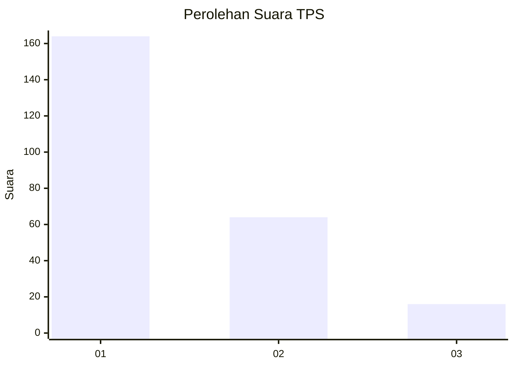
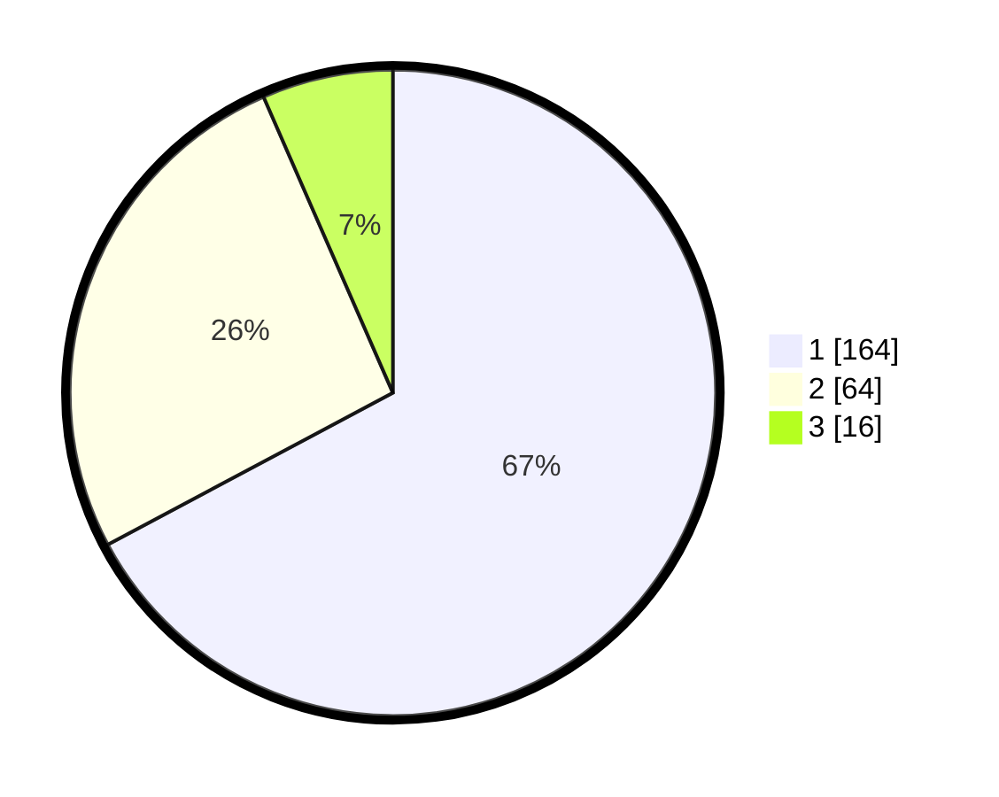

# Hasil

## Grafik

## Tabel

| No. | Nama Paslon    | Suara | Suara (raw) | Persentase |
|:--- |:-------------- | -----:| -----------:| ----------:|
| 1   | ANIES MUHAIMIN | 164   | [164][p-1]  | 67,21      |
| 2   | PRABOWO GIBRAN | 64    | [64][p-2]   | 26,23      |
| 3   | GANJAR MAHFUD  | 16    | [16][p-3]   | 6,56       |

[p-1]: https://github.com/gigit-pemilu/pemilu-2024/blob/main/pilpres/hitung-suara/sub/36-banten/sub/04-serang/sub/08-pulo-ampel/sub/2008-margasari/sub/005-tps/sub/paslon-1.txt
[p-2]: https://github.com/gigit-pemilu/pemilu-2024/blob/main/pilpres/hitung-suara/sub/36-banten/sub/04-serang/sub/08-pulo-ampel/sub/2008-margasari/sub/005-tps/sub/paslon-2.txt
[p-3]: https://github.com/gigit-pemilu/pemilu-2024/blob/main/pilpres/hitung-suara/sub/36-banten/sub/04-serang/sub/08-pulo-ampel/sub/2008-margasari/sub/005-tps/sub/paslon-3.txt

## Foto C Plano

https://sirekap-obj-formc.kpu.go.id/795e/pemilu/ppwp/36/04/08/20/08/3604082008005-20240215-015359--cc6e0d81-1434-4f80-8cc4-c764ddba3986.jpg

https://sirekap-obj-formc.kpu.go.id/795e/pemilu/ppwp/36/04/08/20/08/3604082008005-20240215-015300--85ef2d37-b7c2-4c0d-8ab0-58ad8b95a791.jpg

https://sirekap-obj-formc.kpu.go.id/795e/pemilu/ppwp/36/04/08/20/08/3604082008005-20240215-015446--e95ac7f1-0af9-46af-809f-745e9a68174f.jpg

## Metadata

| Key        | Value               |
| ---------- | ------------------- |
| Time Stamp | 2024-02-16 10:00:28 |

