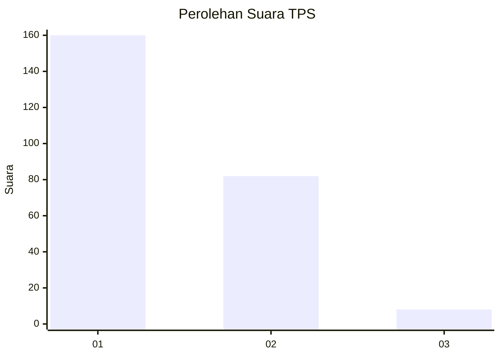
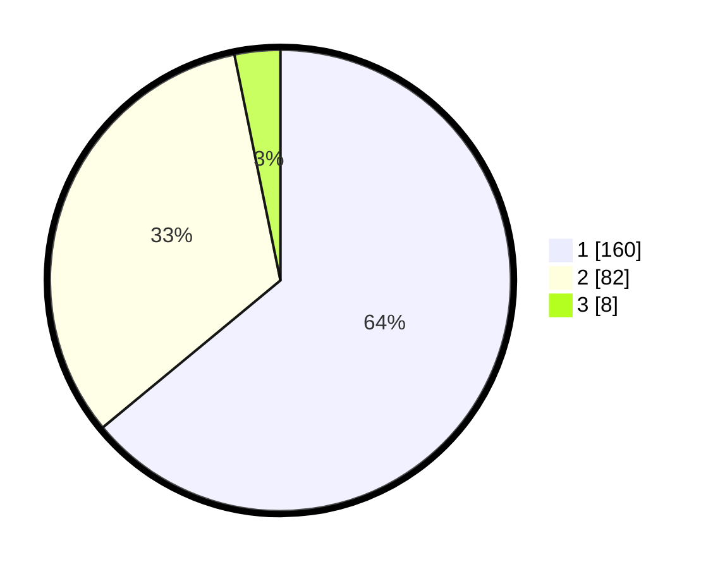

# Hasil

## Grafik

## Tabel

| No. | Nama Paslon    | Suara | Suara (raw) | Persentase |
|:--- |:-------------- | -----:| -----------:| ----------:|
| 1   | ANIES MUHAIMIN | 160   | [160][p-1]  | 64,00      |
| 2   | PRABOWO GIBRAN | 82    | [82][p-2]   | 32,80      |
| 3   | GANJAR MAHFUD  | 8     | [8][p-3]    | 3,20       |

[p-1]: https://github.com/gigit-pemilu/pemilu-2024-36-banten/blob/main/pilpres/hitung-suara/sub/36-banten/sub/04-serang/sub/08-pulo-ampel/sub/2008-margasari/sub/006-tps/sub/paslon-1.txt
[p-2]: https://github.com/gigit-pemilu/pemilu-2024-36-banten/blob/main/pilpres/hitung-suara/sub/36-banten/sub/04-serang/sub/08-pulo-ampel/sub/2008-margasari/sub/006-tps/sub/paslon-2.txt
[p-3]: https://github.com/gigit-pemilu/pemilu-2024-36-banten/blob/main/pilpres/hitung-suara/sub/36-banten/sub/04-serang/sub/08-pulo-ampel/sub/2008-margasari/sub/006-tps/sub/paslon-3.txt

## Foto C Plano

https://sirekap-obj-formc.kpu.go.id/6aec/pemilu/ppwp/36/04/08/20/08/3604082008006-20240215-022843--83edb6b3-3cb1-47e7-a1a6-f48d43c5a2ac.jpg

https://sirekap-obj-formc.kpu.go.id/6aec/pemilu/ppwp/36/04/08/20/08/3604082008006-20240215-022707--79e39bad-cca3-4d5f-be74-bab76c8d801e.jpg

https://sirekap-obj-formc.kpu.go.id/6aec/pemilu/ppwp/36/04/08/20/08/3604082008006-20240215-022832--8f1538de-b009-4122-b710-7a4e01fdb97d.jpg

## Metadata

| Key        | Value               |
| ---------- | ------------------- |
| Time Stamp | 2024-02-16 10:00:28 |

