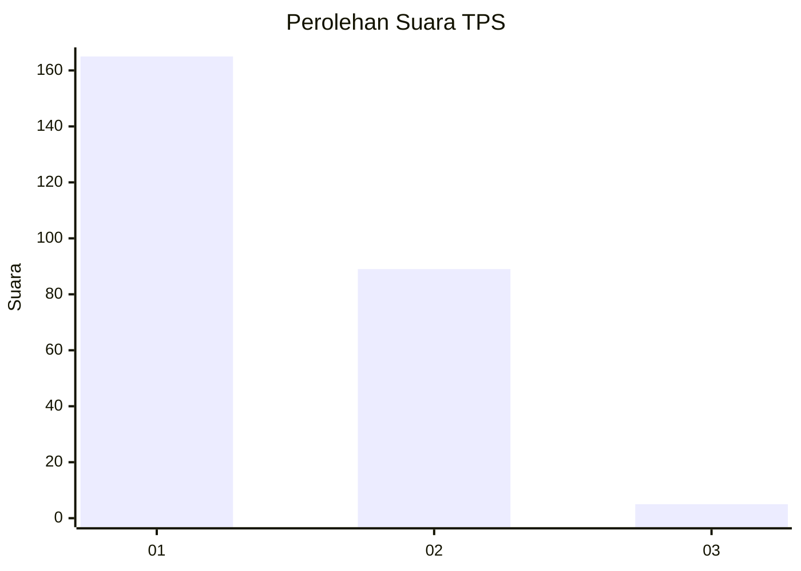
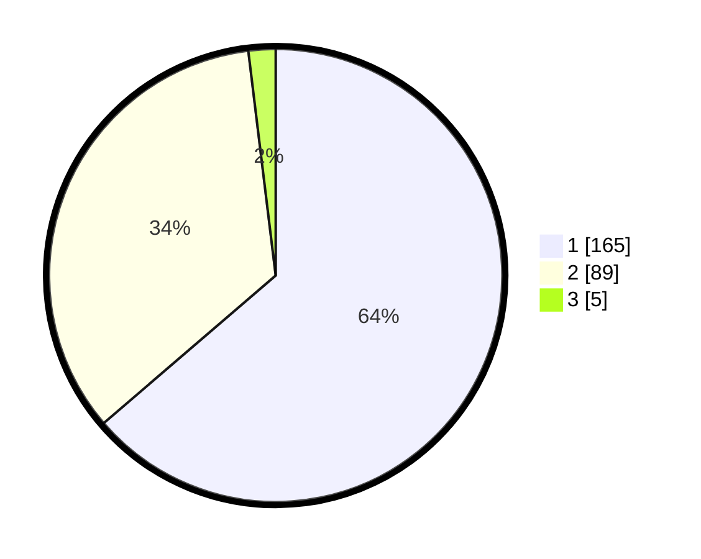

# Hasil

## Grafik

## Tabel

| No. | Nama Paslon    | Suara | Suara (raw) | Persentase |
|:--- |:-------------- | -----:| -----------:| ----------:|
| 1   | ANIES MUHAIMIN | 165   | [165][p-1]  | 63,71      |
| 2   | PRABOWO GIBRAN | 89    | [89][p-2]   | 34,36      |
| 3   | GANJAR MAHFUD  | 5     | [5][p-3]    | 1,93       |

[p-1]: https://github.com/gigit-pemilu/pemilu-2024-36-banten/blob/main/pilpres/hitung-suara/sub/36-banten/sub/04-serang/sub/08-pulo-ampel/sub/2008-margasari/sub/010-tps/sub/paslon-1.txt
[p-2]: https://github.com/gigit-pemilu/pemilu-2024-36-banten/blob/main/pilpres/hitung-suara/sub/36-banten/sub/04-serang/sub/08-pulo-ampel/sub/2008-margasari/sub/010-tps/sub/paslon-2.txt
[p-3]: https://github.com/gigit-pemilu/pemilu-2024-36-banten/blob/main/pilpres/hitung-suara/sub/36-banten/sub/04-serang/sub/08-pulo-ampel/sub/2008-margasari/sub/010-tps/sub/paslon-3.txt

## Foto C Plano

https://sirekap-obj-formc.kpu.go.id/183e/pemilu/ppwp/36/04/08/20/08/3604082008010-20240215-053830--16cb2388-a3a6-40b3-9f3b-02bc5789739c.jpg

https://sirekap-obj-formc.kpu.go.id/183e/pemilu/ppwp/36/04/08/20/08/3604082008010-20240215-054256--e1a42b4e-2378-4863-9a86-0b9c511168e0.jpg

https://sirekap-obj-formc.kpu.go.id/183e/pemilu/ppwp/36/04/08/20/08/3604082008010-20240215-055542--f485935d-0881-4bc9-bafb-eb220fec6208.jpg

## Metadata

| Key        | Value               |
| ---------- | ------------------- |
| Time Stamp | 2024-02-16 10:00:28 |

