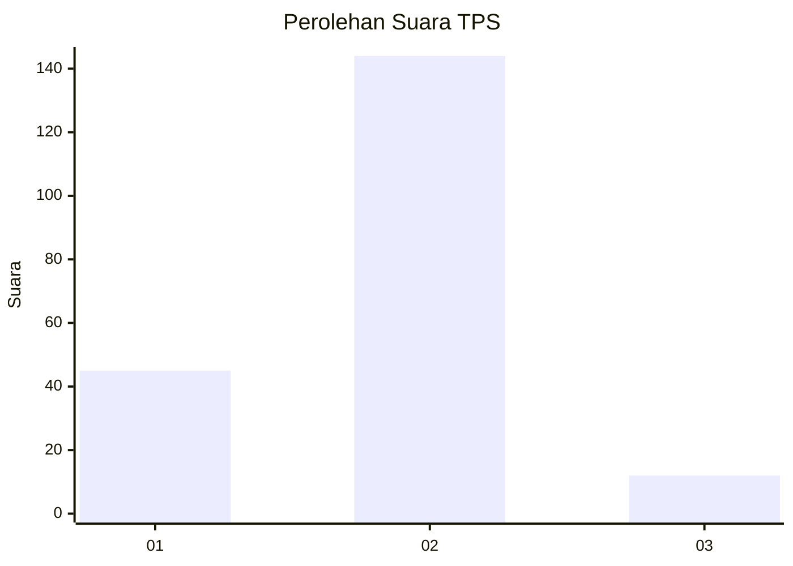

# Hasil

## Grafik

## Tabel

| No. | Nama Paslon    | Suara | Suara (raw) | Persentase |
|:--- |:-------------- | -----:| -----------:| ----------:|
| 1   | ANIES MUHAIMIN | 45    | [45][p-1]   | 22,39      |
| 2   | PRABOWO GIBRAN | 144   | [144][p-2]  | 71,64      |
| 3   | GANJAR MAHFUD  | 12    | [12][p-3]   | 5,97       |

[p-1]: https://github.com/gigit-pemilu/pemilu-2024-36-banten/blob/main/pilpres/hitung-suara/sub/36-banten/sub/04-serang/sub/09-ciruas/sub/2001-ciruas/sub/001-tps/sub/paslon-1.txt
[p-2]: https://github.com/gigit-pemilu/pemilu-2024-36-banten/blob/main/pilpres/hitung-suara/sub/36-banten/sub/04-serang/sub/09-ciruas/sub/2001-ciruas/sub/001-tps/sub/paslon-2.txt
[p-3]: https://github.com/gigit-pemilu/pemilu-2024-36-banten/blob/main/pilpres/hitung-suara/sub/36-banten/sub/04-serang/sub/09-ciruas/sub/2001-ciruas/sub/001-tps/sub/paslon-3.txt

## Foto C Plano

https://sirekap-obj-formc.kpu.go.id/d7df/pemilu/ppwp/36/04/09/20/01/3604092001001-20240219-200921--a70c2802-c96e-4546-8d87-2e6cf51a5d77.jpg

https://sirekap-obj-formc.kpu.go.id/d7df/pemilu/ppwp/36/04/09/20/01/3604092001001-20240219-200738--07e2f73b-212e-416a-a1a0-28327e059629.jpg

https://sirekap-obj-formc.kpu.go.id/d7df/pemilu/ppwp/36/04/09/20/01/3604092001001-20240215-003823--ef3b255d-1f9a-499b-8f89-292cd41b29a2.jpg

## Metadata

| Key        | Value               |
| ---------- | ------------------- |
| Time Stamp | 2024-02-24 22:31:28 |

