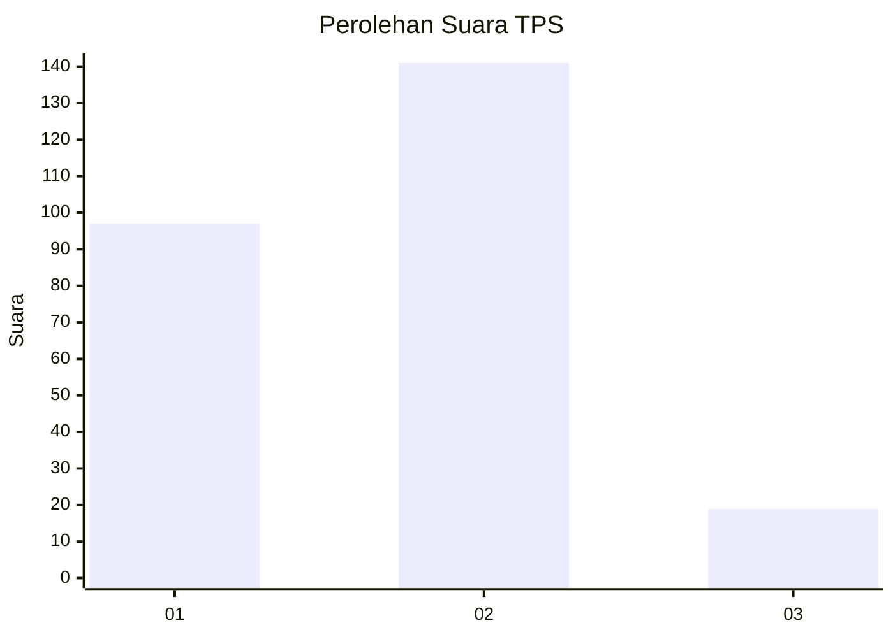
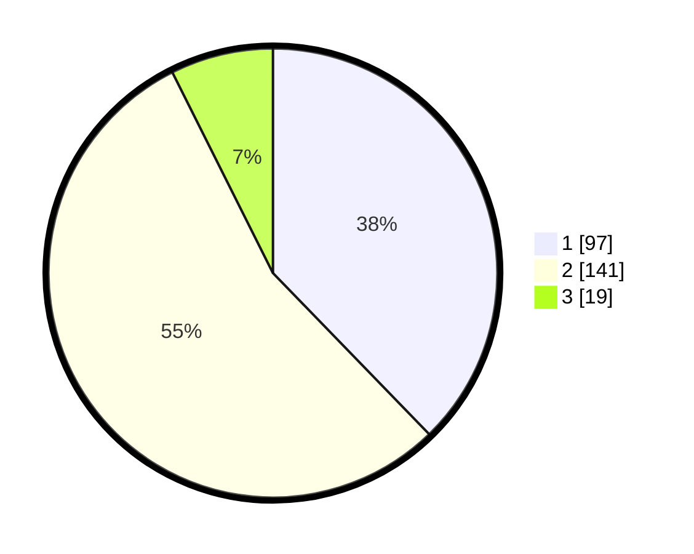

# Hasil

## Grafik

## Tabel

| No. | Nama Paslon    | Suara | Suara (raw) | Persentase |
|:--- |:-------------- | -----:| -----------:| ----------:|
| 1   | ANIES MUHAIMIN | 97    | [97][p-1]   | 37,74      |
| 2   | PRABOWO GIBRAN | 141   | [141][p-2]  | 54,86      |
| 3   | GANJAR MAHFUD  | 19    | [19][p-3]   | 7,39       |

[p-1]: https://github.com/gigit-pemilu/pemilu-2024/blob/main/pilpres/hitung-suara/sub/36-banten/sub/04-serang/sub/11-kragilan/sub/2001-kragilan/sub/001-tps/sub/paslon-1.txt
[p-2]: https://github.com/gigit-pemilu/pemilu-2024/blob/main/pilpres/hitung-suara/sub/36-banten/sub/04-serang/sub/11-kragilan/sub/2001-kragilan/sub/001-tps/sub/paslon-2.txt
[p-3]: https://github.com/gigit-pemilu/pemilu-2024/blob/main/pilpres/hitung-suara/sub/36-banten/sub/04-serang/sub/11-kragilan/sub/2001-kragilan/sub/001-tps/sub/paslon-3.txt

## Foto C Plano

https://sirekap-obj-formc.kpu.go.id/437c/pemilu/ppwp/36/04/11/20/01/3604112001001-20240215-025042--74eddc7f-e6fc-45c6-90db-1ae83ff98716.jpg

https://sirekap-obj-formc.kpu.go.id/437c/pemilu/ppwp/36/04/11/20/01/3604112001001-20240215-025109--17f5afe8-f0e0-41b5-88e2-1334705207be.jpg

https://sirekap-obj-formc.kpu.go.id/437c/pemilu/ppwp/36/04/11/20/01/3604112001001-20240215-025216--840a08e7-6e54-42ac-87c2-570ebb8e6098.jpg

## Metadata

| Key        | Value               |
| ---------- | ------------------- |
| Time Stamp | 2024-02-15 20:00:44 |

