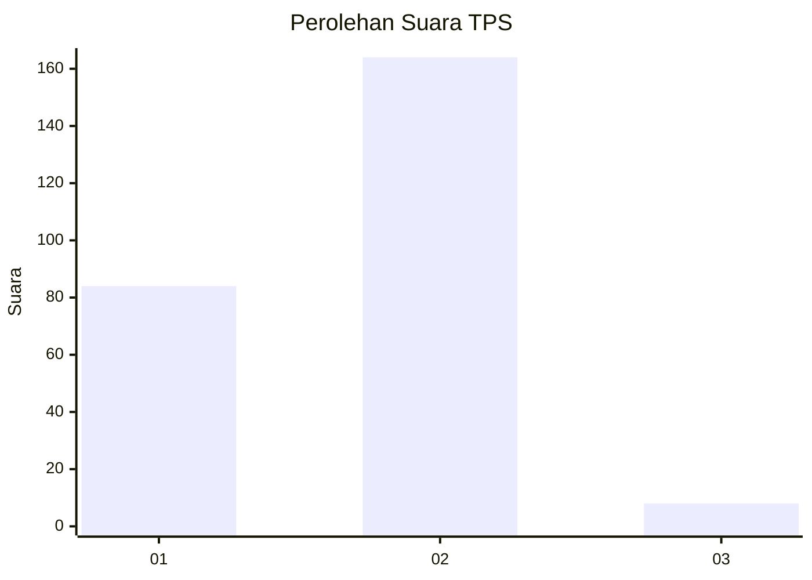
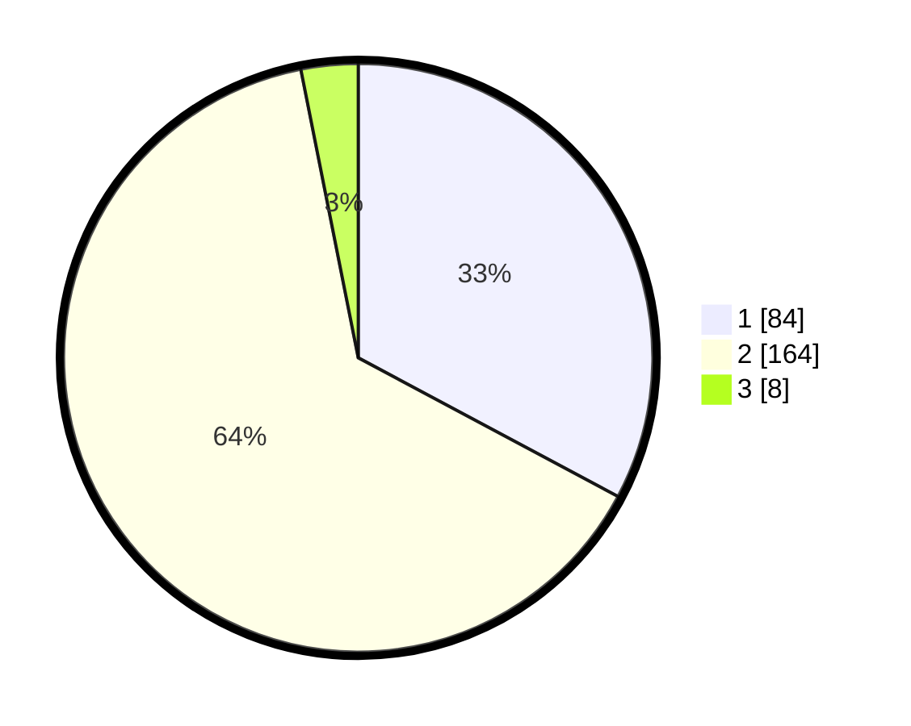

# Hasil

## Grafik

## Tabel

| No. | Nama Paslon    | Suara | Suara (raw) | Persentase |
|:--- |:-------------- | -----:| -----------:| ----------:|
| 1   | ANIES MUHAIMIN | 84    | [84][p-1]   | 32,81      |
| 2   | PRABOWO GIBRAN | 164   | [164][p-2]  | 64,06      |
| 3   | GANJAR MAHFUD  | 8     | [8][p-3]    | 3,13       |

[p-1]: https://github.com/gigit-pemilu/pemilu-2024/blob/main/pilpres/hitung-suara/sub/36-banten/sub/04-serang/sub/11-kragilan/sub/2001-kragilan/sub/002-tps/sub/paslon-1.txt
[p-2]: https://github.com/gigit-pemilu/pemilu-2024/blob/main/pilpres/hitung-suara/sub/36-banten/sub/04-serang/sub/11-kragilan/sub/2001-kragilan/sub/002-tps/sub/paslon-2.txt
[p-3]: https://github.com/gigit-pemilu/pemilu-2024/blob/main/pilpres/hitung-suara/sub/36-banten/sub/04-serang/sub/11-kragilan/sub/2001-kragilan/sub/002-tps/sub/paslon-3.txt

## Foto C Plano

https://sirekap-obj-formc.kpu.go.id/9500/pemilu/ppwp/36/04/11/20/01/3604112001002-20240225-143419--76e65ba7-1c9e-4b2d-aaa6-e32517aa0a3c.jpg

https://sirekap-obj-formc.kpu.go.id/9500/pemilu/ppwp/36/04/11/20/01/3604112001002-20240225-143436--2e132264-7459-42b7-a408-d78909c9ec9c.jpg

https://sirekap-obj-formc.kpu.go.id/9500/pemilu/ppwp/36/04/11/20/01/3604112001002-20240225-143452--450b2d6d-8f32-4415-9561-47cbacf38d6a.jpg

## Metadata

| Key        | Value               |
| ---------- | ------------------- |
| Time Stamp | 2024-02-26 12:00:00 |

