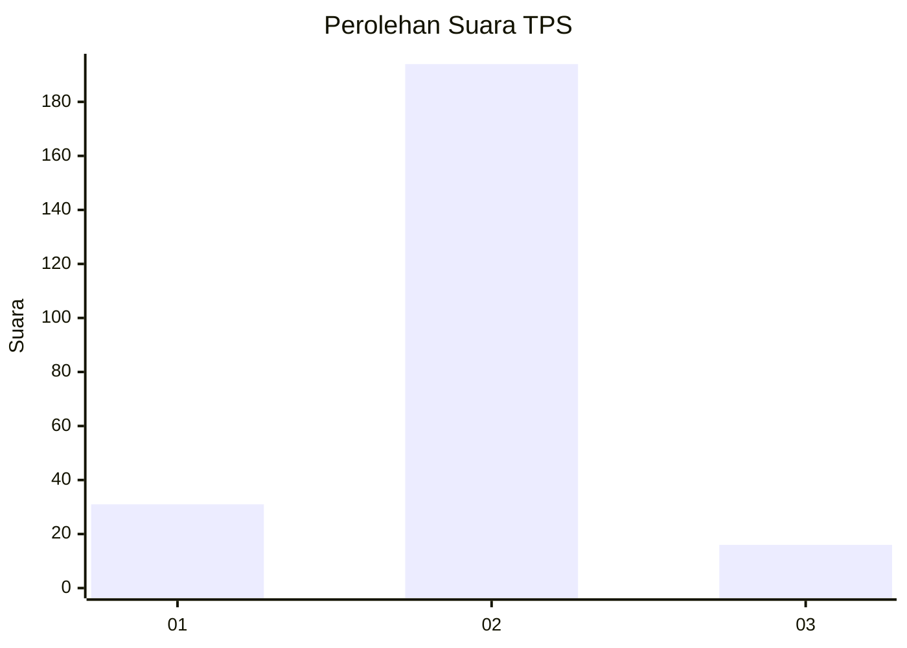
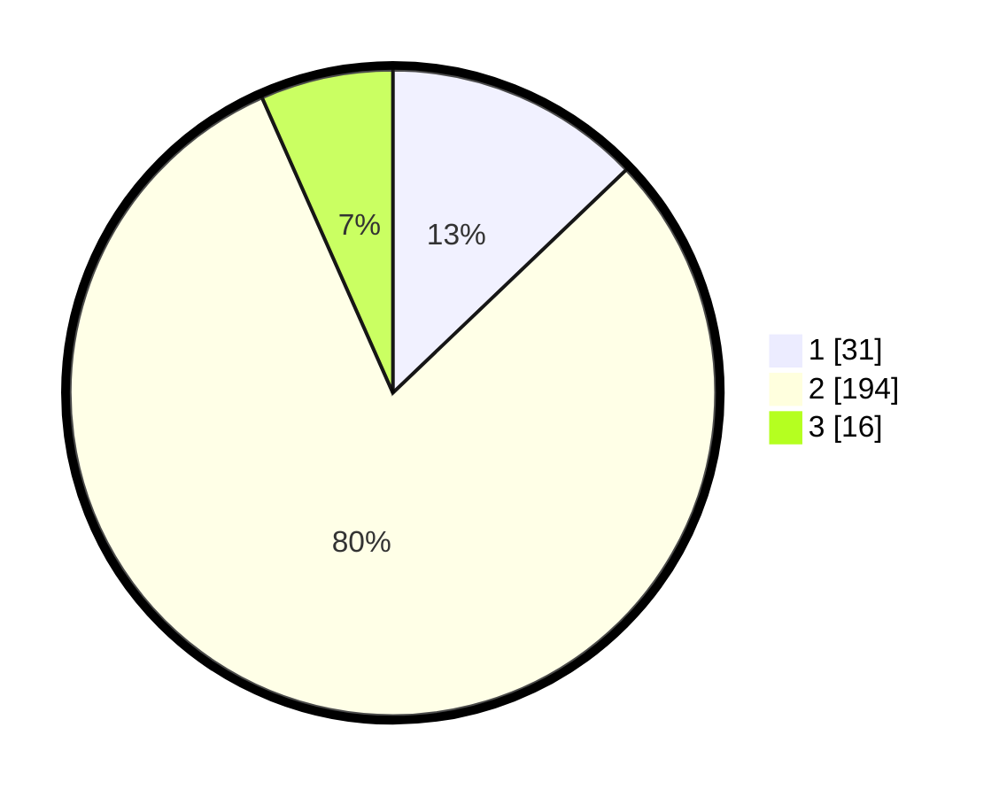

# Hasil

## Grafik

## Tabel

| No. | Nama Paslon    | Suara | Suara (raw) | Persentase |
|:--- |:-------------- | -----:| -----------:| ----------:|
| 1   | ANIES MUHAIMIN | 31    | [31][p-1]   | 12,86      |
| 2   | PRABOWO GIBRAN | 194   | [194][p-2]  | 80,50      |
| 3   | GANJAR MAHFUD  | 16    | [16][p-3]   | 6,64       |

[p-1]: https://github.com/gigit-pemilu/pemilu-2024/blob/main/pilpres/hitung-suara/sub/36-banten/sub/04-serang/sub/11-kragilan/sub/2001-kragilan/sub/003-tps/sub/paslon-1.txt
[p-2]: https://github.com/gigit-pemilu/pemilu-2024/blob/main/pilpres/hitung-suara/sub/36-banten/sub/04-serang/sub/11-kragilan/sub/2001-kragilan/sub/003-tps/sub/paslon-2.txt
[p-3]: https://github.com/gigit-pemilu/pemilu-2024/blob/main/pilpres/hitung-suara/sub/36-banten/sub/04-serang/sub/11-kragilan/sub/2001-kragilan/sub/003-tps/sub/paslon-3.txt

## Foto C Plano

https://sirekap-obj-formc.kpu.go.id/2f5b/pemilu/ppwp/36/04/11/20/01/3604112001003-20240223-172340--62f47dd0-cdb1-46e8-b531-590bc76858ff.jpg

https://sirekap-obj-formc.kpu.go.id/2f5b/pemilu/ppwp/36/04/11/20/01/3604112001003-20240223-172410--da82c375-ae58-4b69-a19c-ef8ca503da58.jpg

https://sirekap-obj-formc.kpu.go.id/2f5b/pemilu/ppwp/36/04/11/20/01/3604112001003-20240223-172449--54e772a8-edba-4a6d-99de-29a425edc177.jpg

## Metadata

| Key        | Value               |
| ---------- | ------------------- |
| Time Stamp | 2024-02-24 22:31:28 |

