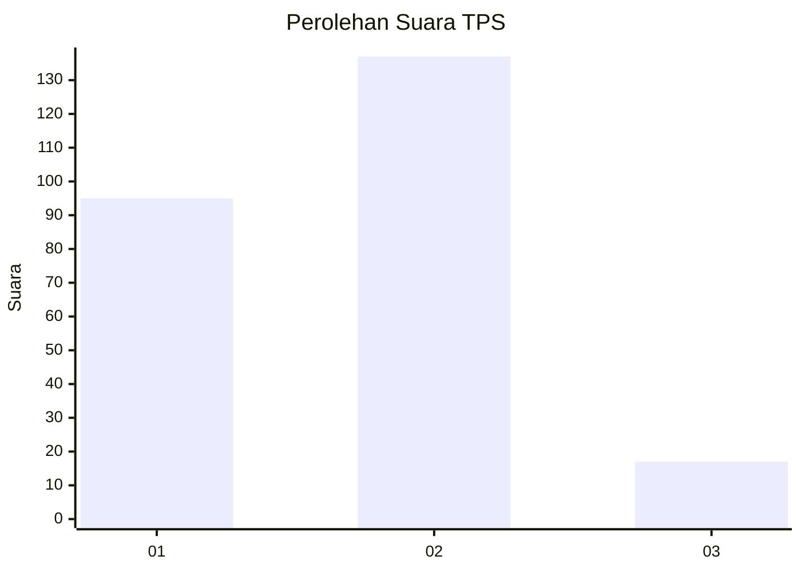

# Hasil

## Grafik

## Tabel

| No. | Nama Paslon    | Suara | Suara (raw) | Persentase |
|:--- |:-------------- | -----:| -----------:| ----------:|
| 1   | ANIES MUHAIMIN | 95    | [95][p-1]   | 38,15      |
| 2   | PRABOWO GIBRAN | 137   | [137][p-2]  | 55,02      |
| 3   | GANJAR MAHFUD  | 17    | [17][p-3]   | 6,83       |

[p-1]: https://github.com/gigit-pemilu/pemilu-2024/blob/main/pilpres/hitung-suara/sub/36-banten/sub/04-serang/sub/11-kragilan/sub/2001-kragilan/sub/005-tps/sub/paslon-1.txt
[p-2]: https://github.com/gigit-pemilu/pemilu-2024/blob/main/pilpres/hitung-suara/sub/36-banten/sub/04-serang/sub/11-kragilan/sub/2001-kragilan/sub/005-tps/sub/paslon-2.txt
[p-3]: https://github.com/gigit-pemilu/pemilu-2024/blob/main/pilpres/hitung-suara/sub/36-banten/sub/04-serang/sub/11-kragilan/sub/2001-kragilan/sub/005-tps/sub/paslon-3.txt

## Foto C Plano

https://sirekap-obj-formc.kpu.go.id/63a5/pemilu/ppwp/36/04/11/20/01/3604112001005-20240225-161630--482a2086-4324-4b8a-ae97-34547c37a94e.jpg

https://sirekap-obj-formc.kpu.go.id/63a5/pemilu/ppwp/36/04/11/20/01/3604112001005-20240225-161649--42d97c81-9dc4-49ba-98ae-7781e10ad34c.jpg

https://sirekap-obj-formc.kpu.go.id/63a5/pemilu/ppwp/36/04/11/20/01/3604112001005-20240225-161708--d79320d1-9433-4585-ac8f-53732e49c48b.jpg

## Metadata

| Key        | Value               |
| ---------- | ------------------- |
| Time Stamp | 2024-03-02 22:00:00 |

