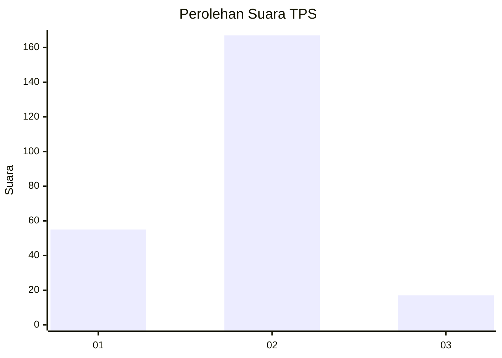

# Hasil

## Grafik

## Tabel

| No. | Nama Paslon    | Suara | Suara (raw) | Persentase |
|:--- |:-------------- | -----:| -----------:| ----------:|
| 1   | ANIES MUHAIMIN | 55    | [55][p-1]   | 23,01      |
| 2   | PRABOWO GIBRAN | 167   | [167][p-2]  | 69,87      |
| 3   | GANJAR MAHFUD  | 17    | [17][p-3]   | 7,11       |

[p-1]: https://github.com/gigit-pemilu/pemilu-2024-36-banten/blob/main/pilpres/hitung-suara/sub/36-banten/sub/04-serang/sub/11-kragilan/sub/2003-pematang/sub/006-tps/sub/paslon-1.txt
[p-2]: https://github.com/gigit-pemilu/pemilu-2024-36-banten/blob/main/pilpres/hitung-suara/sub/36-banten/sub/04-serang/sub/11-kragilan/sub/2003-pematang/sub/006-tps/sub/paslon-2.txt
[p-3]: https://github.com/gigit-pemilu/pemilu-2024-36-banten/blob/main/pilpres/hitung-suara/sub/36-banten/sub/04-serang/sub/11-kragilan/sub/2003-pematang/sub/006-tps/sub/paslon-3.txt

## Foto C Plano

https://sirekap-obj-formc.kpu.go.id/e7f6/pemilu/ppwp/36/04/11/20/03/3604112003006-20240221-170335--887b63c4-45d2-4bc2-80fe-dbba15f0c4f8.jpg

https://sirekap-obj-formc.kpu.go.id/e7f6/pemilu/ppwp/36/04/11/20/03/3604112003006-20240221-170415--6e7617d6-79db-4b56-a76c-c8ed5ac64a17.jpg

https://sirekap-obj-formc.kpu.go.id/e7f6/pemilu/ppwp/36/04/11/20/03/3604112003006-20240221-170424--d9c522c8-3e77-4438-97df-a6ede0f888a1.jpg

## Metadata

| Key        | Value               |
| ---------- | ------------------- |
| Time Stamp | 2024-02-22 13:00:00 |

