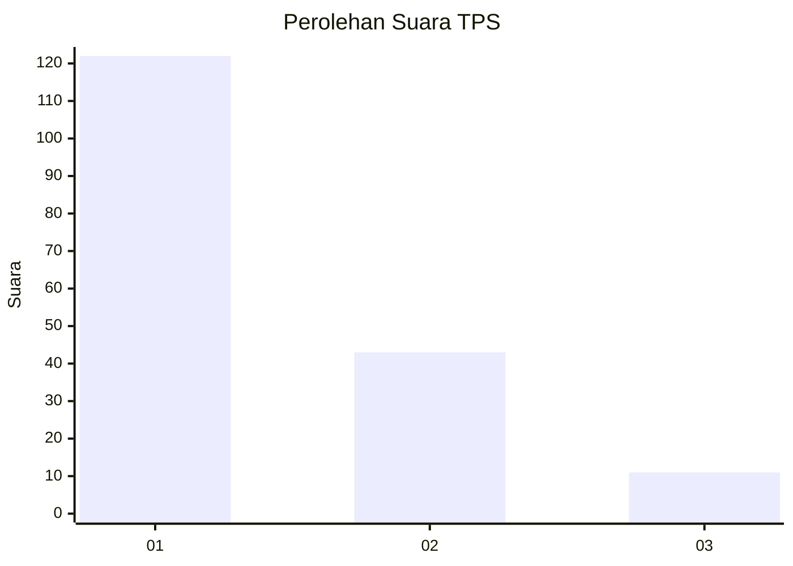
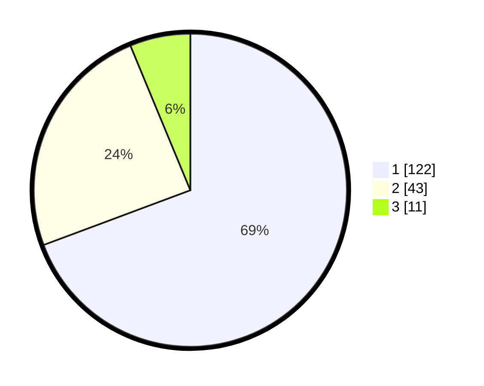

# Hasil

## Grafik

## Tabel

| No. | Nama Paslon    | Suara | Suara (raw) | Persentase |
|:--- |:-------------- | -----:| -----------:| ----------:|
| 1   | ANIES MUHAIMIN | 122   | [122][p-1]  | 69,32      |
| 2   | PRABOWO GIBRAN | 43    | [43][p-2]   | 24,43      |
| 3   | GANJAR MAHFUD  | 11    | [11][p-3]   | 6,25       |

[p-1]: https://github.com/gigit-pemilu/pemilu-2024-36-banten/blob/main/pilpres/hitung-suara/sub/36-banten/sub/04-serang/sub/11-kragilan/sub/2004-dukuh/sub/008-tps/sub/paslon-1.txt
[p-2]: https://github.com/gigit-pemilu/pemilu-2024-36-banten/blob/main/pilpres/hitung-suara/sub/36-banten/sub/04-serang/sub/11-kragilan/sub/2004-dukuh/sub/008-tps/sub/paslon-2.txt
[p-3]: https://github.com/gigit-pemilu/pemilu-2024-36-banten/blob/main/pilpres/hitung-suara/sub/36-banten/sub/04-serang/sub/11-kragilan/sub/2004-dukuh/sub/008-tps/sub/paslon-3.txt

## Foto C Plano

https://sirekap-obj-formc.kpu.go.id/7dbc/pemilu/ppwp/36/04/11/20/04/3604112004008-20240223-173930--5a3daed0-e978-4269-b515-b8a2fb46e6c0.jpg

https://sirekap-obj-formc.kpu.go.id/7dbc/pemilu/ppwp/36/04/11/20/04/3604112004008-20240223-173951--9952f14b-c5e5-4828-8aaf-1a6f9d5ecd63.jpg

https://sirekap-obj-formc.kpu.go.id/7dbc/pemilu/ppwp/36/04/11/20/04/3604112004008-20240223-174019--d751ccb1-04ef-469c-bd8d-be1f66ecfa86.jpg

## Metadata

| Key        | Value               |
| ---------- | ------------------- |
| Time Stamp | 2024-02-24 22:31:28 |

## DATA PEMILIH TETAP

Jumlah pemilih dalam DPT: **295**.
 * L: **0**.
 * P: **146**.

## DATA PENGGUNA HAK PILIH

Jumlah pengguna hak pilih dalam DPT: **482**.
 * L: **0**.
 * P: **0**.

Jumlah pengguna hak pilih dalam DPTb: **700**.
 * L: **0**.
 * P: **0**.

Jumlah pengguna hak pilih dalam DPK: **770**.
 * L: **0**.
 * P: **70**.

Jumlah pengguna hak pilih: **748**.
 * L: **0**.
 * P: **770**.

## JUMLAH SUARA SAH DAN TIDAK SAH

JUMLAH SELURUH SUARA SAH: **246**.

JUMLAH SUARA TIDAK SAH: **2**.

JUMLAH SELURUH SUARA SAH DAN SUARA TIDAK SAH: **248**.

