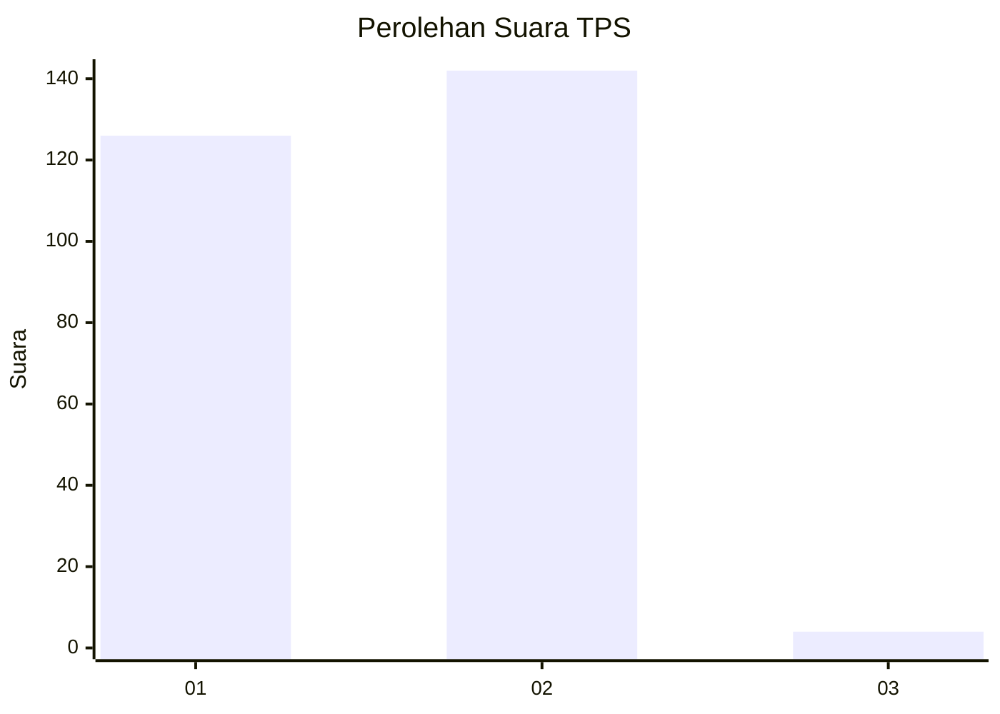
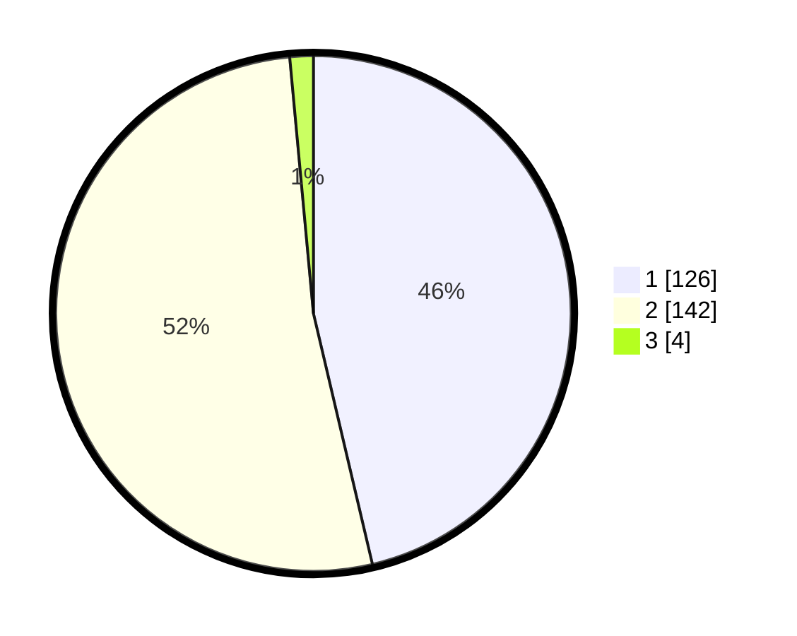

# Hasil

## Grafik

## Tabel

| No. | Nama Paslon    | Suara | Suara (raw) | Persentase |
|:--- |:-------------- | -----:| -----------:| ----------:|
| 1   | ANIES MUHAIMIN | 126   | [126][p-1]  | 46,32      |
| 2   | PRABOWO GIBRAN | 142   | [142][p-2]  | 52,21      |
| 3   | GANJAR MAHFUD  | 4     | [4][p-3]    | 1,47       |

[p-1]: https://github.com/gigit-pemilu/pemilu-2024/blob/main/pilpres/hitung-suara/sub/36-banten/sub/04-serang/sub/11-kragilan/sub/2005-undar-andir/sub/006-tps/sub/paslon-1.txt
[p-2]: https://github.com/gigit-pemilu/pemilu-2024/blob/main/pilpres/hitung-suara/sub/36-banten/sub/04-serang/sub/11-kragilan/sub/2005-undar-andir/sub/006-tps/sub/paslon-2.txt
[p-3]: https://github.com/gigit-pemilu/pemilu-2024/blob/main/pilpres/hitung-suara/sub/36-banten/sub/04-serang/sub/11-kragilan/sub/2005-undar-andir/sub/006-tps/sub/paslon-3.txt

## Foto C Plano

https://sirekap-obj-formc.kpu.go.id/8930/pemilu/ppwp/36/04/11/20/05/3604112005006-20240221-212711--dc7709d1-ef4c-4b05-abf4-22fb4ed64ad9.jpg

https://sirekap-obj-formc.kpu.go.id/8930/pemilu/ppwp/36/04/11/20/05/3604112005006-20240221-212727--e33598be-f193-4b6c-96c2-88db8fa6caca.jpg

https://sirekap-obj-formc.kpu.go.id/8930/pemilu/ppwp/36/04/11/20/05/3604112005006-20240221-212754--01a62ce3-6fb8-4347-a5f7-969778cbf6c2.jpg

## Metadata

| Key        | Value               |
| ---------- | ------------------- |
| Time Stamp | 2024-02-22 13:00:00 |

