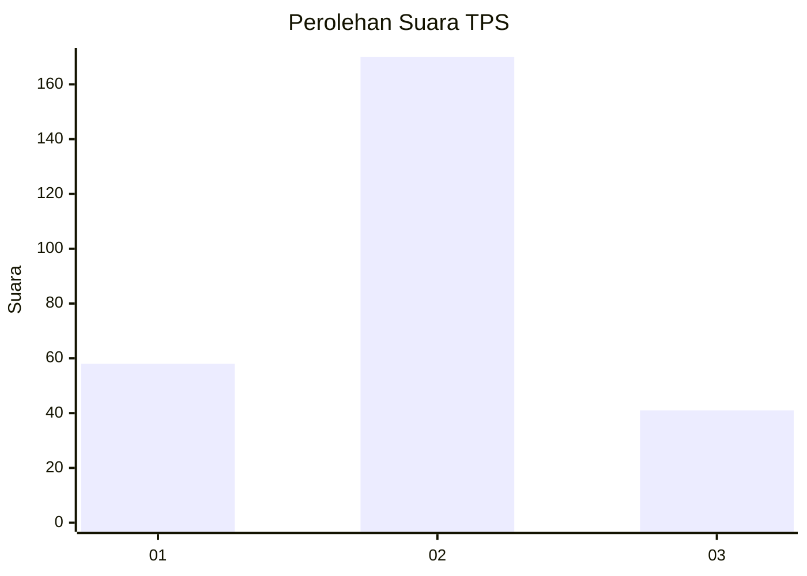
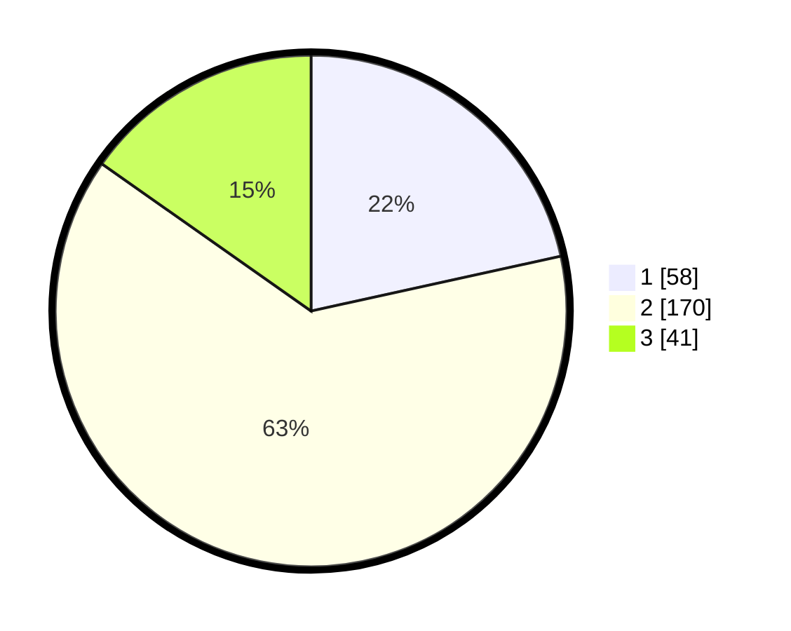

# Hasil

## Grafik

## Tabel

| No. | Nama Paslon    | Suara | Suara (raw) | Persentase |
|:--- |:-------------- | -----:| -----------:| ----------:|
| 1   | ANIES MUHAIMIN | 58    | [58][p-1]   | 21,56      |
| 2   | PRABOWO GIBRAN | 170   | [170][p-2]  | 63,20      |
| 3   | GANJAR MAHFUD  | 41    | [41][p-3]   | 15,24      |

[p-1]: https://github.com/gigit-pemilu/pemilu-2024-36-banten/blob/main/pilpres/hitung-suara/sub/36-banten/sub/04-serang/sub/11-kragilan/sub/2007-sentul/sub/031-tps/sub/paslon-1.txt
[p-2]: https://github.com/gigit-pemilu/pemilu-2024-36-banten/blob/main/pilpres/hitung-suara/sub/36-banten/sub/04-serang/sub/11-kragilan/sub/2007-sentul/sub/031-tps/sub/paslon-2.txt
[p-3]: https://github.com/gigit-pemilu/pemilu-2024-36-banten/blob/main/pilpres/hitung-suara/sub/36-banten/sub/04-serang/sub/11-kragilan/sub/2007-sentul/sub/031-tps/sub/paslon-3.txt

## Foto C Plano

https://sirekap-obj-formc.kpu.go.id/07ce/pemilu/ppwp/36/04/11/20/07/3604112007031-20240225-143457--102ac869-59bb-4368-b4f9-854f8b85df03.jpg

https://sirekap-obj-formc.kpu.go.id/07ce/pemilu/ppwp/36/04/11/20/07/3604112007031-20240225-143533--873f06b5-9ae1-4bb8-ac06-e151bf4c597d.jpg

https://sirekap-obj-formc.kpu.go.id/07ce/pemilu/ppwp/36/04/11/20/07/3604112007031-20240225-143602--490f6575-6b80-40e3-b4b2-e8d86db6482d.jpg

## Metadata

| Key        | Value               |
| ---------- | ------------------- |
| Time Stamp | 2024-02-28 19:00:00 |

