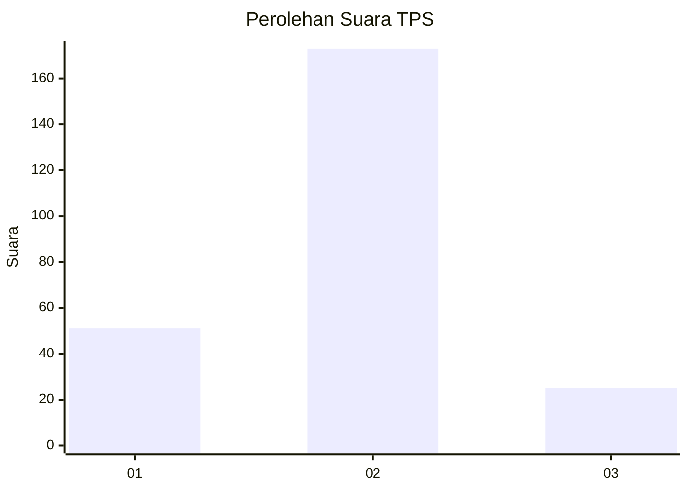

# Hasil

## Grafik

## Tabel

| No. | Nama Paslon    | Suara | Suara (raw) | Persentase |
|:--- |:-------------- | -----:| -----------:| ----------:|
| 1   | ANIES MUHAIMIN | 51    | [51][p-1]   | 20,48      |
| 2   | PRABOWO GIBRAN | 173   | [173][p-2]  | 69,48      |
| 3   | GANJAR MAHFUD  | 25    | [25][p-3]   | 10,04      |

[p-1]: https://github.com/gigit-pemilu/pemilu-2024/blob/main/pilpres/hitung-suara/sub/36-banten/sub/04-serang/sub/11-kragilan/sub/2008-jeruk-tipis/sub/004-tps/sub/paslon-1.txt
[p-2]: https://github.com/gigit-pemilu/pemilu-2024/blob/main/pilpres/hitung-suara/sub/36-banten/sub/04-serang/sub/11-kragilan/sub/2008-jeruk-tipis/sub/004-tps/sub/paslon-2.txt
[p-3]: https://github.com/gigit-pemilu/pemilu-2024/blob/main/pilpres/hitung-suara/sub/36-banten/sub/04-serang/sub/11-kragilan/sub/2008-jeruk-tipis/sub/004-tps/sub/paslon-3.txt

## Foto C Plano

https://sirekap-obj-formc.kpu.go.id/c903/pemilu/ppwp/36/04/11/20/08/3604112008004-20240214-204339--d6d6e8ee-37a3-4062-885b-e642e17d7514.jpg

https://sirekap-obj-formc.kpu.go.id/c903/pemilu/ppwp/36/04/11/20/08/3604112008004-20240214-204354--e42c2792-4a8a-46ad-a63d-9f3dce74ae8e.jpg

https://sirekap-obj-formc.kpu.go.id/c903/pemilu/ppwp/36/04/11/20/08/3604112008004-20240214-193848--35d0a1d4-ec20-4cfd-a7a3-ef8bfccc74ba.jpg

## Metadata

| Key        | Value               |
| ---------- | ------------------- |
| Time Stamp | 2024-02-14 21:46:01 |

