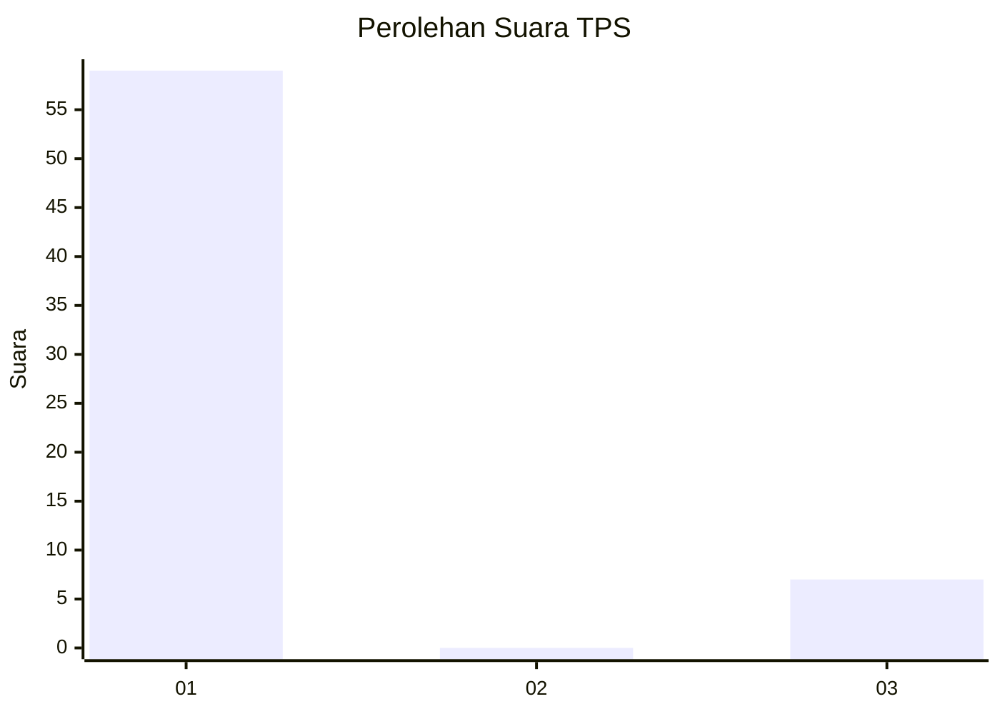
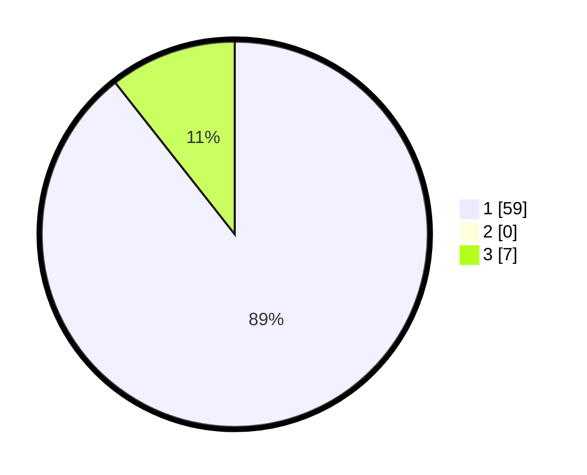

# Hasil

## Grafik

## Tabel

| No. | Nama Paslon    | Suara | Suara (raw) | Persentase |
|:--- |:-------------- | -----:| -----------:| ----------:|
| 1   | ANIES MUHAIMIN | 59    | [59][p-1]   | 89,39      |
| 2   | PRABOWO GIBRAN | 0     | [0][p-2]    | 0,00       |
| 3   | GANJAR MAHFUD  | 7     | [7][p-3]    | 10,61      |

[p-1]: https://github.com/gigit-pemilu/pemilu-2024/blob/main/pilpres/hitung-suara/sub/36-banten/sub/04-serang/sub/11-kragilan/sub/2008-jeruk-tipis/sub/010-tps/sub/paslon-1.txt
[p-2]: https://github.com/gigit-pemilu/pemilu-2024/blob/main/pilpres/hitung-suara/sub/36-banten/sub/04-serang/sub/11-kragilan/sub/2008-jeruk-tipis/sub/010-tps/sub/paslon-2.txt
[p-3]: https://github.com/gigit-pemilu/pemilu-2024/blob/main/pilpres/hitung-suara/sub/36-banten/sub/04-serang/sub/11-kragilan/sub/2008-jeruk-tipis/sub/010-tps/sub/paslon-3.txt

## Foto C Plano

https://sirekap-obj-formc.kpu.go.id/cbab/pemilu/ppwp/36/04/11/20/08/3604112008010-20240220-111146--da216c2f-9a43-4ce5-878e-05ee382a4a7d.jpg

https://sirekap-obj-formc.kpu.go.id/cbab/pemilu/ppwp/36/04/11/20/08/3604112008010-20240220-111222--5469eb68-3894-44fa-a921-95ffe22d690c.jpg

https://sirekap-obj-formc.kpu.go.id/cbab/pemilu/ppwp/36/04/11/20/08/3604112008010-20240220-111338--142cb4b9-13bb-4adf-a174-df51282d0cf0.jpg

## Metadata

| Key        | Value               |
| ---------- | ------------------- |
| Time Stamp | 2024-02-20 12:00:00 |

## DATA PEMILIH TETAP

Jumlah pemilih dalam DPT: **297**.
 * L: **454**.
 * P: **48**.

## DATA PENGGUNA HAK PILIH

Jumlah pengguna hak pilih dalam DPT: **275**.
 * L: **104**.
 * P: **414**.

Jumlah pengguna hak pilih dalam DPTb: **455**.
 * L: **24**.
 * P: **644**.

Jumlah pengguna hak pilih dalam DPK: **224**.
 * L: **4**.
 * P: **664**.

Jumlah pengguna hak pilih: **155**.
 * L: **566**.
 * P: **466**.

## JUMLAH SUARA SAH DAN TIDAK SAH

JUMLAH SELURUH SUARA SAH: **0**.

JUMLAH SUARA TIDAK SAH: **10**.

JUMLAH SELURUH SUARA SAH DAN SUARA TIDAK SAH: **10**.

