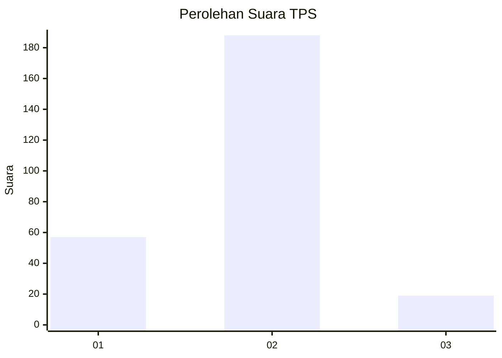
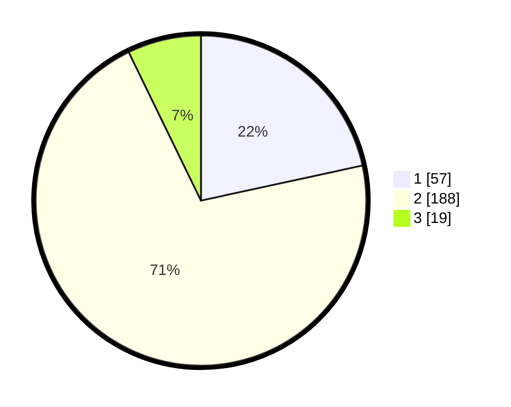

# Hasil

## Grafik

## Tabel

| No. | Nama Paslon    | Suara | Suara (raw) | Persentase |
|:--- |:-------------- | -----:| -----------:| ----------:|
| 1   | ANIES MUHAIMIN | 57    | [57][p-1]   | 21,59      |
| 2   | PRABOWO GIBRAN | 188   | [188][p-2]  | 71,21      |
| 3   | GANJAR MAHFUD  | 19    | [19][p-3]   | 7,20       |

[p-1]: https://github.com/gigit-pemilu/pemilu-2024-36-banten/blob/main/pilpres/hitung-suara/sub/36-banten/sub/04-serang/sub/11-kragilan/sub/2011-kendayakan/sub/004-tps/sub/paslon-1.txt
[p-2]: https://github.com/gigit-pemilu/pemilu-2024-36-banten/blob/main/pilpres/hitung-suara/sub/36-banten/sub/04-serang/sub/11-kragilan/sub/2011-kendayakan/sub/004-tps/sub/paslon-2.txt
[p-3]: https://github.com/gigit-pemilu/pemilu-2024-36-banten/blob/main/pilpres/hitung-suara/sub/36-banten/sub/04-serang/sub/11-kragilan/sub/2011-kendayakan/sub/004-tps/sub/paslon-3.txt

## Foto C Plano

https://sirekap-obj-formc.kpu.go.id/ce78/pemilu/ppwp/36/04/11/20/11/3604112011004-20240223-190333--93fd33e2-65e6-4698-8b7f-74d83fb90083.jpg

https://sirekap-obj-formc.kpu.go.id/ce78/pemilu/ppwp/36/04/11/20/11/3604112011004-20240223-190435--a7b20dd3-4fc2-4650-891b-b36015aeb6a1.jpg

https://sirekap-obj-formc.kpu.go.id/ce78/pemilu/ppwp/36/04/11/20/11/3604112011004-20240223-190458--c1208d07-25ac-40e5-8aac-0e923bbcffc9.jpg

## Metadata

| Key        | Value               |
| ---------- | ------------------- |
| Time Stamp | 2024-02-24 22:31:28 |

