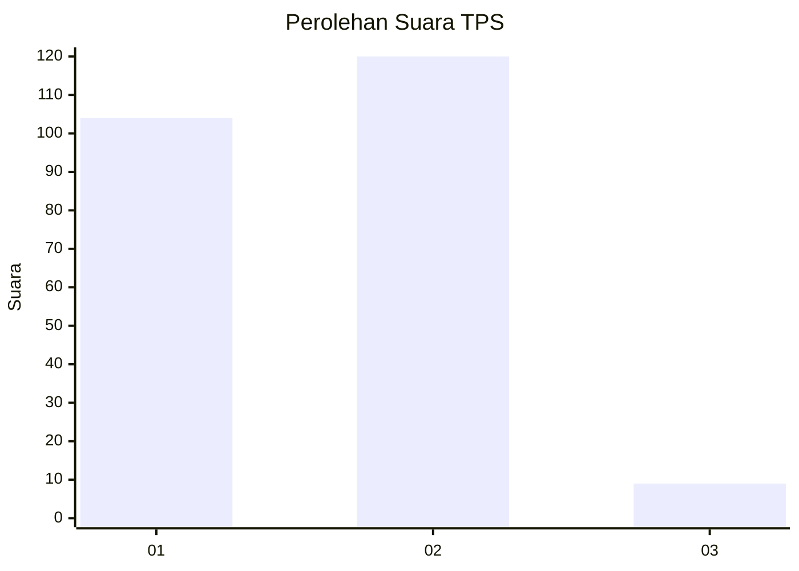
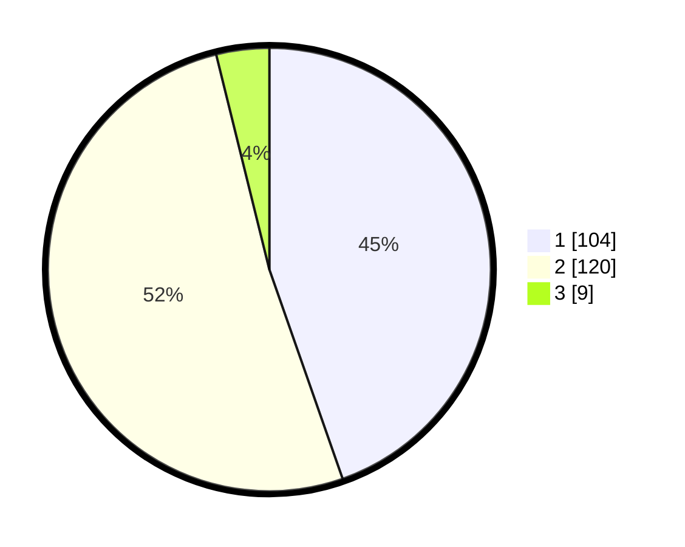

# Hasil

## Grafik

## Tabel

| No. | Nama Paslon    | Suara | Suara (raw) | Persentase |
|:--- |:-------------- | -----:| -----------:| ----------:|
| 1   | ANIES MUHAIMIN | 104   | [104][p-1]  | 44,64      |
| 2   | PRABOWO GIBRAN | 120   | [120][p-2]  | 51,50      |
| 3   | GANJAR MAHFUD  | 9     | [9][p-3]    | 3,86       |

[p-1]: https://github.com/gigit-pemilu/pemilu-2024/blob/main/pilpres/hitung-suara/sub/36-banten/sub/04-serang/sub/12-pontang/sub/2001-pontang/sub/001-tps/sub/paslon-1.txt
[p-2]: https://github.com/gigit-pemilu/pemilu-2024/blob/main/pilpres/hitung-suara/sub/36-banten/sub/04-serang/sub/12-pontang/sub/2001-pontang/sub/001-tps/sub/paslon-2.txt
[p-3]: https://github.com/gigit-pemilu/pemilu-2024/blob/main/pilpres/hitung-suara/sub/36-banten/sub/04-serang/sub/12-pontang/sub/2001-pontang/sub/001-tps/sub/paslon-3.txt

## Foto C Plano

https://sirekap-obj-formc.kpu.go.id/7e4f/pemilu/ppwp/36/04/12/20/01/3604122001001-20240223-142938--8cc6e38e-fc51-4381-8a0e-7eb73408bb86.jpg

https://sirekap-obj-formc.kpu.go.id/7e4f/pemilu/ppwp/36/04/12/20/01/3604122001001-20240223-143134--6e7ef745-ff30-4f47-82ec-15d9512de7a1.jpg

https://sirekap-obj-formc.kpu.go.id/7e4f/pemilu/ppwp/36/04/12/20/01/3604122001001-20240223-143211--8294b1b4-aa16-462a-8f64-b27150732c0a.jpg

## Metadata

| Key        | Value               |
| ---------- | ------------------- |
| Time Stamp | 2024-02-24 22:31:28 |

