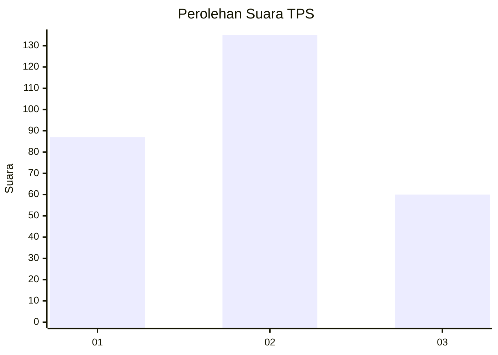
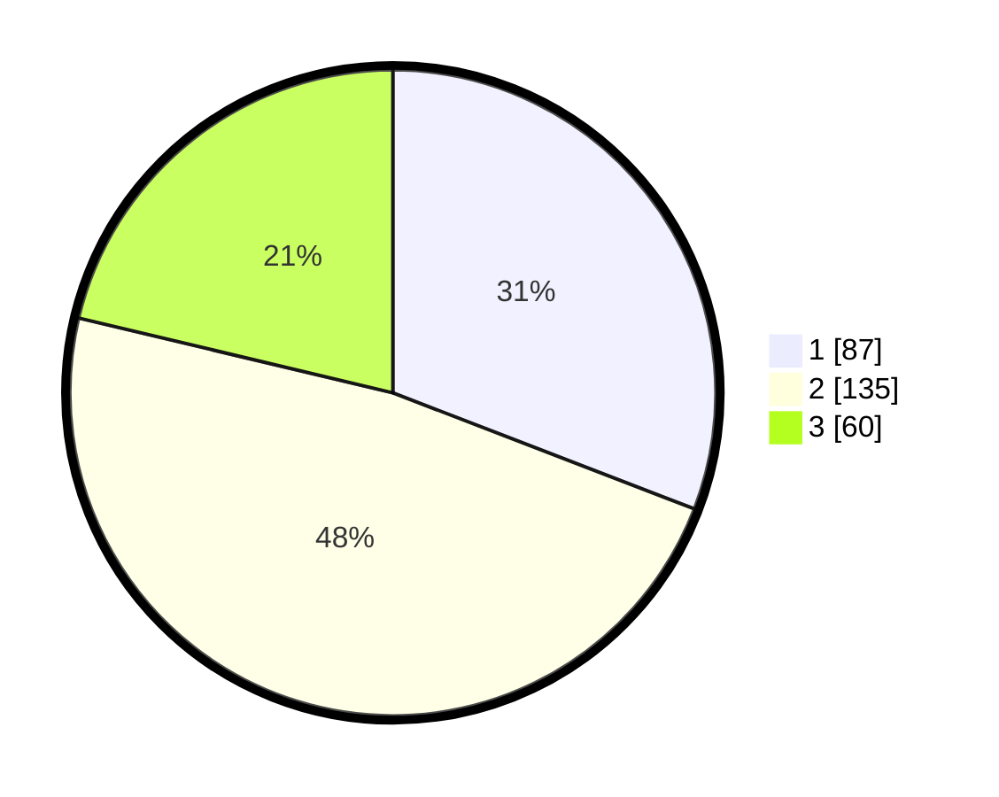

# Hasil

## Grafik

## Tabel

| No. | Nama Paslon    | Suara | Suara (raw) | Persentase |
|:--- |:-------------- | -----:| -----------:| ----------:|
| 1   | ANIES MUHAIMIN | 87    | [87][p-1]   | 30,85      |
| 2   | PRABOWO GIBRAN | 135   | [135][p-2]  | 47,87      |
| 3   | GANJAR MAHFUD  | 60    | [60][p-3]   | 21,28      |

[p-1]: https://github.com/gigit-pemilu/pemilu-2024-36-banten/blob/main/pilpres/hitung-suara/sub/36-banten/sub/04-serang/sub/12-pontang/sub/2004-pulokencana/sub/010-tps/sub/paslon-1.txt
[p-2]: https://github.com/gigit-pemilu/pemilu-2024-36-banten/blob/main/pilpres/hitung-suara/sub/36-banten/sub/04-serang/sub/12-pontang/sub/2004-pulokencana/sub/010-tps/sub/paslon-2.txt
[p-3]: https://github.com/gigit-pemilu/pemilu-2024-36-banten/blob/main/pilpres/hitung-suara/sub/36-banten/sub/04-serang/sub/12-pontang/sub/2004-pulokencana/sub/010-tps/sub/paslon-3.txt

## Foto C Plano

https://sirekap-obj-formc.kpu.go.id/2ae3/pemilu/ppwp/36/04/12/20/04/3604122004010-20240222-231116--d11c9239-9c80-4dc6-b361-ab2c7f3abcea.jpg

https://sirekap-obj-formc.kpu.go.id/2ae3/pemilu/ppwp/36/04/12/20/04/3604122004010-20240222-231047--ba0756e4-77e7-4a32-8774-376136b3c17c.jpg

https://sirekap-obj-formc.kpu.go.id/2ae3/pemilu/ppwp/36/04/12/20/04/3604122004010-20240222-231057--fc30241a-e281-4b5e-9e76-39bc76491f58.jpg

## Metadata

| Key        | Value               |
| ---------- | ------------------- |
| Time Stamp | 2024-02-24 22:31:28 |

