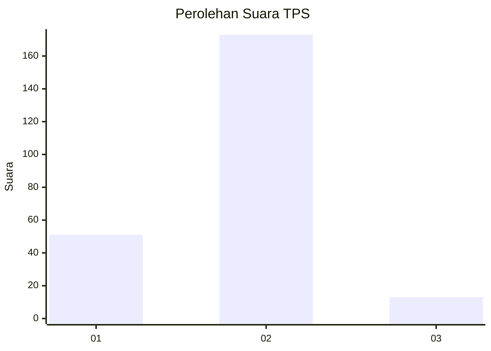
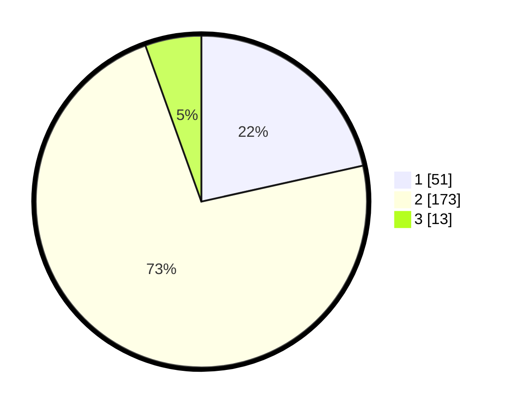

# Hasil

## Grafik

## Tabel

| No. | Nama Paslon    | Suara | Suara (raw) | Persentase |
|:--- |:-------------- | -----:| -----------:| ----------:|
| 1   | ANIES MUHAIMIN | 51    | [51][p-1]   | 21,52      |
| 2   | PRABOWO GIBRAN | 173   | [173][p-2]  | 73,00      |
| 3   | GANJAR MAHFUD  | 13    | [13][p-3]   | 5,49       |

[p-1]: https://github.com/gigit-pemilu/pemilu-2024/blob/main/pilpres/hitung-suara/sub/36-banten/sub/04-serang/sub/12-pontang/sub/2008-kubang-puji/sub/002-tps/sub/paslon-1.txt
[p-2]: https://github.com/gigit-pemilu/pemilu-2024/blob/main/pilpres/hitung-suara/sub/36-banten/sub/04-serang/sub/12-pontang/sub/2008-kubang-puji/sub/002-tps/sub/paslon-2.txt
[p-3]: https://github.com/gigit-pemilu/pemilu-2024/blob/main/pilpres/hitung-suara/sub/36-banten/sub/04-serang/sub/12-pontang/sub/2008-kubang-puji/sub/002-tps/sub/paslon-3.txt

## Foto C Plano

https://sirekap-obj-formc.kpu.go.id/2ef4/pemilu/ppwp/36/04/12/20/08/3604122008002-20240221-113240--81d22af5-72d5-48d3-8fc5-b011ad8b9ccc.jpg

https://sirekap-obj-formc.kpu.go.id/2ef4/pemilu/ppwp/36/04/12/20/08/3604122008002-20240221-113309--33cae8f8-c4f7-409f-83e8-7a683cb55d89.jpg

https://sirekap-obj-formc.kpu.go.id/2ef4/pemilu/ppwp/36/04/12/20/08/3604122008002-20240221-113357--d4362f33-fb79-4f2e-8708-24a11c9bec47.jpg

## Metadata

| Key        | Value               |
| ---------- | ------------------- |
| Time Stamp | 2024-02-24 22:31:28 |

