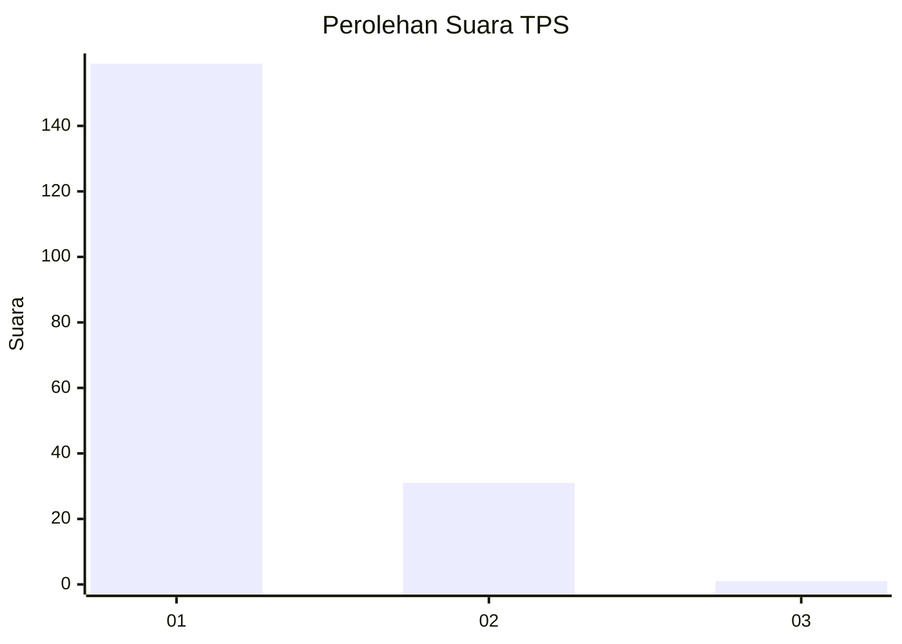
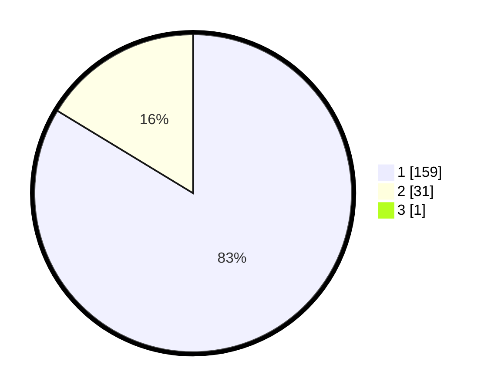

# Hasil

## Grafik

## Tabel

| No. | Nama Paslon    | Suara | Suara (raw) | Persentase |
|:--- |:-------------- | -----:| -----------:| ----------:|
| 1   | ANIES MUHAIMIN | 159   | [159][p-1]  | 83,25      |
| 2   | PRABOWO GIBRAN | 31    | [31][p-2]   | 16,23      |
| 3   | GANJAR MAHFUD  | 1     | [1][p-3]    | 0,52       |

[p-1]: https://github.com/gigit-pemilu/pemilu-2024/blob/main/pilpres/hitung-suara/sub/36-banten/sub/04-serang/sub/12-pontang/sub/2011-kaserangan/sub/006-tps/sub/paslon-1.txt
[p-2]: https://github.com/gigit-pemilu/pemilu-2024/blob/main/pilpres/hitung-suara/sub/36-banten/sub/04-serang/sub/12-pontang/sub/2011-kaserangan/sub/006-tps/sub/paslon-2.txt
[p-3]: https://github.com/gigit-pemilu/pemilu-2024/blob/main/pilpres/hitung-suara/sub/36-banten/sub/04-serang/sub/12-pontang/sub/2011-kaserangan/sub/006-tps/sub/paslon-3.txt

## Foto C Plano

https://sirekap-obj-formc.kpu.go.id/2767/pemilu/ppwp/36/04/12/20/11/3604122011006-20240222-154448--fe2f7df9-e0dc-4578-8200-dcdadc3269d6.jpg

https://sirekap-obj-formc.kpu.go.id/2767/pemilu/ppwp/36/04/12/20/11/3604122011006-20240222-154537--4b63f700-87ab-4450-94bc-b447e6e5c215.jpg

https://sirekap-obj-formc.kpu.go.id/2767/pemilu/ppwp/36/04/12/20/11/3604122011006-20240222-154631--6f094f74-da49-420d-b92b-b7f484b8f8be.jpg

## Metadata

| Key        | Value               |
| ---------- | ------------------- |
| Time Stamp | 2024-02-24 22:31:28 |

