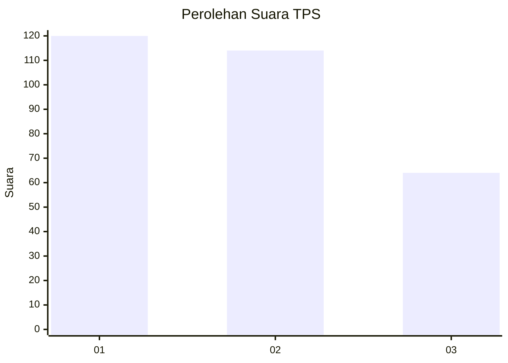
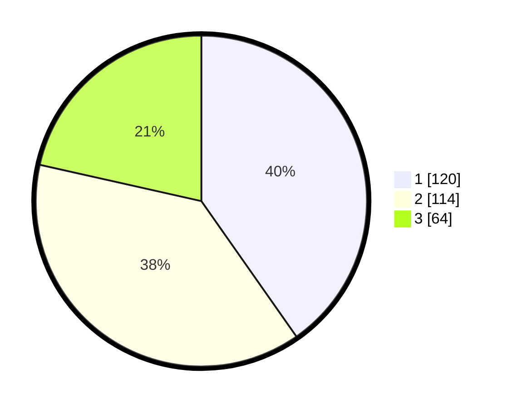

# Hasil

## Grafik

## Tabel

| No. | Nama Paslon    | Suara | Suara (raw) | Persentase |
|:--- |:-------------- | -----:| -----------:| ----------:|
| 1   | ANIES MUHAIMIN | 120   | [120][p-1]  | 40,27      |
| 2   | PRABOWO GIBRAN | 114   | [114][p-2]  | 38,26      |
| 3   | GANJAR MAHFUD  | 64    | [64][p-3]   | 21,48      |

[p-1]: https://github.com/gigit-pemilu/pemilu-2024/blob/main/pilpres/hitung-suara/sub/36-banten/sub/04-serang/sub/12-pontang/sub/2012-wanayasa/sub/001-tps/sub/paslon-1.txt
[p-2]: https://github.com/gigit-pemilu/pemilu-2024/blob/main/pilpres/hitung-suara/sub/36-banten/sub/04-serang/sub/12-pontang/sub/2012-wanayasa/sub/001-tps/sub/paslon-2.txt
[p-3]: https://github.com/gigit-pemilu/pemilu-2024/blob/main/pilpres/hitung-suara/sub/36-banten/sub/04-serang/sub/12-pontang/sub/2012-wanayasa/sub/001-tps/sub/paslon-3.txt

## Foto C Plano

https://sirekap-obj-formc.kpu.go.id/8c57/pemilu/ppwp/36/04/12/20/12/3604122012001-20240220-140054--6eef17d6-11df-4cbd-93b5-b75ab1a68bdb.jpg

https://sirekap-obj-formc.kpu.go.id/8c57/pemilu/ppwp/36/04/12/20/12/3604122012001-20240220-140151--c15912d7-4919-40cb-bbf1-1f79034188e8.jpg

https://sirekap-obj-formc.kpu.go.id/8c57/pemilu/ppwp/36/04/12/20/12/3604122012001-20240220-140244--0759cdb8-bf4a-4906-a234-83be204fa6ba.jpg

## Metadata

| Key        | Value               |
| ---------- | ------------------- |
| Time Stamp | 2024-02-20 19:00:00 |

