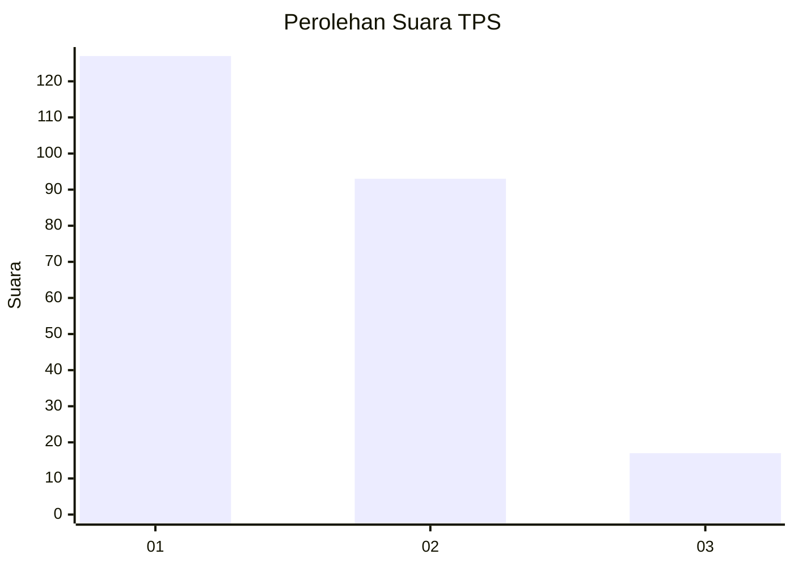
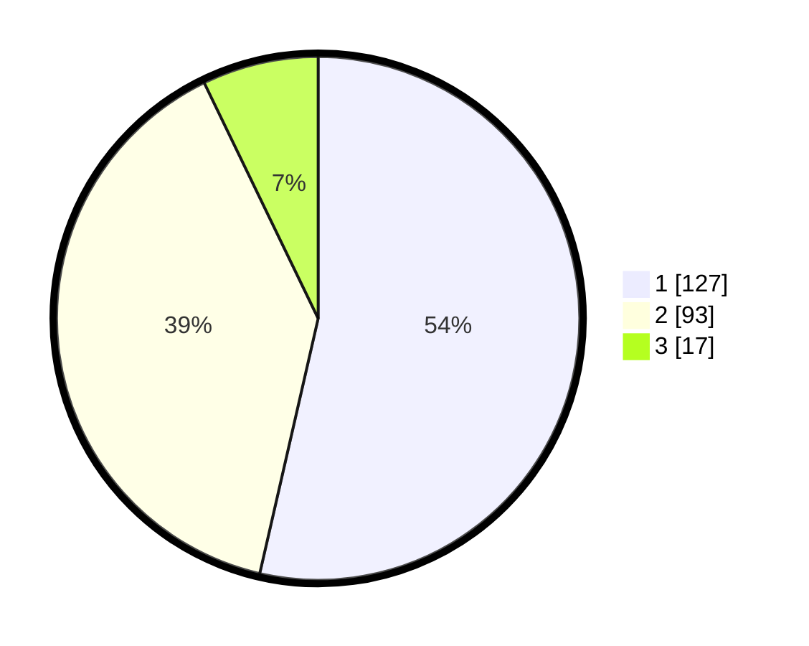

# Hasil

## Grafik

## Tabel

| No. | Nama Paslon    | Suara | Suara (raw) | Persentase |
|:--- |:-------------- | -----:| -----------:| ----------:|
| 1   | ANIES MUHAIMIN | 127   | [127][p-1]  | 53,59      |
| 2   | PRABOWO GIBRAN | 93    | [93][p-2]   | 39,24      |
| 3   | GANJAR MAHFUD  | 17    | [17][p-3]   | 7,17       |

[p-1]: https://github.com/gigit-pemilu/pemilu-2024/blob/main/pilpres/hitung-suara/sub/36-banten/sub/04-serang/sub/13-tirtayasa/sub/2001-tirtayasa/sub/003-tps/sub/paslon-1.txt
[p-2]: https://github.com/gigit-pemilu/pemilu-2024/blob/main/pilpres/hitung-suara/sub/36-banten/sub/04-serang/sub/13-tirtayasa/sub/2001-tirtayasa/sub/003-tps/sub/paslon-2.txt
[p-3]: https://github.com/gigit-pemilu/pemilu-2024/blob/main/pilpres/hitung-suara/sub/36-banten/sub/04-serang/sub/13-tirtayasa/sub/2001-tirtayasa/sub/003-tps/sub/paslon-3.txt

## Foto C Plano

https://sirekap-obj-formc.kpu.go.id/3cbc/pemilu/ppwp/36/04/13/20/01/3604132001003-20240224-104352--422fd03c-ef4a-4826-b300-d115690c8190.jpg

https://sirekap-obj-formc.kpu.go.id/3cbc/pemilu/ppwp/36/04/13/20/01/3604132001003-20240224-104425--658360d5-6059-4492-b1a5-4f0688e64b91.jpg

https://sirekap-obj-formc.kpu.go.id/3cbc/pemilu/ppwp/36/04/13/20/01/3604132001003-20240224-104455--ccf05345-f30a-490c-827b-319c536f6948.jpg

## Metadata

| Key        | Value               |
| ---------- | ------------------- |
| Time Stamp | 2024-02-24 23:00:00 |

