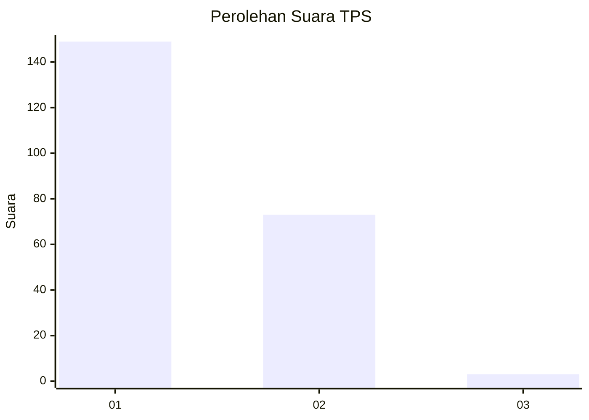
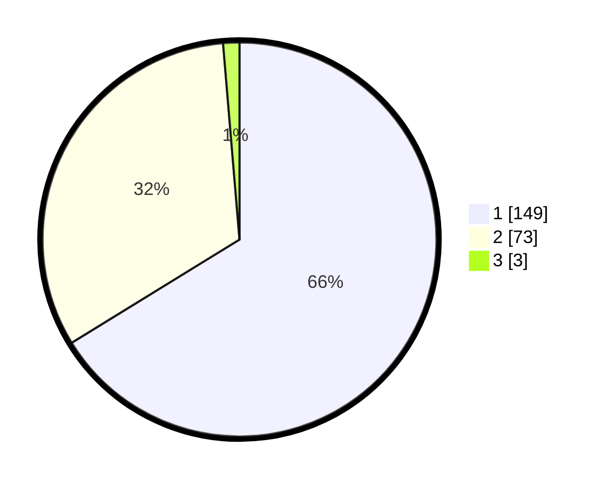

# Hasil

## Grafik

## Tabel

| No. | Nama Paslon    | Suara | Suara (raw) | Persentase |
|:--- |:-------------- | -----:| -----------:| ----------:|
| 1   | ANIES MUHAIMIN | 149   | [149][p-1]  | 66,22      |
| 2   | PRABOWO GIBRAN | 73    | [73][p-2]   | 32,44      |
| 3   | GANJAR MAHFUD  | 3     | [3][p-3]    | 1,33       |

[p-1]: https://github.com/gigit-pemilu/pemilu-2024-36-banten/blob/main/pilpres/hitung-suara/sub/36-banten/sub/04-serang/sub/13-tirtayasa/sub/2001-tirtayasa/sub/004-tps/sub/paslon-1.txt
[p-2]: https://github.com/gigit-pemilu/pemilu-2024-36-banten/blob/main/pilpres/hitung-suara/sub/36-banten/sub/04-serang/sub/13-tirtayasa/sub/2001-tirtayasa/sub/004-tps/sub/paslon-2.txt
[p-3]: https://github.com/gigit-pemilu/pemilu-2024-36-banten/blob/main/pilpres/hitung-suara/sub/36-banten/sub/04-serang/sub/13-tirtayasa/sub/2001-tirtayasa/sub/004-tps/sub/paslon-3.txt

## Foto C Plano

https://sirekap-obj-formc.kpu.go.id/ebd0/pemilu/ppwp/36/04/13/20/01/3604132001004-20240222-085451--3a9fa3c0-debc-4b3e-923f-f152e2d71ba8.jpg

https://sirekap-obj-formc.kpu.go.id/ebd0/pemilu/ppwp/36/04/13/20/01/3604132001004-20240222-085545--dab58937-385d-42ba-8dc0-b03a791a9514.jpg

https://sirekap-obj-formc.kpu.go.id/ebd0/pemilu/ppwp/36/04/13/20/01/3604132001004-20240222-085615--6020eceb-c5b3-4ea4-acd3-246b158959c2.jpg

## Metadata

| Key        | Value               |
| ---------- | ------------------- |
| Time Stamp | 2024-02-24 22:31:28 |

