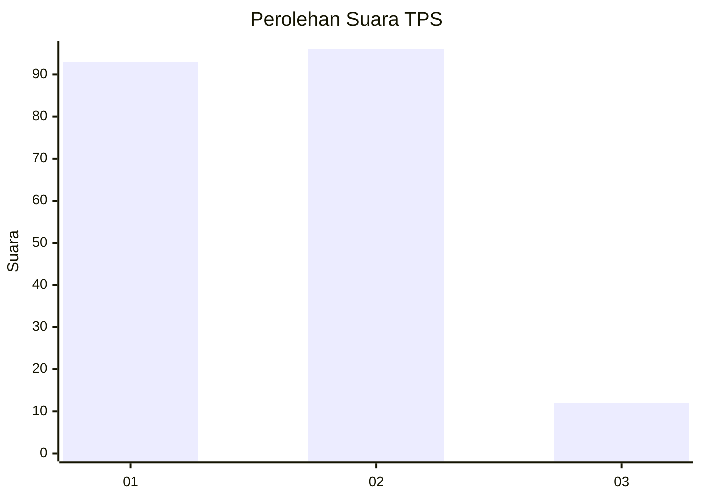
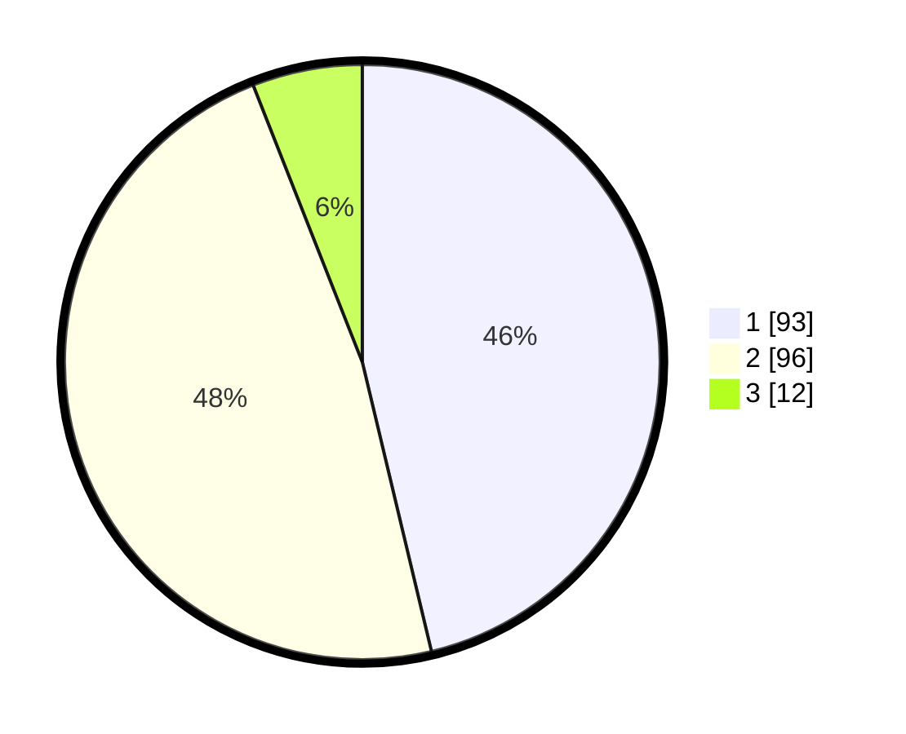

# Hasil

## Grafik

## Tabel

| No. | Nama Paslon    | Suara | Suara (raw) | Persentase |
|:--- |:-------------- | -----:| -----------:| ----------:|
| 1   | ANIES MUHAIMIN | 93    | [93][p-1]   | 46,27      |
| 2   | PRABOWO GIBRAN | 96    | [96][p-2]   | 47,76      |
| 3   | GANJAR MAHFUD  | 12    | [12][p-3]   | 5,97       |

[p-1]: https://github.com/gigit-pemilu/pemilu-2024/blob/main/pilpres/hitung-suara/sub/36-banten/sub/04-serang/sub/13-tirtayasa/sub/2001-tirtayasa/sub/005-tps/sub/paslon-1.txt
[p-2]: https://github.com/gigit-pemilu/pemilu-2024/blob/main/pilpres/hitung-suara/sub/36-banten/sub/04-serang/sub/13-tirtayasa/sub/2001-tirtayasa/sub/005-tps/sub/paslon-2.txt
[p-3]: https://github.com/gigit-pemilu/pemilu-2024/blob/main/pilpres/hitung-suara/sub/36-banten/sub/04-serang/sub/13-tirtayasa/sub/2001-tirtayasa/sub/005-tps/sub/paslon-3.txt

## Foto C Plano

https://sirekap-obj-formc.kpu.go.id/43e6/pemilu/ppwp/36/04/13/20/01/3604132001005-20240221-204042--319bd433-ff47-4005-a798-0de3f3568131.jpg

https://sirekap-obj-formc.kpu.go.id/43e6/pemilu/ppwp/36/04/13/20/01/3604132001005-20240221-203936--25dac84c-28e5-493d-bdfa-b3d32ef1abef.jpg

https://sirekap-obj-formc.kpu.go.id/43e6/pemilu/ppwp/36/04/13/20/01/3604132001005-20240221-204008--25388bf2-3463-4f72-8c6a-754e2e2edbee.jpg

## Metadata

| Key        | Value               |
| ---------- | ------------------- |
| Time Stamp | 2024-02-24 22:31:28 |

