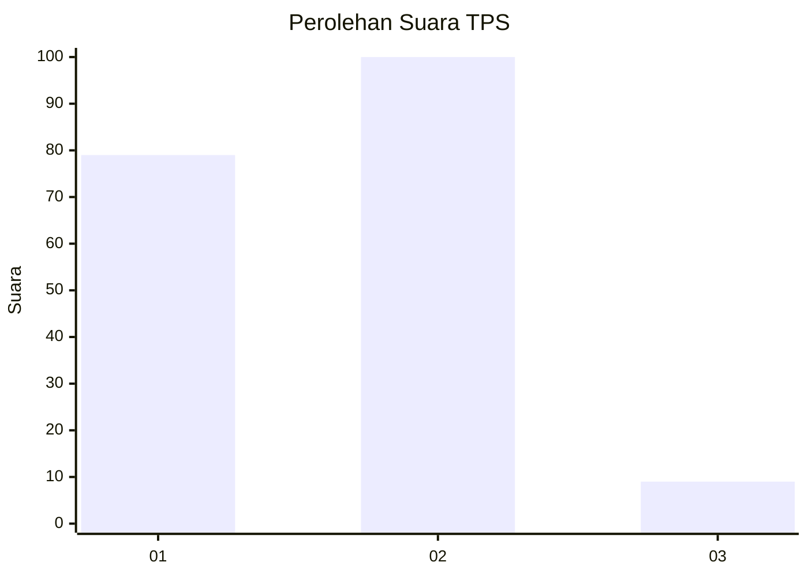
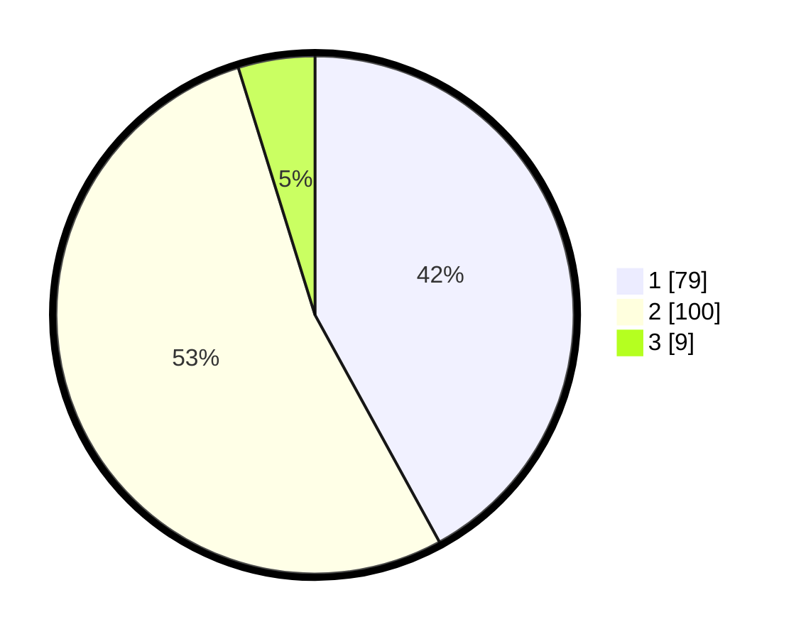

# Hasil

## Grafik

## Tabel

| No. | Nama Paslon    | Suara | Suara (raw) | Persentase |
|:--- |:-------------- | -----:| -----------:| ----------:|
| 1   | ANIES MUHAIMIN | 79    | [79][p-1]   | 42,02      |
| 2   | PRABOWO GIBRAN | 100   | [100][p-2]  | 53,19      |
| 3   | GANJAR MAHFUD  | 9     | [9][p-3]    | 4,79       |

[p-1]: https://github.com/gigit-pemilu/pemilu-2024/blob/main/pilpres/hitung-suara/sub/36-banten/sub/04-serang/sub/13-tirtayasa/sub/2011-tengkurak/sub/006-tps/sub/paslon-1.txt
[p-2]: https://github.com/gigit-pemilu/pemilu-2024/blob/main/pilpres/hitung-suara/sub/36-banten/sub/04-serang/sub/13-tirtayasa/sub/2011-tengkurak/sub/006-tps/sub/paslon-2.txt
[p-3]: https://github.com/gigit-pemilu/pemilu-2024/blob/main/pilpres/hitung-suara/sub/36-banten/sub/04-serang/sub/13-tirtayasa/sub/2011-tengkurak/sub/006-tps/sub/paslon-3.txt

## Foto C Plano

https://sirekap-obj-formc.kpu.go.id/bdb0/pemilu/ppwp/36/04/13/20/11/3604132011006-20240224-002409--e5c1f307-d907-41a9-aa15-4bb959ff2e19.jpg

https://sirekap-obj-formc.kpu.go.id/bdb0/pemilu/ppwp/36/04/13/20/11/3604132011006-20240224-002439--072c1e83-fb34-4b67-9eda-0df413a4fe54.jpg

https://sirekap-obj-formc.kpu.go.id/bdb0/pemilu/ppwp/36/04/13/20/11/3604132011006-20240224-002509--73267ff0-8e57-47a9-812a-7c057bf675c2.jpg

## Metadata

| Key        | Value               |
| ---------- | ------------------- |
| Time Stamp | 2024-02-24 22:31:28 |

