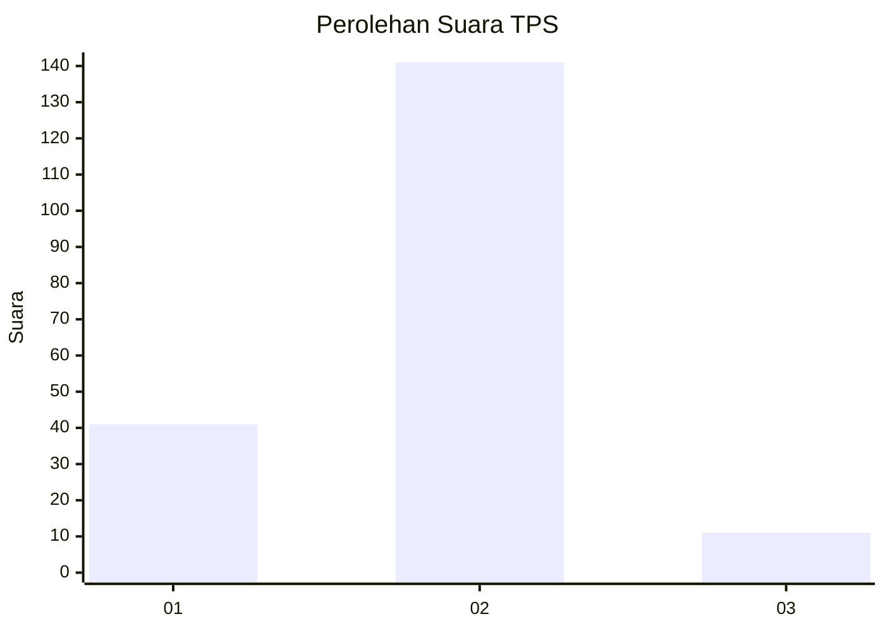
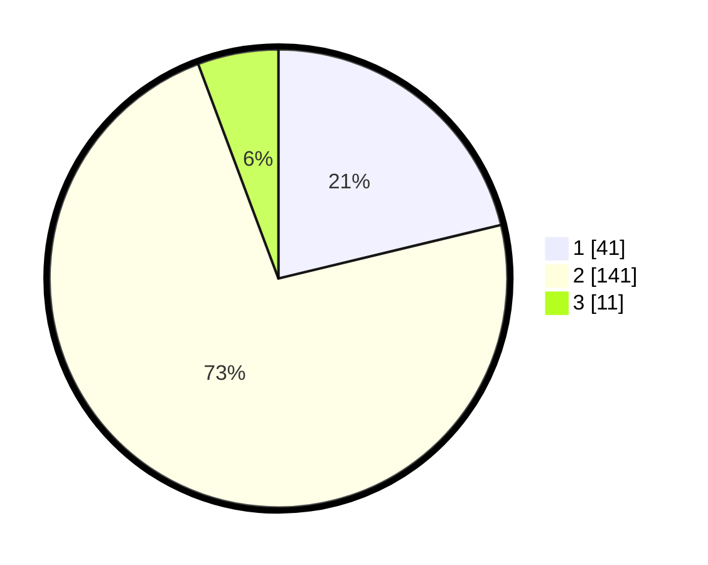

# Hasil

## Grafik

## Tabel

| No. | Nama Paslon    | Suara | Suara (raw) | Persentase |
|:--- |:-------------- | -----:| -----------:| ----------:|
| 1   | ANIES MUHAIMIN | 41    | [41][p-1]   | 21,24      |
| 2   | PRABOWO GIBRAN | 141   | [141][p-2]  | 73,06      |
| 3   | GANJAR MAHFUD  | 11    | [11][p-3]   | 5,70       |

[p-1]: https://github.com/gigit-pemilu/pemilu-2024-36-banten/blob/main/pilpres/hitung-suara/sub/36-banten/sub/04-serang/sub/13-tirtayasa/sub/2012-alang-alang/sub/004-tps/sub/paslon-1.txt
[p-2]: https://github.com/gigit-pemilu/pemilu-2024-36-banten/blob/main/pilpres/hitung-suara/sub/36-banten/sub/04-serang/sub/13-tirtayasa/sub/2012-alang-alang/sub/004-tps/sub/paslon-2.txt
[p-3]: https://github.com/gigit-pemilu/pemilu-2024-36-banten/blob/main/pilpres/hitung-suara/sub/36-banten/sub/04-serang/sub/13-tirtayasa/sub/2012-alang-alang/sub/004-tps/sub/paslon-3.txt

## Foto C Plano

https://sirekap-obj-formc.kpu.go.id/4a8d/pemilu/ppwp/36/04/13/20/12/3604132012004-20240222-115014--bdb3e0af-97b6-4c66-b8be-76e4d9a6fec3.jpg

https://sirekap-obj-formc.kpu.go.id/4a8d/pemilu/ppwp/36/04/13/20/12/3604132012004-20240222-115046--85bbac80-2dd2-478a-953a-01330f4873fc.jpg

https://sirekap-obj-formc.kpu.go.id/4a8d/pemilu/ppwp/36/04/13/20/12/3604132012004-20240222-115122--89c7e61b-104c-46b2-9f0b-d659827bc978.jpg

## Metadata

| Key        | Value               |
| ---------- | ------------------- |
| Time Stamp | 2024-02-24 22:31:28 |

