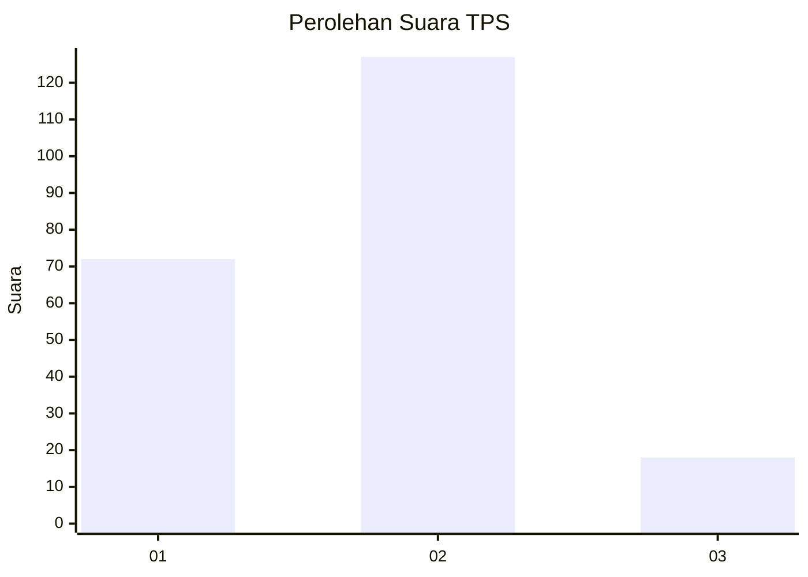
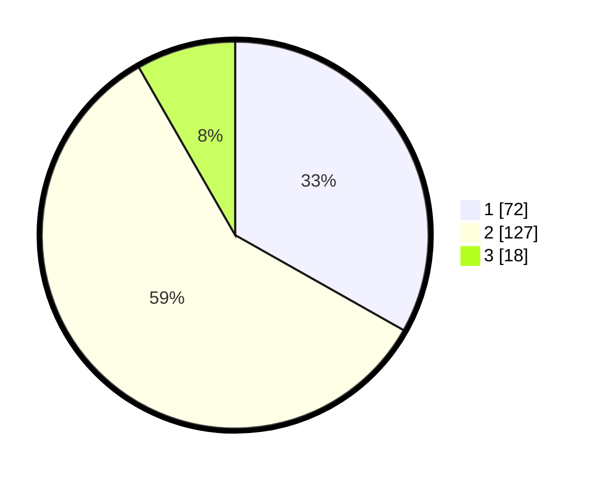

# Hasil

## Grafik

## Tabel

| No. | Nama Paslon    | Suara | Suara (raw) | Persentase |
|:--- |:-------------- | -----:| -----------:| ----------:|
| 1   | ANIES MUHAIMIN | 72    | [72][p-1]   | 33,18      |
| 2   | PRABOWO GIBRAN | 127   | [127][p-2]  | 58,53      |
| 3   | GANJAR MAHFUD  | 18    | [18][p-3]   | 8,29       |

[p-1]: https://github.com/gigit-pemilu/pemilu-2024/blob/main/pilpres/hitung-suara/sub/36-banten/sub/04-serang/sub/14-tanara/sub/2001-tanara/sub/002-tps/sub/paslon-1.txt
[p-2]: https://github.com/gigit-pemilu/pemilu-2024/blob/main/pilpres/hitung-suara/sub/36-banten/sub/04-serang/sub/14-tanara/sub/2001-tanara/sub/002-tps/sub/paslon-2.txt
[p-3]: https://github.com/gigit-pemilu/pemilu-2024/blob/main/pilpres/hitung-suara/sub/36-banten/sub/04-serang/sub/14-tanara/sub/2001-tanara/sub/002-tps/sub/paslon-3.txt

## Foto C Plano

https://sirekap-obj-formc.kpu.go.id/f339/pemilu/ppwp/36/04/14/20/01/3604142001002-20240215-020900--a975a5cb-cac8-4ff6-95f6-a13a5d408a0d.jpg

https://sirekap-obj-formc.kpu.go.id/f339/pemilu/ppwp/36/04/14/20/01/3604142001002-20240215-020923--cd024468-9179-4a95-ad4e-79c950325290.jpg

https://sirekap-obj-formc.kpu.go.id/f339/pemilu/ppwp/36/04/14/20/01/3604142001002-20240215-020951--0e52e932-a4ae-4df8-baa2-6b2c7de50af2.jpg

## Metadata

| Key        | Value               |
| ---------- | ------------------- |
| Time Stamp | 2024-02-25 16:00:00 |

