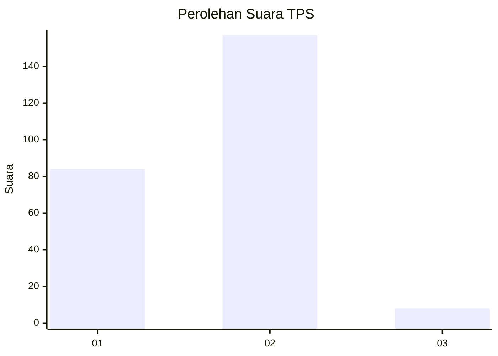
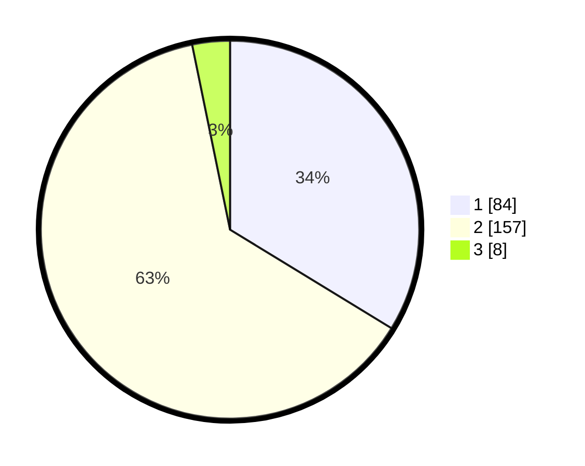

# Hasil

## Grafik

## Tabel

| No. | Nama Paslon    | Suara | Suara (raw) | Persentase |
|:--- |:-------------- | -----:| -----------:| ----------:|
| 1   | ANIES MUHAIMIN | 84    | [84][p-1]   | 33,73      |
| 2   | PRABOWO GIBRAN | 157   | [157][p-2]  | 63,05      |
| 3   | GANJAR MAHFUD  | 8     | [8][p-3]    | 3,21       |

[p-1]: https://github.com/gigit-pemilu/pemilu-2024-36-banten/blob/main/pilpres/hitung-suara/sub/36-banten/sub/04-serang/sub/14-tanara/sub/2001-tanara/sub/005-tps/sub/paslon-1.txt
[p-2]: https://github.com/gigit-pemilu/pemilu-2024-36-banten/blob/main/pilpres/hitung-suara/sub/36-banten/sub/04-serang/sub/14-tanara/sub/2001-tanara/sub/005-tps/sub/paslon-2.txt
[p-3]: https://github.com/gigit-pemilu/pemilu-2024-36-banten/blob/main/pilpres/hitung-suara/sub/36-banten/sub/04-serang/sub/14-tanara/sub/2001-tanara/sub/005-tps/sub/paslon-3.txt

## Foto C Plano

https://sirekap-obj-formc.kpu.go.id/18d3/pemilu/ppwp/36/04/14/20/01/3604142001005-20240218-112411--ec34290e-a0de-4229-9896-cd484cff92b3.jpg

https://sirekap-obj-formc.kpu.go.id/18d3/pemilu/ppwp/36/04/14/20/01/3604142001005-20240214-223458--087c9a9e-2c27-4286-9902-308a1b545e26.jpg

https://sirekap-obj-formc.kpu.go.id/18d3/pemilu/ppwp/36/04/14/20/01/3604142001005-20240218-112834--8775aeb9-6f16-474c-8bd0-7b704a4ebe3a.jpg

## Metadata

| Key        | Value               |
| ---------- | ------------------- |
| Time Stamp | 2024-02-19 06:16:00 |

