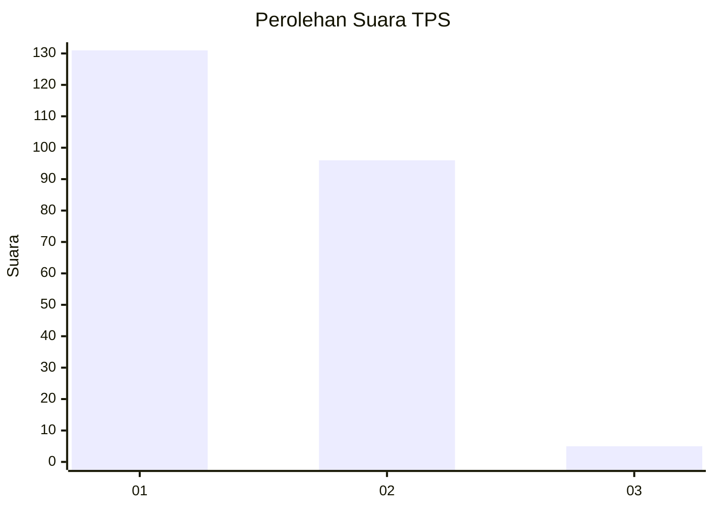
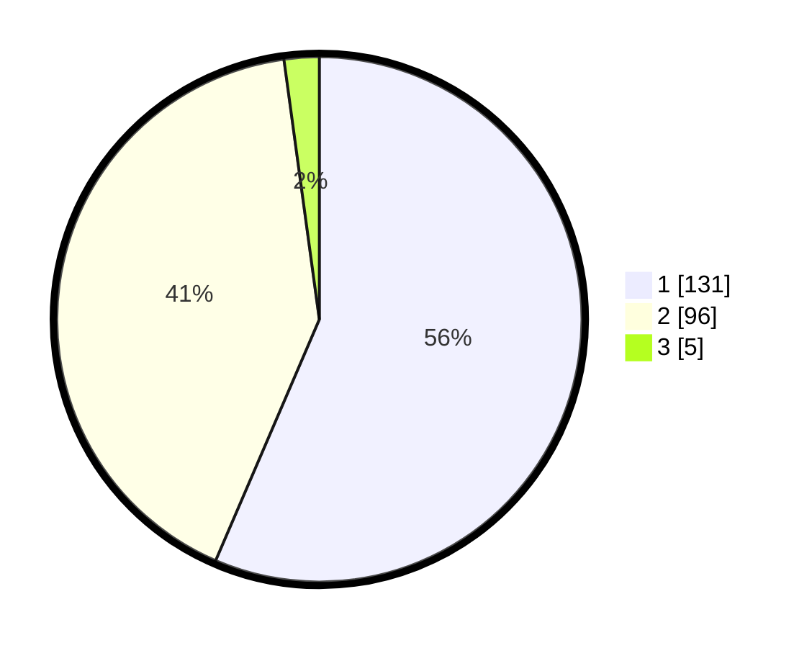

# Hasil

## Grafik

## Tabel

| No. | Nama Paslon    | Suara | Suara (raw) | Persentase |
|:--- |:-------------- | -----:| -----------:| ----------:|
| 1   | ANIES MUHAIMIN | 131   | [131][p-1]  | 56,47      |
| 2   | PRABOWO GIBRAN | 96    | [96][p-2]   | 41,38      |
| 3   | GANJAR MAHFUD  | 5     | [5][p-3]    | 2,16       |

[p-1]: https://github.com/gigit-pemilu/pemilu-2024/blob/main/pilpres/hitung-suara/sub/36-banten/sub/04-serang/sub/14-tanara/sub/2002-cerukcuk/sub/002-tps/sub/paslon-1.txt
[p-2]: https://github.com/gigit-pemilu/pemilu-2024/blob/main/pilpres/hitung-suara/sub/36-banten/sub/04-serang/sub/14-tanara/sub/2002-cerukcuk/sub/002-tps/sub/paslon-2.txt
[p-3]: https://github.com/gigit-pemilu/pemilu-2024/blob/main/pilpres/hitung-suara/sub/36-banten/sub/04-serang/sub/14-tanara/sub/2002-cerukcuk/sub/002-tps/sub/paslon-3.txt

## Foto C Plano

https://sirekap-obj-formc.kpu.go.id/da26/pemilu/ppwp/36/04/14/20/02/3604142002002-20240215-193024--f86a5e6b-a726-4252-a4ef-94704f877c0d.jpg

https://sirekap-obj-formc.kpu.go.id/da26/pemilu/ppwp/36/04/14/20/02/3604142002002-20240215-193304--19986b79-9804-4fe8-9476-b05d892576a8.jpg

https://sirekap-obj-formc.kpu.go.id/da26/pemilu/ppwp/36/04/14/20/02/3604142002002-20240215-193734--62b49a89-84a1-4e73-8dec-eae48c9cbd9c.jpg

## Metadata

| Key        | Value               |
| ---------- | ------------------- |
| Time Stamp | 2024-02-17 11:30:03 |

