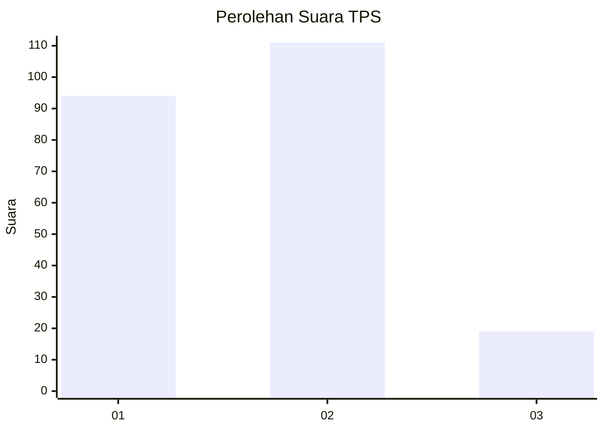
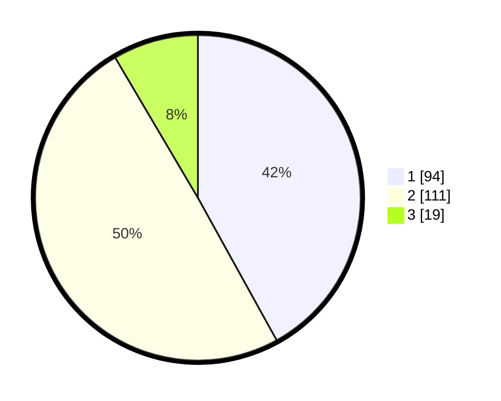

# Hasil

## Grafik

## Tabel

| No. | Nama Paslon    | Suara | Suara (raw) | Persentase |
|:--- |:-------------- | -----:| -----------:| ----------:|
| 1   | ANIES MUHAIMIN | 94    | [94][p-1]   | 41,96      |
| 2   | PRABOWO GIBRAN | 111   | [111][p-2]  | 49,55      |
| 3   | GANJAR MAHFUD  | 19    | [19][p-3]   | 8,48       |

[p-1]: https://github.com/gigit-pemilu/pemilu-2024/blob/main/pilpres/hitung-suara/sub/36-banten/sub/04-serang/sub/14-tanara/sub/2003-tenjoayu/sub/003-tps/sub/paslon-1.txt
[p-2]: https://github.com/gigit-pemilu/pemilu-2024/blob/main/pilpres/hitung-suara/sub/36-banten/sub/04-serang/sub/14-tanara/sub/2003-tenjoayu/sub/003-tps/sub/paslon-2.txt
[p-3]: https://github.com/gigit-pemilu/pemilu-2024/blob/main/pilpres/hitung-suara/sub/36-banten/sub/04-serang/sub/14-tanara/sub/2003-tenjoayu/sub/003-tps/sub/paslon-3.txt

## Foto C Plano

https://sirekap-obj-formc.kpu.go.id/5f1f/pemilu/ppwp/36/04/14/20/03/3604142003003-20240214-223640--20a2ec12-1b50-43e1-90f3-ee44d4f6a1f2.jpg

https://sirekap-obj-formc.kpu.go.id/5f1f/pemilu/ppwp/36/04/14/20/03/3604142003003-20240214-223919--66103216-0193-4153-968c-e421ec558a26.jpg

https://sirekap-obj-formc.kpu.go.id/5f1f/pemilu/ppwp/36/04/14/20/03/3604142003003-20240218-104424--a8cc7977-74f2-4999-8aaf-60472cb01c2c.jpg

## Metadata

| Key        | Value               |
| ---------- | ------------------- |
| Time Stamp | 2024-02-19 06:16:00 |

