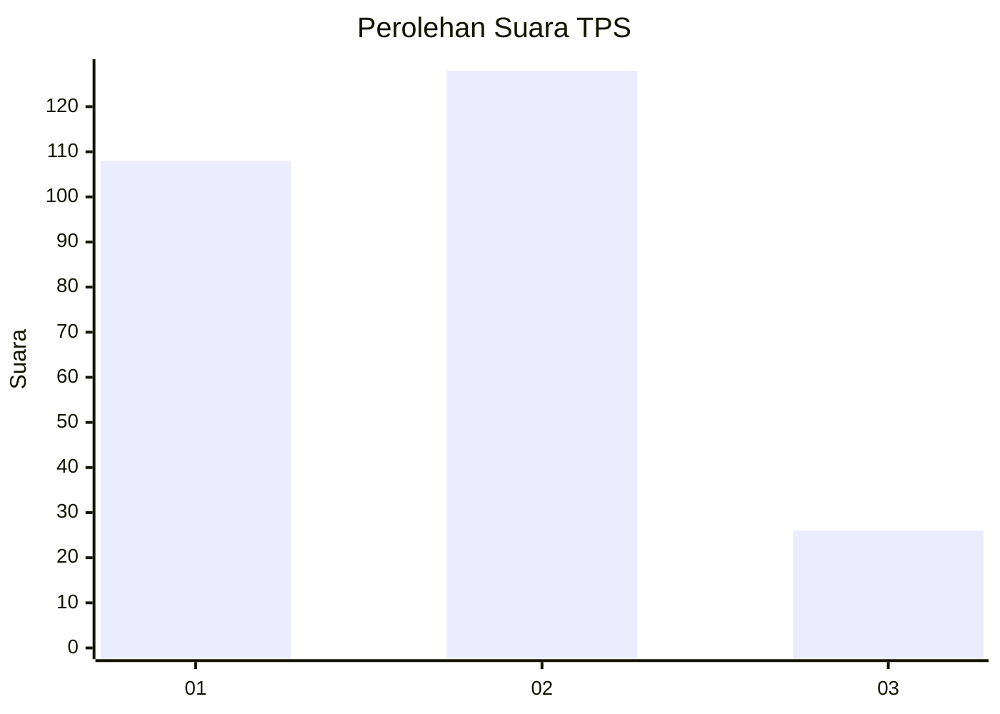
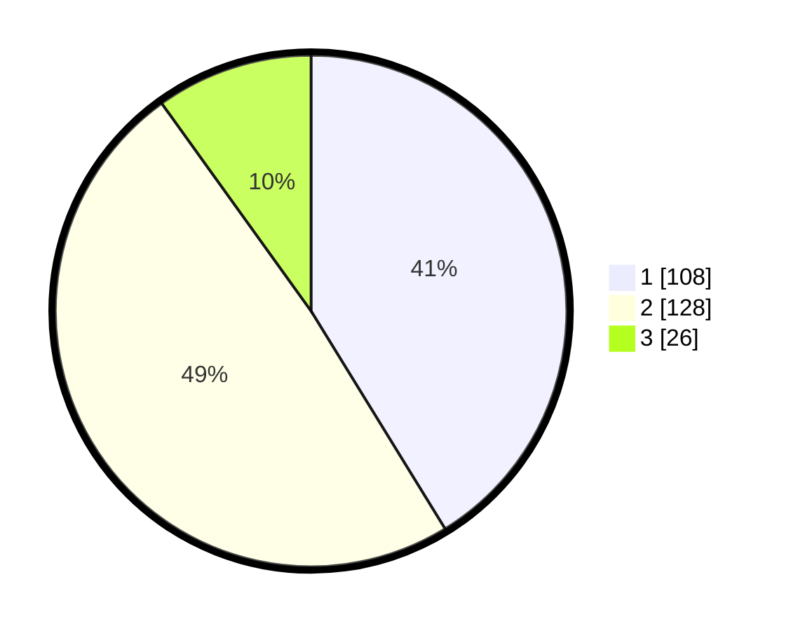

# Hasil

## Grafik

## Tabel

| No. | Nama Paslon    | Suara | Suara (raw) | Persentase |
|:--- |:-------------- | -----:| -----------:| ----------:|
| 1   | ANIES MUHAIMIN | 108   | [108][p-1]  | 41,22      |
| 2   | PRABOWO GIBRAN | 128   | [128][p-2]  | 48,85      |
| 3   | GANJAR MAHFUD  | 26    | [26][p-3]   | 9,92       |

[p-1]: https://github.com/gigit-pemilu/pemilu-2024/blob/main/pilpres/hitung-suara/sub/36-banten/sub/04-serang/sub/15-cikande/sub/2013-cikande-permai/sub/005-tps/sub/paslon-1.txt
[p-2]: https://github.com/gigit-pemilu/pemilu-2024/blob/main/pilpres/hitung-suara/sub/36-banten/sub/04-serang/sub/15-cikande/sub/2013-cikande-permai/sub/005-tps/sub/paslon-2.txt
[p-3]: https://github.com/gigit-pemilu/pemilu-2024/blob/main/pilpres/hitung-suara/sub/36-banten/sub/04-serang/sub/15-cikande/sub/2013-cikande-permai/sub/005-tps/sub/paslon-3.txt

## Foto C Plano

https://sirekap-obj-formc.kpu.go.id/b326/pemilu/ppwp/36/04/15/20/13/3604152013005-20240214-212805--78cdaf36-4af7-43c8-8e5b-8c79ac3b5728.jpg

https://sirekap-obj-formc.kpu.go.id/b326/pemilu/ppwp/36/04/15/20/13/3604152013005-20240214-212906--9b6f807b-c9ea-4176-ad5d-32c614a61a13.jpg

https://sirekap-obj-formc.kpu.go.id/b326/pemilu/ppwp/36/04/15/20/13/3604152013005-20240214-213002--8c44938f-9eaf-4dce-84d2-d30f0949e053.jpg

## Metadata

| Key        | Value               |
| ---------- | ------------------- |
| Time Stamp | 2024-02-24 22:31:28 |

