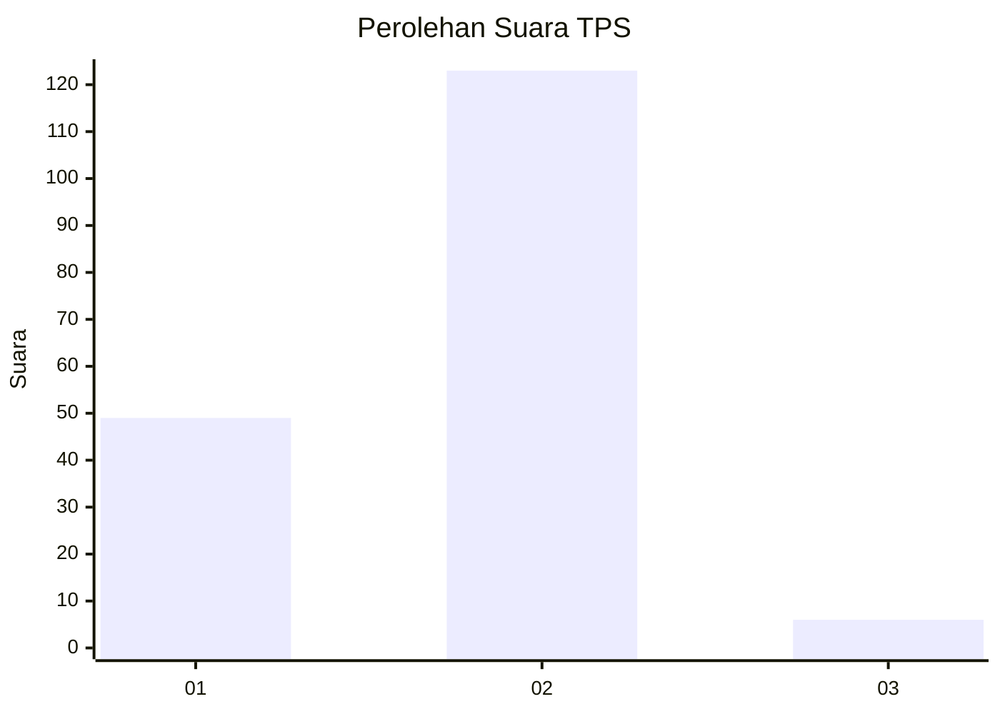
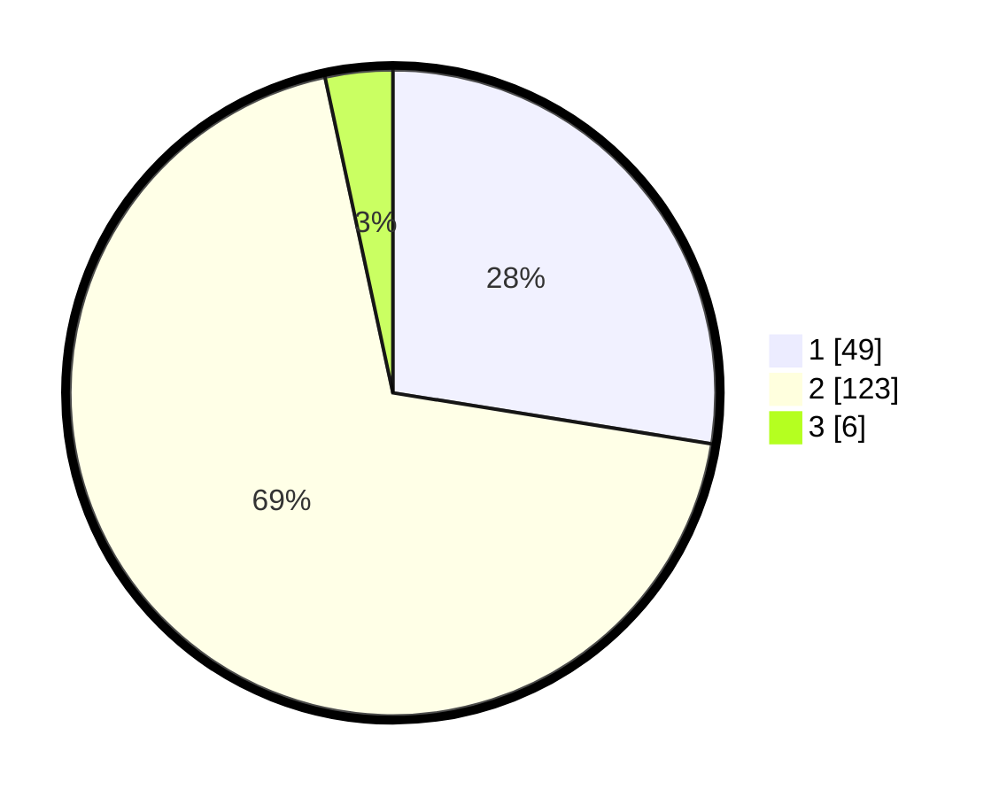

# Hasil

## Grafik

## Tabel

| No. | Nama Paslon    | Suara | Suara (raw) | Persentase |
|:--- |:-------------- | -----:| -----------:| ----------:|
| 1   | ANIES MUHAIMIN | 49    | [49][p-1]   | 27,53      |
| 2   | PRABOWO GIBRAN | 123   | [123][p-2]  | 69,10      |
| 3   | GANJAR MAHFUD  | 6     | [6][p-3]    | 3,37       |

[p-1]: https://github.com/gigit-pemilu/pemilu-2024/blob/main/pilpres/hitung-suara/sub/36-banten/sub/04-serang/sub/16-kibin/sub/2001-kibin/sub/004-tps/sub/paslon-1.txt
[p-2]: https://github.com/gigit-pemilu/pemilu-2024/blob/main/pilpres/hitung-suara/sub/36-banten/sub/04-serang/sub/16-kibin/sub/2001-kibin/sub/004-tps/sub/paslon-2.txt
[p-3]: https://github.com/gigit-pemilu/pemilu-2024/blob/main/pilpres/hitung-suara/sub/36-banten/sub/04-serang/sub/16-kibin/sub/2001-kibin/sub/004-tps/sub/paslon-3.txt

## Foto C Plano

https://sirekap-obj-formc.kpu.go.id/f64c/pemilu/ppwp/36/04/16/20/01/3604162001004-20240214-212629--76b22e9b-55a1-484e-ae24-2df2a61d4e5c.jpg

https://sirekap-obj-formc.kpu.go.id/f64c/pemilu/ppwp/36/04/16/20/01/3604162001004-20240214-212753--207c8978-7ad2-4ee9-9bae-234c3b7063fb.jpg

https://sirekap-obj-formc.kpu.go.id/f64c/pemilu/ppwp/36/04/16/20/01/3604162001004-20240214-212856--5231cf3c-0d74-4a2f-a773-9dc27e1210e7.jpg

## Metadata

| Key        | Value               |
| ---------- | ------------------- |
| Time Stamp | 2024-02-16 16:25:10 |

