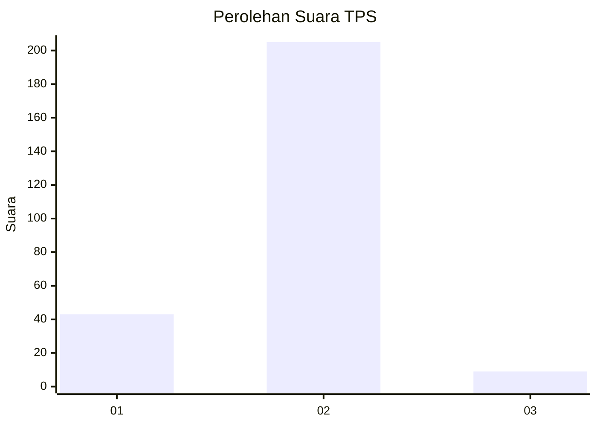
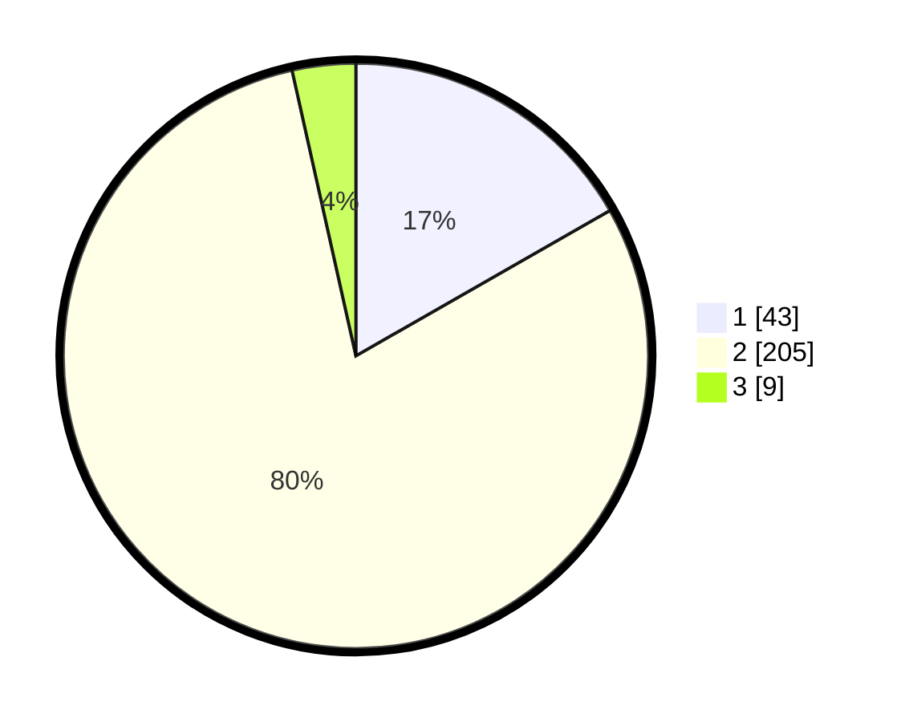

# Hasil

## Grafik

## Tabel

| No. | Nama Paslon    | Suara | Suara (raw) | Persentase |
|:--- |:-------------- | -----:| -----------:| ----------:|
| 1   | ANIES MUHAIMIN | 43    | [43][p-1]   | 16,73      |
| 2   | PRABOWO GIBRAN | 205   | [205][p-2]  | 79,77      |
| 3   | GANJAR MAHFUD  | 9     | [9][p-3]    | 3,50       |

[p-1]: https://github.com/gigit-pemilu/pemilu-2024-36-banten/blob/main/pilpres/hitung-suara/sub/36-banten/sub/04-serang/sub/16-kibin/sub/2001-kibin/sub/008-tps/sub/paslon-1.txt
[p-2]: https://github.com/gigit-pemilu/pemilu-2024-36-banten/blob/main/pilpres/hitung-suara/sub/36-banten/sub/04-serang/sub/16-kibin/sub/2001-kibin/sub/008-tps/sub/paslon-2.txt
[p-3]: https://github.com/gigit-pemilu/pemilu-2024-36-banten/blob/main/pilpres/hitung-suara/sub/36-banten/sub/04-serang/sub/16-kibin/sub/2001-kibin/sub/008-tps/sub/paslon-3.txt

## Foto C Plano

https://sirekap-obj-formc.kpu.go.id/b897/pemilu/ppwp/36/04/16/20/01/3604162001008-20240214-214311--209a4e0c-49a9-4ccb-babe-645f840fad2b.jpg

https://sirekap-obj-formc.kpu.go.id/b897/pemilu/ppwp/36/04/16/20/01/3604162001008-20240214-214415--494dc3eb-9245-4c85-946a-bea78e21b741.jpg

https://sirekap-obj-formc.kpu.go.id/b897/pemilu/ppwp/36/04/16/20/01/3604162001008-20240214-214607--31035abc-11f9-4553-bc73-3f7dc8d3c81c.jpg

## Metadata

| Key        | Value               |
| ---------- | ------------------- |
| Time Stamp | 2024-02-16 16:25:10 |

