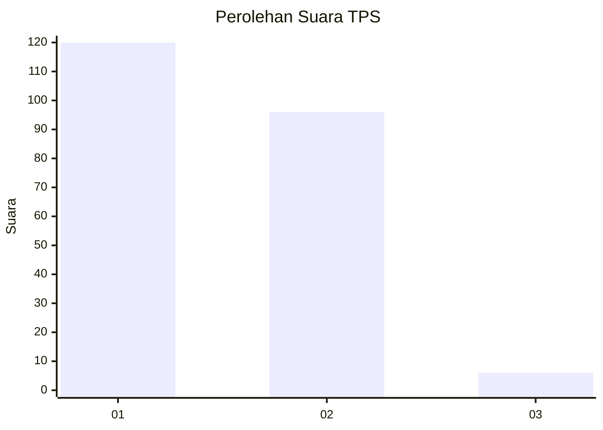
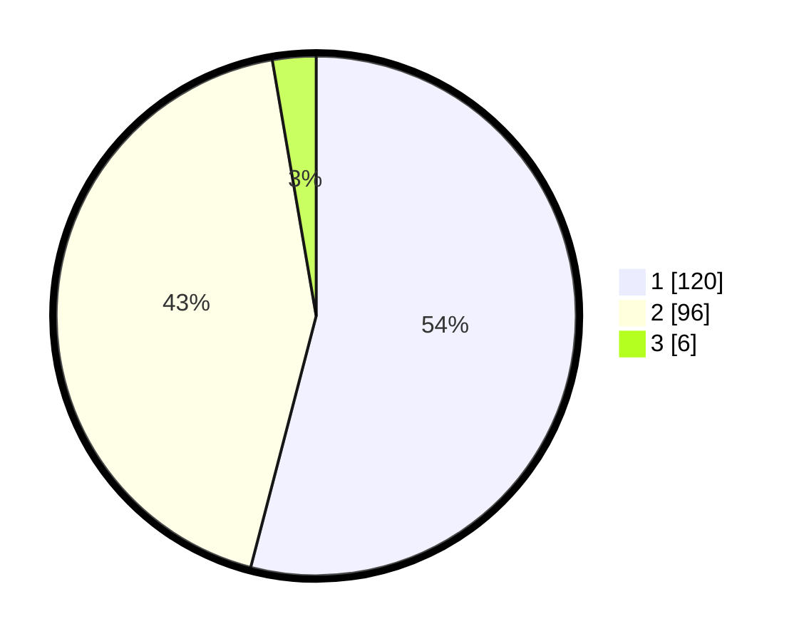

# Hasil

## Grafik

## Tabel

| No. | Nama Paslon    | Suara | Suara (raw) | Persentase |
|:--- |:-------------- | -----:| -----------:| ----------:|
| 1   | ANIES MUHAIMIN | 120   | [120][p-1]  | 54,05      |
| 2   | PRABOWO GIBRAN | 96    | [96][p-2]   | 43,24      |
| 3   | GANJAR MAHFUD  | 6     | [6][p-3]    | 2,70       |

[p-1]: https://github.com/gigit-pemilu/pemilu-2024/blob/main/pilpres/hitung-suara/sub/36-banten/sub/04-serang/sub/17-carenang/sub/2003-mandaya/sub/003-tps/sub/paslon-1.txt
[p-2]: https://github.com/gigit-pemilu/pemilu-2024/blob/main/pilpres/hitung-suara/sub/36-banten/sub/04-serang/sub/17-carenang/sub/2003-mandaya/sub/003-tps/sub/paslon-2.txt
[p-3]: https://github.com/gigit-pemilu/pemilu-2024/blob/main/pilpres/hitung-suara/sub/36-banten/sub/04-serang/sub/17-carenang/sub/2003-mandaya/sub/003-tps/sub/paslon-3.txt

## Foto C Plano

https://sirekap-obj-formc.kpu.go.id/4ee0/pemilu/ppwp/36/04/17/20/03/3604172003003-20240220-084500--03ded3be-2c8a-46c3-b5a1-3142171fd727.jpg

https://sirekap-obj-formc.kpu.go.id/4ee0/pemilu/ppwp/36/04/17/20/03/3604172003003-20240220-084630--c6f70031-0ff1-4851-bc53-3b3c6658e13a.jpg

https://sirekap-obj-formc.kpu.go.id/4ee0/pemilu/ppwp/36/04/17/20/03/3604172003003-20240220-084743--65d07c7b-f841-46cb-9291-5ab522d792de.jpg

## Metadata

| Key        | Value               |
| ---------- | ------------------- |
| Time Stamp | 2024-02-24 22:31:28 |

