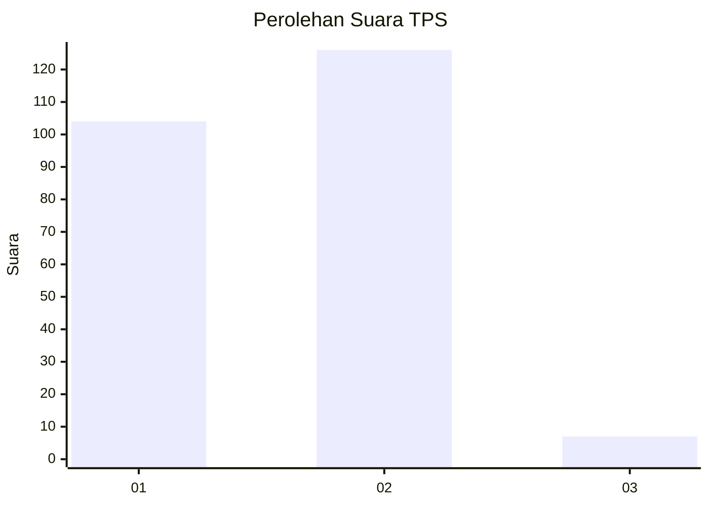
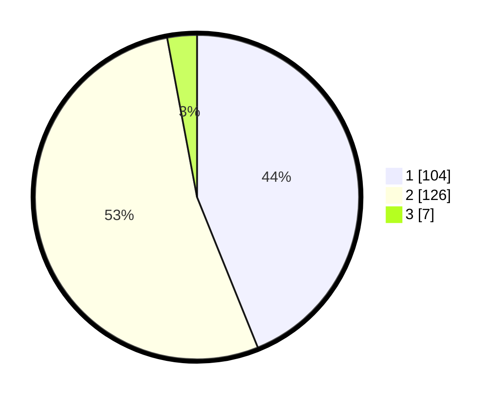

# Hasil

## Grafik

## Tabel

| No. | Nama Paslon    | Suara | Suara (raw) | Persentase |
|:--- |:-------------- | -----:| -----------:| ----------:|
| 1   | ANIES MUHAIMIN | 104   | [104][p-1]  | 43,88      |
| 2   | PRABOWO GIBRAN | 126   | [126][p-2]  | 53,16      |
| 3   | GANJAR MAHFUD  | 7     | [7][p-3]    | 2,95       |

[p-1]: https://github.com/gigit-pemilu/pemilu-2024/blob/main/pilpres/hitung-suara/sub/36-banten/sub/04-serang/sub/17-carenang/sub/2003-mandaya/sub/004-tps/sub/paslon-1.txt
[p-2]: https://github.com/gigit-pemilu/pemilu-2024/blob/main/pilpres/hitung-suara/sub/36-banten/sub/04-serang/sub/17-carenang/sub/2003-mandaya/sub/004-tps/sub/paslon-2.txt
[p-3]: https://github.com/gigit-pemilu/pemilu-2024/blob/main/pilpres/hitung-suara/sub/36-banten/sub/04-serang/sub/17-carenang/sub/2003-mandaya/sub/004-tps/sub/paslon-3.txt

## Foto C Plano

https://sirekap-obj-formc.kpu.go.id/b151/pemilu/ppwp/36/04/17/20/03/3604172003004-20240214-160058--a6b0d8c8-032a-4562-94f1-1f628bae679c.jpg

https://sirekap-obj-formc.kpu.go.id/b151/pemilu/ppwp/36/04/17/20/03/3604172003004-20240214-160157--2c87b2ea-3ecb-4682-acf5-a4773e116cce.jpg

https://sirekap-obj-formc.kpu.go.id/b151/pemilu/ppwp/36/04/17/20/03/3604172003004-20240215-173533--6772c9e9-f61f-4e33-bf4d-384f77419ce9.jpg

## Metadata

| Key        | Value               |
| ---------- | ------------------- |
| Time Stamp | 2024-02-15 18:00:26 |

