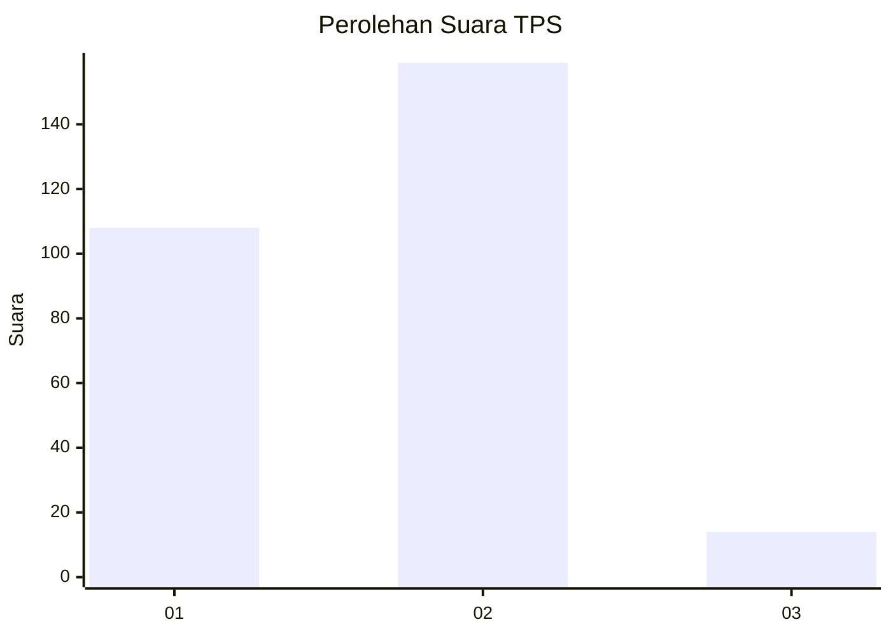
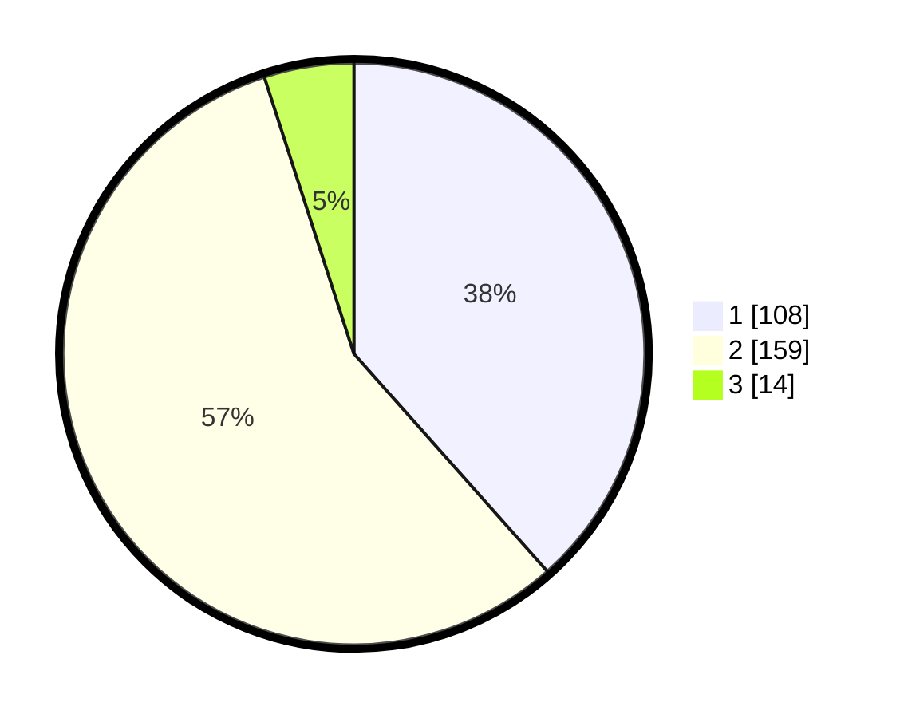

# Hasil

## Grafik

## Tabel

| No. | Nama Paslon    | Suara | Suara (raw) | Persentase |
|:--- |:-------------- | -----:| -----------:| ----------:|
| 1   | ANIES MUHAIMIN | 108   | [108][p-1]  | 38,43      |
| 2   | PRABOWO GIBRAN | 159   | [159][p-2]  | 56,58      |
| 3   | GANJAR MAHFUD  | 14    | [14][p-3]   | 4,98       |

[p-1]: https://github.com/gigit-pemilu/pemilu-2024-36-banten/blob/main/pilpres/hitung-suara/sub/36-banten/sub/04-serang/sub/19-petir/sub/2011-kampung-baru/sub/001-tps/sub/paslon-1.txt
[p-2]: https://github.com/gigit-pemilu/pemilu-2024-36-banten/blob/main/pilpres/hitung-suara/sub/36-banten/sub/04-serang/sub/19-petir/sub/2011-kampung-baru/sub/001-tps/sub/paslon-2.txt
[p-3]: https://github.com/gigit-pemilu/pemilu-2024-36-banten/blob/main/pilpres/hitung-suara/sub/36-banten/sub/04-serang/sub/19-petir/sub/2011-kampung-baru/sub/001-tps/sub/paslon-3.txt

## Foto C Plano

https://sirekap-obj-formc.kpu.go.id/9e4b/pemilu/ppwp/36/04/19/20/11/3604192011001-20240215-084527--bfc98e53-26ae-4e28-885e-510472d1bd64.jpg

https://sirekap-obj-formc.kpu.go.id/9e4b/pemilu/ppwp/36/04/19/20/11/3604192011001-20240215-084927--51a37127-6201-484b-80d1-baf2cf3f1970.jpg

https://sirekap-obj-formc.kpu.go.id/9e4b/pemilu/ppwp/36/04/19/20/11/3604192011001-20240215-085115--22966c00-9e12-4229-9b6c-c7b9299cecd9.jpg

## Metadata

| Key        | Value               |
| ---------- | ------------------- |
| Time Stamp | 2024-02-16 21:01:00 |

